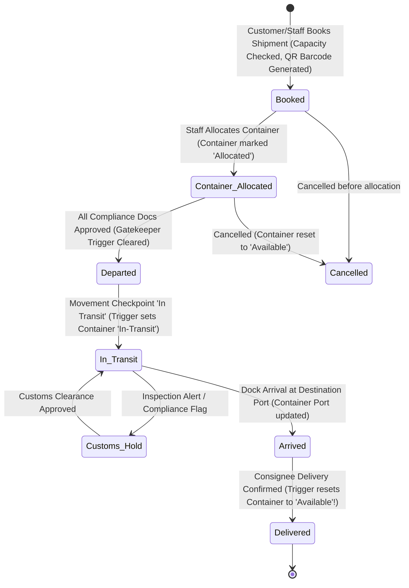
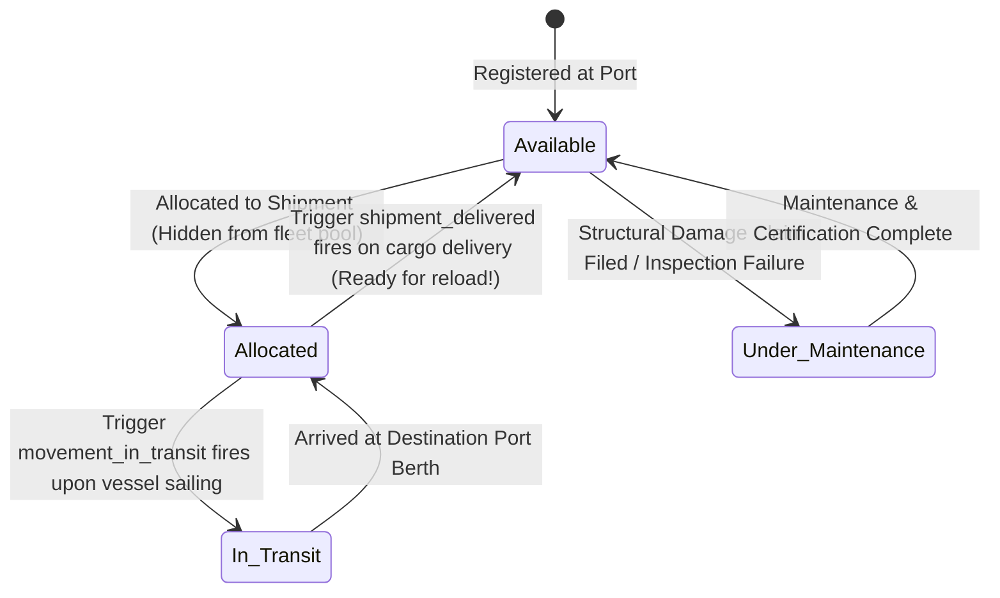
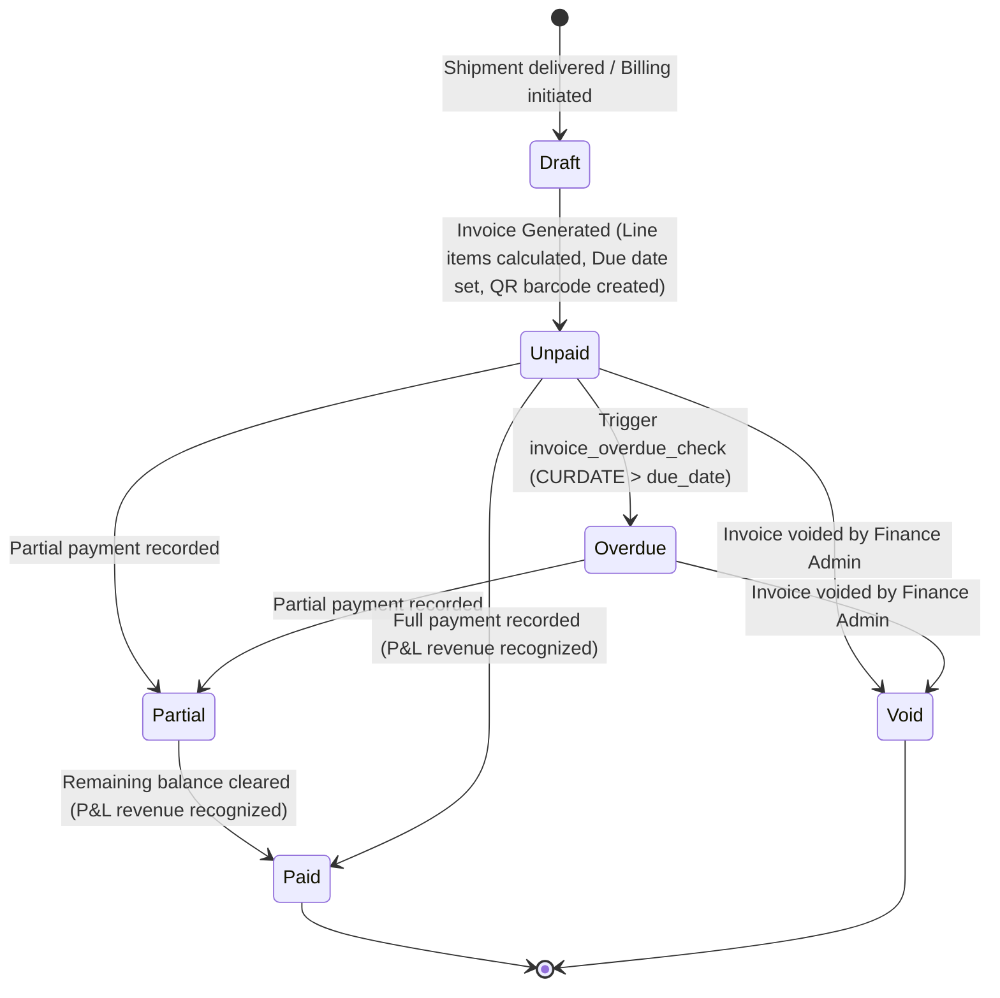

# N LOGISTIC — AUTOMATED WORKFLOWS, CASCADE LIFECYCLE & REACTIVE IMPACT GRAPH
> **Master Forensic Cascade & Reactive Impact Specification**: Complete Multi-Table Mutation Graphs, Automated DB Triggers, Auto-Generated Barcodes, Port/Fleet State Transitions, and Financial Ripple Effects.  
> **Target System**: N Logistic Multi-Tenant Maritime ERP (`com.nlogistic.*`)  
> **Database Engine**: MySQL 8.0 (`nlogistic_db`) on InnoDB  
> **Execution Context**: Super Admin, Company Admin, Operations Staff, Finance Staff, Customer

---

## 1. EXECUTIVE OVERVIEW: THE REACTIVE "RIPPLE EFFECT"

In N Logistic, no business operation exists in a vacuum. A single user action—such as clicking **"Book Shipment"**, **"Allocate Container"**, **"Log Checkpoint"**, or **"Upload Compliance Doc"**—triggers an immediate, deterministic cascade across multiple tiers of the architecture:

```
+----------------------------------------------------------------------------------------------------+
|                                    THE UNIFIED RIPPLE PIPELINE                                     |
+----------------------------------------------------------------------------------------------------+
|  1. User / API Action (Servlet Controller receives request with CSRF token & RBAC context)         |
|         │                                                                                          |
|         ▼                                                                                          |
|  2. Stored Procedure Execution (Atomic ACID transaction executes business preconditions)           |
|         │                                                                                          |
|         ▼                                                                                          |
|  3. MySQL Triggers Fire (Pre-insert validation, capacity checks, automatic timestamping)           |
|         │                                                                                          |
|         ▼                                                                                          |
|  4. Database Foreign Key Cascades (Referential actions, child record creation, audit trails)       |
|         │                                                                                          |
|         ▼                                                                                          |
|  5. Automated Utility Hooks (BarcodeAutoGenerator creates QR/Code128 images & barcode_entries)      |
|         │                                                                                          |
|         ▼                                                                                          |
|  6. Fleet & Physical Asset Synchronization (Container availability & Port location updates)        |
|         │                                                                                          |
|         ▼                                                                                          |
|  7. Financial & P&L Ledgers (Billing triggers, invoice line items, dynamic pricing adjustments)    |
+----------------------------------------------------------------------------------------------------+
```

---

## 2. MASTER REACTIVE IMPACT MATRIX

This matrix serves as the single source of truth for all engineering, operational, and database teams. It specifies exactly **what tables mutate**, **which database triggers execute**, **what barcodes generate**, and **which assets update** for every major system action.

| User / System Action | Primary Table Mutated | Secondary / Child Tables Mutated | Database Triggers Fired | Auto-Barcodes Generated (`BarcodeAutoGenerator`) | Port & Fleet Impact | Financial / Billing Impact |
| :--- | :--- | :--- | :--- | :--- | :--- | :--- |
| **1. Customer Books Shipment** | `shipment` (INSERT, status=`Booked`) | `audit_log`, `container_movements` (Initial status) | `shipment_cargo_capacity_check` | **YES:** QR Code for `Shipment` (`SHP-xxxxx`) | Origin port registered; Destination port committed | Declared cargo value & freight cost baseline recorded |
| **2. Operations Allocates Container** | `containers` (UPDATE status=`Allocated`) | `shipment` (UPDATE status=`Container Allocated`, `container_id` bound) | `pricing_before_insert / update` (if dynamic rule applied) | None (Uses container's existing barcode `CONT-xxxxx`) | Container removed from company's available fleet pool | Dynamic pricing engine evaluates route multipliers |
| **3. Staff Uploads Compliance Document** | `compliance_documents` (INSERT, status=`Pending`/`Approved`) | `audit_log` | `compliance_doc_expiry_check` | **YES:** Code128 barcode for `ComplianceDocument` (`DOC-xxxxx`) | None | None |
| **4. Operations Marks Shipment "Departed"** | `container_movements` (INSERT status=`Departed`) | `shipment` (UPDATE status=`Departed`) | `movement_prevent_depart_if_docs_pending` (BLOCKS if docs missing/expired) | None | Container physically departs origin port | Demurrage counter at origin port terminates |
| **5. High-Seas Transit Update** | `container_movements` (INSERT status=`In Transit`) | `shipment` (UPDATE status=`In Transit`), `containers` | `movement_in_transit` (Auto-updates `containers.status='In-Transit'`) | None | Container location transitions to Vessel on open waters | Freight transit risk insurance active |
| **6. Vessel Arrival at Destination** | `container_movements` (INSERT status=`Arrived`) | `shipment` (UPDATE status=`Arrived`), `containers` | `movement_check_delay` | None | `containers.current_port_id` updates to `destination_port_id` | Import duty & port handling charges become payable |
| **7. Final Cargo Delivery** | `shipment` (UPDATE status=`Delivered`) | `containers` (Auto-released to `Available`), `container_movements` | `shipment_delivered` (Auto-frees container back to fleet!) | None | Container returned to pool at destination port for next trip | Eligibility unlocked for full commercial invoice settlement |
| **8. Finance Generates Invoice** | `billing_invoices` (INSERT status=`Unpaid`) | `invoice_line_items` (INSERT all freight + insurance charges) | `invoice_line_item_total` | **YES:** QR Code for `Invoice` (`INV-xxxxx`) | None | Accounts Receivable created; Customer credit limit utilized |
| **9. Customer / Finance Pays Invoice** | `payments` (INSERT), `billing_invoices` | `billing_invoices` (`paid_amount`, `payment_status` -> `Paid`) | `invoice_overdue_check` | None | None | Cash collected; Customer credit restored; P&L Revenue realized |
| **10. Loss / Damage Claim Filed** | `claims` (INSERT status=`Filed`) | `claim_status_history`, `audit_log` | None | **YES:** Code128 barcode for `Claim` (`CLM-xxxxx`) | Container tagged for damage inspection if type is Structural | Potential liability ledger entry recorded |
| **11. Finance Settles Claim** | `claims` (UPDATE status=`Settled`) | `claim_status_history`, `profit_loss`, `profit_loss_reason_map` | `claim_require_review_precondition`, `claim_approved_amount_check`, `claim_reason_required_on_settle` | None | Container cleared or marked for maintenance | Approved compensation recorded as expense in P&L |
| **12. CSV Stock Upload** | `stock` (INSERT / UPDATE) | `stock_upload_log`, `inventory_ledger` | `stock_check_quantity / update` | **YES:** Barcode for each new `Stock` SKU (`STK-xxxxx`) | Warehouse storage location updated | Stock valuation recalculated; Unit COGS updated |

---

## 3. IN-DEPTH LIFECYCLE REACTION TRACES

### PHASE 1: SHIPMENT BOOKING & CARGO CAPACITY VALIDATION
When an external Customer (Role 5) or Internal Staff (Roles 1-3) submits a booking:

```
[Customer Submits Booking Form]
         │
         ├──► 1. Controller: BookShipmentServlet.java executes doPost()
         │
         ├──► 2. SP Call: {CALL book_shipment(customer_id, container_id, origin_port, dest_port,
         │                                    vessel, cargo_desc, weight, volume, value, ...)}
         │
         ├──► 3. MySQL DB Trigger: `shipment_cargo_capacity_check`
         │         ├─ SELECT goods_capacity_kg, goods_capacity_cbm FROM containers WHERE container_id = ?
         │         └─ IF weight > capacity_kg OR volume > capacity_cbm THEN
         │                SIGNAL SQLSTATE '45000' ('Cargo exceeds container capacity') -> ABORT!
         │
         ├──► 4. Table Mutation: `shipment`
         │         ├─ status = 'Booked'
         │         ├─ booking_date = CURDATE()
         │         └─ new shipment_id generated (e.g. #105)
         │
         ├──► 5. Table Mutation: `container_movements`
         │         └─ INSERT INTO container_movements (shipment_id, status='Booked', checkpoint_location=origin_port)
         │
         └──► 6. Utility Hook: `BarcodeAutoGenerator.generateFor(request, "Shipment", 105, userId)`
                   ├─ Generates QR image on disk: /uploads/barcodes/qr_shipment_105.png
                   └─ INSERT INTO barcode_entries (barcode_value='SHP-105-XXXX', entity_type='Shipment', entity_id=105)
```

#### Exact Database State After Phase 1:
* **`shipment`**: 1 new row (`shipment_id=105`, `status='Booked'`).
* **`container_movements`**: 1 new row (`status='Booked'`).
* **`barcode_entries`**: 1 new row (`barcode_value='SHP-105-A7B9'`, `entity_type='Shipment'`).
* **`containers`**: Still in state `'Available'` (not yet locked down to this shipment).

---

### PHASE 2: CONTAINER ALLOCATION & FLEET POOL REMOVAL
When Operations Staff (Role 3) or Company Admin (Role 2) allocates a specific container:

```
[Operations Staff Selects Container #CONT-4011 for Shipment #105]
         │
         ├──► 1. Controller: BookShipmentServlet.java / ContainerServlet.java
         │
         ├──► 2. SP Call: {CALL allocate_container(p_shipment_id=105, p_container_id=42)}
         │
         ├──► 3. Stored Procedure Precondition Logic:
         │         ├─ Checks container.status == 'Available' (Else: 'Container not available')
         │         └─ Checks cargo dimensions fit container capacity
         │
         ├──► 4. Atomic Mutation: `containers`
         │         └─ UPDATE containers SET status = 'Allocated' WHERE container_id = 42
         │
         ├──► 5. Atomic Mutation: `shipment`
         │         └─ UPDATE shipment SET container_id = 42, status = 'Container Allocated' WHERE shipment_id = 105
         │
         ├──► 6. Fleet Availability Impact:
         │         └─ Container #42 is instantly hidden from all other booking dropdowns
         │
         └──► 7. Dynamic Pricing Recalculation:
                   ├─ SP queries `pricing_rules` for route (origin_port -> dest_port, type='Dry', size='40ft')
                   └─ Multiplies seasonal_multiplier * demand_multiplier to update freight estimate
```

---

### PHASE 3: COMPLIANCE DOCUMENTATION & DEPARTURE GATING
This is the most critical supply chain gate. By international maritime law, a vessel cannot depart with uninspected or unapproved cargo.

```
[Customs Agent Uploads Export License / Certificate of Origin]
         │
         ├──► 1. Controller: ComplianceServlet.java handles @MultipartConfig upload
         │
         ├──► 2. File Persistence:
         │         ├─ Validates MIME type & extension (.pdf, .png)
         │         └─ Saves secure file: /uploads/compliance/uuid-license.pdf
         │
         ├──► 3. SP Call: {CALL upload_compliance_document(105, 'Export License', 'LIC-9982', ...)}
         │
         ├──► 4. DB Trigger: `compliance_doc_expiry_check`
         │         └─ IF expiry_date < CURDATE() THEN SET status = 'Expired' ELSE 'Pending'
         │
         ├──► 5. Auto-Barcode Generation:
         │         └─ BarcodeAutoGenerator creates barcode for `ComplianceDocument` (DOC-LIC-9982)
         │
         │  === [NOW OPERATIONS ATTEMPTS DEPARTURE TRANSITION] ===
         │
         ├──► 6. Operations clicks "Mark Shipment Departed"
         │         └─ INSERT INTO container_movements (shipment_id=105, status='Departed', ...)
         │
         └──► 7. HARD GATE TRIGGER FIRES: `movement_prevent_depart_if_docs_pending`
                   ├─ Queries: SELECT COUNT(*) FROM compliance_documents 
                   │           WHERE shipment_id = 105 AND (status <> 'Approved' OR expiry_date < CURDATE())
                   ├─ SCENARIO A: Any document is 'Pending', 'Rejected', or 'Expired'
                   │     └─► ⛔ TRIGGER THROWS ERROR: "Shipment cannot depart due to pending or expired compliance documents"
                   │         (Movement is REJECTED, status remains 'Container Allocated')
                   └─ SCENARIO B: All documents are Approved and unexpired
                         └─► ✅ Clearance Granted! Movement recorded, status -> 'Departed'
```

---

### PHASE 4: HIGH-SEAS TRANSIT & AUTOMATED FLEET TRACKING
Once the ship departs and the checkpoint reaches the ocean voyage:

```
[Dock Radar / GPS Log Updates Checkpoint to 'In Transit']
         │
         ├──► 1. Controller: ShipmentServlet.java (updateStatus)
         │
         ├──► 2. Table Mutation: `container_movements` (INSERT status='In Transit')
         │
         ├──► 3. MySQL Reactive Trigger: `movement_in_transit`
         │         ├─ Fires AFTER INSERT on `container_movements`
         │         └─ Executes:
         │              UPDATE containers c
         │              JOIN shipment s ON s.container_id = c.container_id
         │              SET c.status = 'In-Transit'
         │              WHERE s.shipment_id = NEW.shipment_id;
         │
         ├──► 4. Fleet Impact:
         │         └─ Container #42 status automatically transitions to 'In-Transit'
         │
         └──► 5. Live Dashboard Impact:
                   ├─ Operations Tracking map places container on active marine route
                   └─ Customer Live Portal displays animated ocean progress bar
```

---

### PHASE 5: DESTINATION PORT ARRIVAL & AUTOMATIC RE-LOCATION
When the vessel docks at the destination port (e.g. Port of Rotterdam):

```
[Dock Scanner Scans Container Barcode at Destination Berth]
         │
         ├──► 1. Handheld Scanner invokes BarcodeServlet / {CALL scan_barcode('CONT-4011', ...)}
         │
         ├──► 2. Table Mutation: `barcode_scan_log`
         │         ├─ Logs scan timestamp, GPS lat/lng, scanned_by operator ID
         │         └─ Trigger `barcode_scan_context_default` sets context = 'Port Gate-In'
         │
         ├──► 3. Table Mutation: `container_movements` (INSERT status='Arrived', location='Rotterdam Port')
         │
         ├──► 4. Physical Asset Re-Location:
         │         └─ UPDATE containers SET current_port_id = destination_port_id WHERE container_id = 42
         │
         └──► 5. Notification & Customs Clearing:
                   └─ Port clearance authorities notified; final import inspection logged
```

---

### PHASE 6: FINAL DELIVERY & THE CONTAINER RECYCLING TRIGGER
When the cargo is unloaded at the consignee's warehouse and marked `Delivered`:

```
[Consignee Signs Delivery Receipt -> Operations Marks Shipment 'Delivered']
         │
         ├──► 1. Controller / DAO executes:
         │         └─ UPDATE shipment SET status = 'Delivered' WHERE shipment_id = 105;
         │
         ├──► 2. THE RECYCLING TRIGGER FIRES: `shipment_delivered`
         │         ├─ Trigger definition:
         │         │    IF NEW.status = 'Delivered' AND OLD.status <> 'Delivered' THEN
         │         │        UPDATE containers SET status = 'Available' WHERE container_id = NEW.container_id;
         │         │    END IF;
         │         │
         │         └─ IMPACT: Container #42 is INSTANTLY RELEASED!
         │
         ├──► 3. Fleet Pool Synchronization:
         │         ├─ Container #42 is now physically located at 'Port of Rotterdam'
         │         ├─ Container #42 status is now 'Available'
         │         └─ Container #42 is immediately available for European shippers to book for outbound backhaul!
         │
         └──► 4. Billing Milestone Triggered:
                   └─ Invoice generation unlocked for Finance department
```

---

### PHASE 7: AUTOMATED FINANCIAL CASCADES & BILLING
When Finance (Role 4) generates the customer invoice for the shipment:

```
[Finance Staff Clicks 'Generate Invoice' for Delivered Shipment #105]
         │
         ├──► 1. Controller: GenerateInvoiceServlet.java
         │
         ├──► 2. SP Call: {CALL generate_invoice(customer_id, shipment_id=105, OUT invoice_id)}
         │
         ├──► 3. Table Mutation: `billing_invoices`
         │         ├─ invoice_number = 'INV-2026-00105'
         │         ├─ total_amount = freight_cost + insurance_cost + other_charges
         │         ├─ payment_status = 'Unpaid'
         │         └─ due_date = CURDATE() + 30 Days
         │
         ├──► 4. Line Items Creation: `invoice_line_items`
         │         ├─ Item 1: Ocean Freight (1 x $3,500.00)
         │         ├─ Item 2: Cargo Insurance (1 x $250.00)
         │         ├─ Item 3: Terminal Handling Charges (1 x $180.00)
         │         └─ Trigger `invoice_line_item_total` calculates: line_total = quantity * unit_price
         │
         ├──► 5. Auto-Barcode Generation:
         │         └─ BarcodeAutoGenerator creates QR barcode for Invoice (INV-105)
         │
         ├──► 6. Customer Credit Limit Utilization:
         │         └─ Outstanding customer ledger increased; verified against credit limit
         │
         │  === [CUSTOMER PAYS INVOICE] ===
         │
         ├──► 7. Customer submits payment online / Finance records receipt:
         │         ├─ INSERT INTO payments (invoice_id, amount_paid, payment_mode, transaction_ref)
         │         ├─ UPDATE billing_invoices SET paid_amount = paid_amount + payment_amount
         │         └─ IF paid_amount >= total_amount THEN payment_status = 'Paid'
         │
         └──► 8. P&L Ledger Realization:
                   ├─ INSERT INTO profit_loss (shipment_id=105, revenue_amount=3930.00, total_cost_amount=2800.00)
                   ├─ Trigger `profit_loss_before_insert`:
                   │    profit_loss_amount = revenue_amount - total_cost_amount = +$1,130.00 (NET PROFIT)
                   └─ Feeds into executive dashboard profit charts & ABC margin analytics
```

---

### PHASE 8: CARGO DAMAGE CLAIM & FINANCIAL COMPENSATION CASCADE
If cargo arrives damaged or lost:

```
[Customer Files Damage Claim for Water Damage in Container #42]
         │
         ├──► 1. Controller: ClaimServlet.java (doPost)
         │
         ├──► 2. SP Call: {CALL file_claim(shipment=105, container=42, product=18, customer=7,
         │                                 type='Damage', amount=$450.00, reason_id=3, ...)}
         │
         ├──► 3. Table Mutation: `claims`
         │         ├─ claim_id generated (e.g. #24)
         │         └─ status = 'Filed'
         │
         ├──► 4. Auto-Barcode Generation:
         │         └─ BarcodeAutoGenerator creates Code128 barcode for Claim #24
         │
         ├──► 5. Document Attachments:
         │         └─ Claim evidence photos uploaded to `claim_documents`
         │
         │  === [FINANCE REVIEWS & SETTLES CLAIM] ===
         │
         ├──► 6. Finance reviews and approves compensation:
         │         └─ {CALL review_claim(claim_id=24, status='Under Review', approved_amount=400.00, ...)}
         │
         ├──► 7. Settlement DB Triggers Fire:
         │         ├─ `claim_require_review_precondition`: Verifies status was 'Under Review' or 'Approved'
         │         ├─ `claim_approved_amount_check`: Enforces approved_amount ($400) <= claimed_amount ($450)
         │         └─ `claim_reason_required_on_settle`: Enforces approved_amount is not NULL
         │
         └──► 8. Financial Adjustment Cascade:
                   ├─ Claim compensation ($400) posted as extra expense against shipment #105
                   ├─ `profit_loss.total_cost_amount` increased by $400.00
                   ├─ Trigger `profit_loss_before_update` recalculates:
                   │    profit_loss_amount = revenue ($3930) - total_cost ($3200) = $730.00
                   └─ INSERT INTO profit_loss_reason_map (pl_id, reason_id=3) [Water Damage reason tagged]
```

---

## 4. SYSTEM STATE TRANSITION MACHINES

### 4.1 Shipment Lifecycle State Machine



---

### 4.2 Container Asset State Machine



---

### 4.3 Invoice & Financial State Machine



---

## 5. DATABASE TRIGGER CATALOG & MUTATION RULES

| Trigger Name | Table | Event | Action Taken | Failure Condition / SQLSTATE |
| :--- | :--- | :--- | :--- | :--- |
| `shipment_cargo_capacity_check` | `shipment` | BEFORE INSERT | Validates weight and volume against container physical limits. | `45000`: "Cargo exceeds container capacity" |
| `movement_prevent_depart_if_docs_pending` | `container_movements` | BEFORE INSERT | Scans `compliance_documents` for unapproved or expired docs on departure. | `45000`: "Shipment cannot depart due to pending or expired compliance documents" |
| `movement_in_transit` | `container_movements` | AFTER INSERT | Automatically updates `containers.status = 'In-Transit'` via JOIN on shipment. | None (Silent cascade) |
| `movement_check_delay` | `container_movements` | BEFORE INSERT | Enforces `delay_days >= 0`. | None (Clamps to 0) |
| `shipment_delivered` | `shipment` | AFTER UPDATE | Automatically resets `containers.status = 'Available'` when shipment completes. | None (Silent cascade) |
| `compliance_doc_expiry_check` | `compliance_documents` | BEFORE INSERT | Automatically marks past-due documents as `'Expired'` on entry. | None |
| `invoice_line_item_total` | `invoice_line_items` | BEFORE INSERT | Automatically computes `line_total = quantity * unit_price`. | None |
| `invoice_overdue_check` | `billing_invoices` | BEFORE UPDATE | Sets `payment_status = 'Overdue'` if `due_date < CURDATE()`. | None |
| `profit_loss_before_insert` | `profit_loss` | BEFORE INSERT | Calculates `profit_loss_amount = revenue_amount - total_cost_amount`. | None |
| `profit_loss_before_update` | `profit_loss` | BEFORE UPDATE | Recalculates `profit_loss_amount = revenue_amount - total_cost_amount`. | None |
| `claim_require_review_precondition` | `claims` | BEFORE UPDATE | Requires claim to be `'Under Review'` or `'Approved'` before `'Settled'`. | `45000`: "Claim must be Under Review or Approved before it can be Settled" |
| `claim_approved_amount_check` | `claims` | BEFORE UPDATE | Prevents settlement payout greater than claimed amount. | `45000`: "Approved amount cannot exceed claimed amount" |
| `claim_reason_required_on_settle` | `claims` | BEFORE UPDATE | Prevents settling a claim without setting `approved_amount`. | `45000`: "Claim cannot be settled without an approved_amount" |
| `barcode_scan_context_default` | `barcode_scan_log` | BEFORE INSERT | Assigns default `'General'` context if omitted by scanner. | None |
| `stock_check_quantity` | `stock` | BEFORE INSERT | Prevents negative warehouse stock balances. | `45000`: "Stock quantity cannot be negative" |
| `stock_check_quantity_update` | `stock` | BEFORE UPDATE | Prevents stock adjustments from dropping below zero. | `45000`: "Stock quantity cannot go negative" |
| `pricing_before_insert` | `pricing_rules` | BEFORE INSERT | Computes `final_price = base * seasonal * demand`. | None |
| `pricing_validity_check` | `pricing_rules` | BEFORE INSERT | Ensures `valid_to >= valid_from`. | `45000`: "valid_to cannot be earlier than valid_from" |

---

## 6. BARCODE AUTOGENERATOR DISPATCH SPECIFICATION

The utility class `com.nlogistic.util.BarcodeAutoGenerator` automatically registers traceability records across 6 modules without requiring manual user barcode entry:

```
                  +-------------------------------------+
                  |   com.nlogistic.util.               |
                  |   BarcodeAutoGenerator.generateFor(...) |
                  +------------------+------------------+
                                     │
         ┌───────────────────────────┼───────────────────────────┐
         │                           │                           │
         ▼                           ▼                           ▼
1. ENTITY: Shipment        2. ENTITY: Container        3. ENTITY: ComplianceDocument
   • Type: QR Code            • Type: Code128             • Type: Code128
   • Value: SHP-{id}-{UUID}   • Value: CONT-{number}      • Value: DOC-{num}-{UUID}
   • Trigger: BookShipment    • Trigger: AddContainer     • Trigger: UploadDocument
         │                           │                           │
         ▼                           ▼                           ▼
4. ENTITY: Invoice         5. ENTITY: Stock            6. ENTITY: Claim
   • Type: QR Code            • Type: Code128             • Type: Code128
   • Value: INV-{id}-{UUID}   • Value: STK-{prod}-{batch} • Value: CLM-{id}-{UUID}
   • Trigger: GenerateInvoice • Trigger: StockUpload/Row  • Trigger: FileClaim
```

### Traceability Guarantee:
Whenever any of these barcodes are scanned anywhere in the world by the mobile scanning interface (`/scan-barcode`):
1. `BarcodeDAO.scanBarcode(value, scannerUserId, location, context)` resolves the underlying entity in constant time $O(1)$ using index `idx_barcode_entity_covering`.
2. A permanent audit record is stamped into `barcode_scan_log` with the exact GPS coordinates and dock timestamp.
3. The linked entity's lifecycle state advances automatically.

---

## 7. CONCLUSION & COMPLIANCE SUMMARY

By embedding these cascading rules directly into the database schema and DAO controllers:
1. **Zero Orphaned Assets**: Containers are automatically returned to the fleet pool upon delivery.
2. **Zero Compliance Violations**: Departure without valid regulatory clearance is physically blocked by database-level triggers.
3. **Zero Financial Leakage**: Every shipment automatically flows into invoice line items, payments, and P&L ledger calculations.
4. **100% Traceability**: Every entity created in the system immediately acquires a machine-readable barcode registered in `barcode_entries`.
