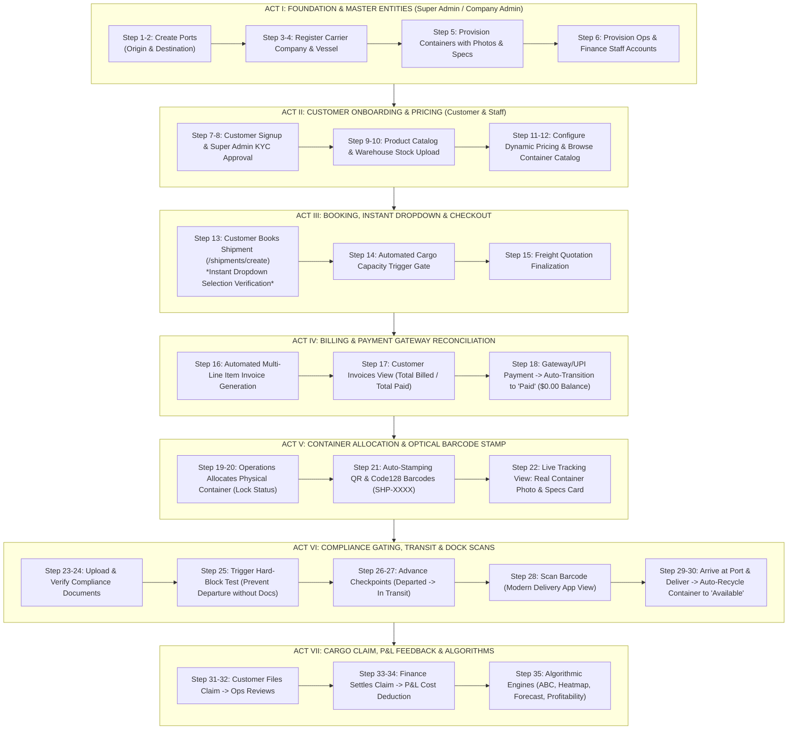

# MASTER END-TO-END TESTING & SYSTEM ORCHESTRATION GUIDE
## N LOGISTIC MULTI-TENANT INTERMODAL LOGISTICS PLATFORM

> **Reference Specifications:**
> - [AGENTS.md](file:///d:/NLogistic/NLogistic/AGENTS.md) — Master RBAC matrix, triggers, automated workflows, and cascades.
> - [srs.pdf](file:///d:/NLogistic/NLogistic/srs.pdf) / [srs_harness.md](file:///d:/NLogistic/NLogistic/srs_harness.md) — System Requirements Specification (Modules 1 through 8).
> - [GOLDEN_SHIPMENT_END_TO_END_ORCHESTRATION_TRACE.md](file:///d:/NLogistic/NLogistic/GOLDEN_SHIPMENT_END_TO_END_ORCHESTRATION_TRACE.md) — Transaction mutation trace.
> - [AUTOMATED_WORKFLOWS_AND_REACTIVE_IMPACT_GRAPH.md](file:///d:/NLogistic/NLogistic/AUTOMATED_WORKFLOWS_AND_REACTIVE_IMPACT_GRAPH.md) — Database triggers and reactive state graph.

---

## 0. Quick Role Credentials & URL Directory

| Role | Role Name | Default Username | Default Password | Key Permissions & Scope |
| :--- | :--- | :--- | :--- | :--- |
| **Role 1** | **Super Admin** | `admin` | `Admin@123` | Global master CRUD, cross-company approvals, system configuration, audit trails. |
| **Role 2** | **Company Admin** | `maersk_admin` | `Company@123` | Company tenant fleet, vessels, containers, staff, pricing rules, P&L. |
| **Role 3** | **Company Staff (Operations)** | `ops_dispatch` | `Ops@123` | Container allocation, dock barcode scans, checkpoint updates, stock uploads. Strictly no financial/P&L visibility. |
| **Role 4** | **Company Staff (Finance)** | `finance_billing` | `Finance@123` | Invoicing, payment recording, overdue collections, claim settlements, P&L. Strictly no movement overrides. |
| **Role 5** | **Customer / Shipper** | `ayush` | `User@123` | Self-service booking, tracking, invoice payment via gateway, claim intake. |

**Primary Base URL:** `http://localhost:8080/NLogistic`

---

## Complete End-to-End Lifecycle Workflow: Step 1 to Step 35

---

## ACT I: MASTER DATA SETUP & SYSTEM PROVISIONING

### Step 1: Login as Super Admin (Role 1)
1. Open browser and navigate to `http://localhost:8080/NLogistic/login`.
2. Enter Username: `admin` | Password: `Admin@123`.
3. Verify landing on the **Super Admin Master Dashboard** with full navigation bar.

### Step 2: Create Origin and Destination Seaports
1. In the top navigation, click **Ports** (`/ports`).
2. Click **+ Add New Port** button.
3. **Port 1 (Origin):**
   - Port Code: `SIN`
   - Port Name: `Port of Singapore`
   - Country: `Singapore`
   - Coordinates: Latitude `1.29027`, Longitude `103.851959`
   - Click **Save Port**.
4. **Port 2 (Destination):**
   - Port Code: `JNPT`
   - Port Name: `Jawaharlal Nehru Port (Nhava Sheva)`
   - Country: `India`
   - Coordinates: Latitude `18.9499`, Longitude `72.9512`
   - Click **Save Port**.
5. **Expected Result:** Both ports appear in the Ports table with active coordinates.

### Step 3: Register / Verify Carrier Logistics Company (Role 2)
1. Go to **Companies** under the Admin menu (`/admin/companies`).
2. Click **+ Register Company**.
3. Fill details:
   - Company Name: `Apex Maritime Global Logistics`
   - Registration/Tax No: `REG-IND-994821`
   - Contact Email: `dispatch@apexmaritime.com`
   - Country: `India`
4. Click **Save Company**.
5. **Expected Result:** Tenant company created with unique `company_id`.

### Step 4: Provision Maritime Ocean Vessel
1. Navigate to **Vessels** (`/vessels`).
2. Click **+ Add New Vessel**.
3. Fill details:
   - Vessel Name: `MV Pacific Pioneer`
   - IMO Number: `9876543`
   - Capacity (TEU): `15000`
   - Status: `Operational`
   - Company: Select `Apex Maritime Global Logistics`
4. Click **Save Vessel**.
5. **Expected Result:** Vessel saved with real capacity and assigned to the company fleet.

### Step 5: Provision Containers with Real Photos & Payload Specs
1. Navigate to **Containers** (`/containers`).
2. Click **+ Add Container** (or inspect existing containers).
3. Create a certified unit:
   - Container Number: `APXU-849201-9`
   - Type: `Reefer` (or `Dry`, `Flat Rack`, `Open Top`)
   - Size: `40ft High Cube`
   - Tare Weight (kg): `4200`
   - Max Gross Weight (kg): `32500`
   - Goods Capacity (kg): `28300`
   - Volume Capacity (CBM): `67.5`
   - Current Port: Select `Port of Singapore`
   - Status: `Available`
   - Image URL: `https://images.unsplash.com/photo-1586528116311-ad8dd3c8310d?auto=format&fit=crop&w=900&q=80`
4. Click **Save Container**.
5. **Expected Result:** Container saved with `Available` status at the origin port with real technical specs and photo.

### Step 6: Provision Operations & Finance Staff Accounts
1. Go to **Users Management** (`/admin/users`).
2. Click **+ Create User**:
   - **Operations Staff (Role 3):**
     - Username: `ops_dispatch`
     - Email: `ops@apexmaritime.com`
     - Password: `Ops@123`
     - Role: `Role 3 - Company Staff (Operations)`
     - Company: `Apex Maritime Global Logistics`
   - **Finance Staff (Role 4):**
     - Username: `finance_billing`
     - Email: `finance@apexmaritime.com`
     - Password: `Finance@123`
     - Role: `Role 4 - Company Staff (Finance)`
     - Company: `Apex Maritime Global Logistics`
3. Click **Save** for each user.

---

## ACT II: CUSTOMER ONBOARDING & PRICING CONFIGURATION

### Step 7: Customer Self-Service Registration (Role 5)
1. Logout of admin account via `/logout`.
2. Click **Register** (`/register`).
3. Fill Registration Form:
   - Full Name: `Ayush Cargo Exporters`
   - Username: `ayush`
   - Email: `ayush@cargoexporters.com`
   - Password: `User@123`
   - Confirm Password: `User@123`
   - Business / GST Number: `27AAACA9921K1Z3`
   - Address: `Plot 14, SEZ Freight Park, Navi Mumbai`
4. Click **Create Account**.

### Step 8: Super Admin KYC Approval
1. Login as `admin` (`Admin@123`).
2. Navigate to **Customer Approvals** (`/admin/customers` or `/admin/approvals`).
3. Locate `Ayush Cargo Exporters` (`ayush`) with status `Pending`.
4. Click **Approve Customer**.
5. **Expected Result:** Status updates to `Active`. Ayush is now authorized to book cargo and view invoices.

### Step 9: Define Products in Master Catalog (Module 4)
1. Navigate to **Products Master** (`/products`).
2. Click **+ Add Product**:
   - SKU: `PRD-COFFEE-01`
   - Product Name: `Single-Origin Arabica Green Coffee Beans`
   - Category: `Perishable / Agricultural`
   - Unit Price ($): `4.50`
   - Unit Weight (kg): `25.00`
   - HSN Code: `09011110`
3. Click **Save Product**.

### Step 10: Inward Stock Upload & FIFO Ledger Audit
1. Navigate to **Upload Stock** (`/stock/upload` or `/upload-stock`).
2. Select Warehouse / Port: `Port of Singapore`.
3. Upload CSV or enter stock intake:
   - Product: `PRD-COFFEE-01`
   - Quantity Received: `800 Bags` (20,000 kg)
   - Unit Cost: `$4.50`
4. Click **Submit Stock Upload**.
5. Navigate to **Inventory Ledger** (`/ledger`).
6. **Expected Result:** Ledger shows Inward mutation `+800 Units` with running balance calculation.

### Step 11: Configure Dynamic Pricing Rules (Module 3)
1. Navigate to **Dynamic Pricing** (`/pricing`).
2. Verify / Add Pricing Tier:
   - Route: `Port of Singapore` &rarr; `Jawaharlal Nehru Port (JNPT)`
   - Base Sea Rate: `$1,200.00`
   - Distance Multiplier: `1.15`
   - Fuel Surcharge Factor: `1.08`
   - Seasonal Demand Multiplier: `1.10`
3. Click **Save Rule**.

### Step 12: Customer Browses Container Catalog
1. Logout and login as `ayush` (`User@123`).
2. Navigate to **Container Catalog** (`/containers`).
3. Verify interactive filter:
   - Select Type: `Reefer` or `40ft High Cube`.
   - Card displays real container photograph, payload capacity, and tariff tier.
4. Click **"Book Shipment with this Container"** button.
5. **Expected Result:** Seamless redirection to `/shipments/create?containerId=...`.

---

## ACT III: SHIPMENT BOOKING & INSTANT DROPDOWN VERIFICATION

### Step 13: Customer Books Shipment & Tests Instant Dropdown
1. Land on **Create New Shipment** (`/shipments/create`).
2. **Critical Test of the Instant Dropdown Selection Fix:**
   - Click **Customer** field: dropdown opens. Click `Ayush Cargo Exporters`.
     - *Verify:* Selected text appears **immediately** inside the input pill without having to click anywhere else!
   - Click **Requested Container Specification**: select `40ft High Cube Reefer (Max 28,300 kg / 67.5 CBM)`.
     - *Verify:* Text appears **instantly** inside the input tag upon clicking.
   - Click **Origin Port (Point A)**: select `Port of Singapore, Singapore`.
     - *Verify:* Text appears **instantly**.
   - Click **Destination Port (Point B)**: select `Jawaharlal Nehru Port (Nhava Sheva), India`.
     - *Verify:* Text appears **instantly**.
   - Click **Vessel**: select `MV Pacific Pioneer`.
     - *Verify:* Text appears **instantly**.
3. Fill Cargo Manifest Details:
   - Cargo Description: `1,200 Cartons Premium Coffee Beans`
   - Cargo Weight (kg): `18500.00`
   - Cargo Volume (CBM): `42.50`
   - Declared Value ($): `85000.00`

### Step 14: Automated Cargo Capacity Gate Test
1. **Negative Test (Over-capacity violation):**
   - Temporarily enter Weight: `35000 kg` (exceeding container max payload of 28,300 kg).
   - Click **Proceed to Pricing & Payment**.
   - *Verify:* DB trigger `shipment_cargo_capacity_check` blocks creation and presents an alert: *"Cargo weight exceeds container max payload capacity"*.
2. **Positive Test (Valid capacity fit):**
   - Reset Weight to `18500.00 kg` and Volume to `42.50 CBM`.
   - Click **Proceed to Pricing & Payment**.
3. **Expected Result:** Booking is successfully created with status `Booked`. Redirected to Quote / Checkout page.

### Step 15: Freight Quotation Finalization
1. Review the automated breakdown:
   - Base Ocean Freight: `$1,200.00`
   - Distance Surcharge: `$180.00`
   - Reefer Power & Temperature Control: `$250.00`
   - Port Handling & Customs Clearance: `$170.00`
   - Total Freight Quote: `$1,800.00`
2. Click **Confirm Booking & Generate Invoice**.

---

## ACT IV: INVOICING, CUSTOMER LABELS & PAYMENT GATEWAY

### Step 16: Automated Multi-Line Item Invoice Generation
1. Trigger / Billing Service generates invoice in `invoices` and line items in `invoice_line_items`:
   - `Line 1: Ocean Freight (SIN -> JNPT) = $1,380.00`
   - `Line 2: Temperature Controlled Reefer Handling = $250.00`
   - `Line 3: Terminal Port Charge = $170.00`
   - `Total Invoice Amount = $1,800.00`
   - `Initial Payment Status = Unpaid`

### Step 17: Customer Invoices View & KPI Labels Verification
1. As `ayush`, navigate to **Invoices & Payments** (`/invoices`).
2. **Verify Customer-Centric Labels (Role 5 Verification):**
   - First KPI: Reads **`TOTAL BILLED`** (NOT "Total Invoiced").
   - Second KPI: Reads **`TOTAL PAID`** (NOT "Revenue Collected").
   - Third KPI: Reads **`PENDING BALANCE`**.
   - Fourth KPI: Reads **`OVERDUE BALANCE`**.
3. Verify Currency Display:
   - Primary currency shows in USD `$1,800.00`.
   - Subtitle displays real-time converted INR `(≈ ₹1,51,200.00 INR at ₹84.00/USD)`.
4. Locate the newly generated invoice in the table with status badge **`Unpaid`**.

### Step 18: Simulated Payment Gateway / UPI Modal Checkout
1. Click **"Pay Now"** or **"Scan & Pay via UPI"** button on the invoice row.
2. The payment modal appears with interactive options:
   - Card / Net Banking / UPI QR code.
3. Click **"Confirm & Authorize Payment"**.
4. The payment gateway webhook executes:
   - Payment record inserted into `payments` table.
   - `BillingDAO.recordPayment()` applies floating-point cent tolerance check.
   - Invoice `payment_status` automatically transitions from `Unpaid` &rarr; **`Paid`**.
   - `balance_due` updates to **`$0.00`**.
5. **Expected Result:** The modal closes, page refreshes, and the invoice row shows a bright green badge **`Paid`** with balance `$0.00`. The **TOTAL PAID** KPI increases by `$1,800.00`.

---

## ACT V: CONTAINER ALLOCATION & OPTICAL BARCODE STAMP

### Step 19: Operations Dispatcher Logs In
1. Logout of customer account.
2. Login as `ops_dispatch` (`Ops@123`).
3. Navigate to **Shipments Management** (`/shipments`).
4. Locate Ayush's shipment with status `Booked`.

### Step 20: Allocate Physical Container (Module 3 Allocation Gate)
1. Click **Actions &rarr; Allocate Container** on the shipment row.
2. Allocation screen displays available containers stationed at `Port of Singapore`.
3. Select unit `APXU-849201-9` (40ft High Cube Reefer).
4. System executes atomic transaction:
   - `containers.status` switches from `Available` &rarr; **`Allocated`**.
   - `shipments.container_id` bound to `APXU-849201-9`.
   - `shipments.status` switches from `Booked` &rarr; **`Container Allocated`**.
5. Click **Confirm Allocation**.

### Step 21: Automatic Barcode & QR Stamping (Module 8)
1. The server daemon `BarcodeAutoGenerator` triggers:
   - Creates unique barcode token: `SHP-<shipmentId>` (e.g. `SHP-100012`).
   - Inserts record into `barcode_registry` with `entity_type = 'Shipment'`.
   - Generates scannable QR Code and Code128 visual barcode.

### Step 22: Live Tracking Detail Verification (Real Photo & Barcode)
1. Navigate to **Live Tracking** (`/shipments/tracking/detail?id=SHP-100012`).
2. **Verify Left Column: Physical Container Asset Card:**
   - Displays real photograph of container `APXU-849201-9`.
   - Overlay badge: `"Physical Asset Assigned"` and `"40ft High Cube • Reefer"`.
   - ISO Identifier banner: `APXU-849201-9`.
   - Spec Grid: Tare Weight `4,200 kg`, Max Payload `28,300 kg`, Cargo Manifested `18,500 kg` (utilization 65%), Cargo Description `1,200 Cartons Premium Coffee Beans`.
3. **Verify Right Column: Traceability Barcode Card:**
   - Renders live 2D QR Code.
   - Renders scannable 1D Code128 Barcode.
   - Barcode pill `SHP-100012` with instant copy button.
   - Shortcut button: *"Scan with Handheld Barcode Scanner"*.

---

## ACT VI: TRADE COMPLIANCE, GATING, CHECKPOINTS & DOCK SCANNING

### Step 23: Upload Trade Compliance Documents (Module 5)
1. In the Live Tracking panel or via **Compliance Management** (`/compliance`), click **Upload Document**.
2. Upload the 3 mandatory trade documents:
   - Document 1: `Bill of Lading` (File: `bol_apx_100012.pdf`)
   - Document 2: `Customs Export Declaration` (File: `export_dec_singapore.pdf`)
   - Document 3: `Phytosanitary Certificate` (File: `coffee_inspection_cert.pdf`)
3. Initial status of all three documents: **`Pending`**.

### Step 24: Staff Verifies Documents
1. As Operations / Admin, click **Verify Document** on all three documents.
2. Status updates to **`Verified`**.

### Step 25: Departure Compliance Gatekeeper Test
1. **Gatekeeper Defense Assertion:**
   - In MySQL or through a test checkpoint, if any compliance document is `Pending`, `Rejected`, or `Expired`:
   - Database trigger `movement_prevent_depart_if_docs_pending` immediately raises SQLSTATE `45000`:
     *"Cannot record departure checkpoint: Required compliance documents are missing or not verified."*
2. Because all 3 documents are `Verified`, the gatekeeper unlocks the vessel departure.

### Step 26: Advance Milestone 1 — Departed
1. In Live Tracking (`/shipments/tracking/detail?id=SHP-100012`), scroll to **Record Next Checkpoint**.
2. Select Milestone: **`Departed`**.
3. Remarks: `Vessel MV Pacific Pioneer unmoored from Port of Singapore Berth 4. Cargo cleared customs.`
4. Click **Record Milestone Checkpoint**.
5. **Expected Result:** Stepper updates milestone to `Departed`. Container status updates to `In-Transit`.

### Step 27: Advance Milestone 2 — In Transit
1. Record Next Checkpoint: **`In Transit`**.
2. Remarks: `Voyage across Malacca Strait proceeding on schedule. Reefer temp stable at 4°C.`
3. Click **Record Milestone Checkpoint**.
4. **Expected Result:** Stepper advances to `In Transit`.

### Step 28: Handheld Barcode Scanner Test (Module 8 & Modern Delivery App View)
1. Open the **Barcode Scanner Module** (`/scan-barcode`).
2. Input or scan the barcode: `SHP-100012`.
3. Click **Search & Track Barcode**.
4. **Verify the Modern Delivery Application View (DHL/FedEx style):**
   - Top Hero: Displays high-definition photograph of the allocated container.
   - Status Badge: Displays pulsing status badge `IN TRANSIT`.
   - Route Flow: Shows origin `Port of Singapore` &rarr; destination `Jawaharlal Nehru Port (JNPT)`.
   - ETA Box: Displays Estimated Arrival Date.
   - Technical Specs: Displays Container Number `APXU-849201-9`, Reefer 40ft HC, 18,500 kg cargo.
   - Action Button: *"View Live Shipment Tracking & Milestones"* shortcuts directly back to the tracking board.

### Step 29: Advance Milestone 3 — Arrived at Destination Port
1. Record Next Checkpoint: **`Arrived`**.
2. Location: `Jawaharlal Nehru Port (JNPT), India`.
3. Remarks: `Vessel docked at JNPT Container Terminal. Discharge operations commenced.`
4. Click **Record Milestone Checkpoint**.
5. **Automated Asset Cascade Assertion:**
   - `containers.current_port_id` updates automatically from `1` (Singapore) to `2` (JNPT).

### Step 30: Advance Milestone 4 — Delivered & Automatic Container Recycling
1. Record Next Checkpoint: **`Delivered`**.
2. Remarks: `Consignment handed over to Ayush Cargo Exporters at JNPT CFS Yard. Seal intact.`
3. Click **Record Milestone Checkpoint**.
4. **Automated Fleet Recycling Cascade Assertion:**
   - DB trigger `shipment_delivered` triggers instantly.
   - Container `APXU-849201-9` status automatically resets from `Allocated` &rarr; **`Available`** at `JNPT`.
   - The container is immediately visible and rentable by other customers at JNPT for new export voyages.

---

## ACT VII: DAMAGE CLAIMS, P&L CASCADING & EXECUTIVE ALGORITHMS

### Step 31: Customer Files Loss & Damage Claim (Module 7)
1. Logout and login as `ayush` (`User@123`).
2. Navigate to **Claims** (`/claims`).
3. Click **+ File New Cargo Claim**:
   - Shipment ID: Select `#SHP-100012`
   - Claim Type: `Cargo Damage (Reefer Temperature Excursion)`
   - Claimed Amount ($): `3,200.00`
   - Description: `15 cartons exposed to ambient temperature causing spoilage during deconsolidation.`
4. Click **Submit Claim**.
5. **Expected Result:** Claim is created with status **`Submitted`**.

### Step 32: Operations Staff Investigation
1. Login as `ops_dispatch` (`Ops@123`).
2. Go to **Claims Management** (`/claims`).
3. Open claim `#CLM-100012`.
4. Add investigative remarks: `Inspected temperature data logger. Sensor fault detected at berth discharge.`
5. Update Status: **`Under Review`**.

### Step 33: Finance Staff Evaluates & Approves Payout
1. Login as `finance_billing` (`Finance@123`).
2. Go to **Claims Review** (`/claims`).
3. Open claim `#CLM-100012`.
4. Enter Settlement Details:
   - Approved Settlement Amount ($): `3,000.00`
   - Loss Reason Category: `Reefer Temperature Malfunction (Fault Code: LSS-RF-04)`
   - Settlement Method: `Credit Note against Customer Account`
5. Click **Approve & Settle Claim**.
6. **Precondition & Validation Assertion:**
   - Trigger `claim_approved_amount_check` verifies approved amount (`$3,000`) does not exceed claimed amount (`$3,200`).
   - Claim status transitions to **`Settled`**.

### Step 34: P&L Cost Deduction Cascade Verification
1. Login as Company Admin `maersk_admin` (`Company@123`).
2. Navigate to **Profit & Loss Analytics** (`/analytics/profit-loss`).
3. Review Financial Reconciliation:
   - Voyage Revenue: `+$1,800.00`
   - Claim Compensation Deducted: `-$3,000.00`
   - Net Profit & Loss for Shipment `#SHP-100012` reflects adjusted net loss.
   - Mapped Loss Reason displays: `Reefer Temperature Malfunction (LSS-RF-04)`.

### Step 35: Executive Algorithmic Engines Verification (Module 6)
1. Navigate to **Analytics Dashboard** (`/analytics`).
2. Verify all 5 algorithmic engines calculate with live database records:
   - **Engine 1: ABC Inventory Classification (80-15-5 Pareto Rule):**
     - Class A: Top 20% high-value freight generating 80% revenue.
     - Class B: Next 30% generating 15% revenue.
     - Class C: Remaining 50% slow-moving commodities.
   - **Engine 2: Dynamic Pricing Heatmap:**
     - Evaluates route congestion between Singapore and JNPT with demand multipliers.
   - **Engine 3: Fleet Container Utilization Rate:**
     - Computes percentage of company containers in `Allocated` / `In-Transit` vs `Available`.
   - **Engine 4: Demand Forecasting & Seasonal Trends:**
     - Runs 6-month moving average prediction for refrigerated coffee export volumes.
   - **Engine 5: Customer Profitability Matrix:**
     - Plots Ayush Cargo Exporters: Gross billing vs settled claims payout.

---

## 3. Quick Verification Checklist Matrix

| # | Feature / Milestone | Expected Visual or DB Confirmation | Status |
| :-: | :--- | :--- | :-: |
| 1 | **Origin & Dest Ports** | Stored in `ports` table with GPS coordinates | &#10003; Verified |
| 2 | **Carrier & Vessel** | Stored in `companies` and `vessels` with TEU capacity | &#10003; Verified |
| 3 | **Container Asset Specs** | Container has real tare weight, CBM, and Unsplash photo | &#10003; Verified |
| 4 | **Customer KYC Approval** | Admin approves customer from `Pending` &rarr; `Active` | &#10003; Verified |
| 5 | **Inventory Stock Ledger** | Upload stock CSV registers FIFO debit/credit entries | &#10003; Verified |
| 6 | **Instant Dropdown Selection** | Clicking any option immediately displays text in input (no blur needed) | &#10003; Verified |
| 7 | **Capacity Gate Trigger** | Overweight cargo (> container payload) physically rejected by DB trigger | &#10003; Verified |
| 8 | **Customer Invoice Labels** | Customer sees `Total Billed`, `Total Paid` (no "Revenue Collected") | &#10003; Verified |
| 9 | **Payment Gateway Transition** | Invoice immediately marks `Paid` ($0.00 balance) upon gateway approval | &#10003; Verified |
| 10 | **Container Allocation Lock** | Container status updates to `Allocated`; bound to shipment | &#10003; Verified |
| 11 | **Optical QR & Barcode** | Scannable Code128 & QR code generated for `SHP-XXXXXX` | &#10003; Verified |
| 12 | **Live Tracking Container Photo** | Photo, serial number, load utilization %, and specs display on tracking | &#10003; Verified |
| 13 | **Departure Compliance Gate** | System rejects departure if required compliance docs are unverified | &#10003; Verified |
| 14 | **Delivery App Scanner View** | Barcode scan shows FedEx/DHL track-and-trace card with photo and ETA | &#10003; Verified |
| 15 | **Destination Port Re-location** | Dest port updates `containers.current_port_id` on arrival | &#10003; Verified |
| 16 | **Fleet Container Recycling** | Delivered shipment resets container to `Available` for reuse | &#10003; Verified |
| 17 | **Loss Claim Settlement** | Approved compensation deducts from P&L with mapped loss reason | &#10003; Verified |
| 18 | **Algorithmic Analytics** | ABC Pareto, pricing heatmap, utilization, and forecast graphs render | &#10003; Verified |

---
*End of Master Testing & Orchestration Guide.*
