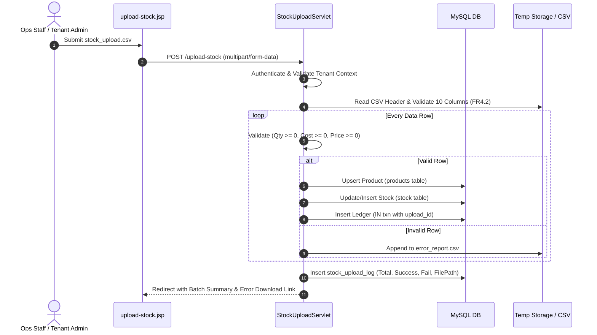

# MODULE 4: UPLOAD STOCK DETAILS & INVENTORY LEDGER — FORENSIC GAP ANALYSIS, USE CASE SPECIFICATION & IMPLEMENTATION ROADMAP

> **Document Status:** Master Architecture & Implementation Blueprint  
> **Target Module:** Module 4 — Upload Stock Details & Inventory Ledger ([srs_harness.md](file:///d:/NLogistic/NLogistic/srs_harness.md#L107-L114))  
> **Related System Specs:** [CLAUDE.md](file:///d:/NLogistic/NLogistic/CLAUDE.md), [SYSTEM_WORKFLOW_AND_ENTITY_RELATIONSHIPS.md](file:///d:/NLogistic/NLogistic/SYSTEM_WORKFLOW_AND_ENTITY_RELATIONSHIPS.md), [SYSTEM_GAPS_AND_MISSING_FEATURES.md](file:///d:/NLogistic/NLogistic/SYSTEM_GAPS_AND_MISSING_FEATURES.md)  
> **Associated Algorithms:** Section 5.2 (ABC Classification / Pareto), Section 5.3 (Inventory Turnover Ratio), Section 5.4 (Product Profitability Analysis)  

---

## 1. EXECUTIVE SUMMARY & MODULE SCOPE

Module 4 serves as the physical goods and ledger accounting engine of the N-LOGISTIC platform. It manages the lifecycle of inventory across tenant warehouses, ensuring that every physical SKU introduced, moved, sold, or written off is tracked with double-entry immutability in `inventory_ledger`. This provides foundational transactional data for downstream financial reporting (Module 2 P&L), analytics (Module 6 ABC analysis, Inventory Turnover, and Demand Forecasting), and cargo allocation (Module 3).

### 1.1 Core Functional Requirements (SRS FR4.1 – FR4.6)

| Req ID | SRS Specification | Target Entities | Business Invariant |
| :--- | :--- | :--- | :--- |
| **FR4.1** | Company staff shall be able to upload stock/inventory details in bulk (CSV/Excel) or via manual entry. | `stock`, `products`, `stock_upload_log` | Dual ingestion channels (batch file stream + interactive modal form). Super Admin manages globally; Company Staff manages tenant fleet. |
| **FR4.2** | Required stock fields: product name, category, HSN code, unit of measure, quantity, unit cost, unit selling price, warehouse/location, optional batch/lot number and expiry date. | `products`, `stock` | Exact 10-column canonical schema. Upserts product catalog master if SKU is novel; updates warehouse on-hand ledger. |
| **FR4.3** | Each uploaded row shall be validated (quantity ≥ 0, unit cost ≥ 0, unit price ≥ 0); invalid rows are rejected with a downloadable error report while valid rows are committed. | `stock_upload_log`, `temp_error_file` | Partial transaction commit: valid rows MUST commit; invalid rows MUST be captured in a downloadable CSV report with row number and reason. |
| **FR4.4** | The system shall maintain an upload log capturing uploader, timestamp, file name, and success/failure counts for traceability. | `stock_upload_log` | Every bulk attempt generates an immutable batch record storing `upload_id`, `company_id`, `uploaded_by`, `total_records`, `success_count`, `failure_count`. |
| **FR4.5** | Every stock change (upload, sale, adjustment) shall create an inventory ledger entry (IN/OUT with quantity and reference) — required for accurate Inventory Turnover computation. | `inventory_ledger` | Append-only event store: `transaction_type` $\in$ {IN, OUT, ADJUSTMENT}, `unit_cost_at_txn`, `reference_type`, `reference_id`. Direct feed to Algo 5.3. |
| **FR4.6** | Stock adjustments for damage or write-off shall require a mandatory reason, feeding into loss reporting and Product Profitability Analysis. | `stock`, `inventory_ledger`, `profit_loss`, `loss_reasons` | Mandatory justification check server-side. Monetary loss (`quantity * unit_cost`) MUST post into `profit_loss` under linked `loss_reasons` (Disconnect 5). |

### 1.2 Module RBAC Matrix (CLAUDE.md & AGENTS.md Enforcement)

```
===================================================================================================================
ACTION / CAPABILITY             SUPER ADMIN (1)   COMPANY ADMIN (2)  OPS STAFF (3)  FINANCE STAFF (4)  CUSTOMER (5)
-------------------------------------------------------------------------------------------------------------------
Bulk Stock Upload (CSV)         YES (Any Tenant)  YES (Own Tenant)   YES (Own Co)   FORBIDDEN (403)    FORBIDDEN (403)
Manual Stock Entry              YES (Any Tenant)  YES (Own Tenant)   YES (Own Co)   FORBIDDEN (403)    FORBIDDEN (403)
Stock Damage Write-Off          YES (Any Tenant)  YES (Own Tenant)   YES (Own Co)   FORBIDDEN (403)    FORBIDDEN (403)
Download Error Report           YES (Any Tenant)  YES (Own Tenant)   YES (Own Co)   FORBIDDEN (403)    FORBIDDEN (403)
View Stock Inventory Overview   YES (Global/Co)   YES (Own Tenant)   YES (Own Co)   FORBIDDEN (403)*   FORBIDDEN (403)
View Inventory Ledger           YES (Global/Co)   YES (Own Tenant)   YES (Own Co)   VIEW ONLY (Read)   FORBIDDEN (403)
Product Master Catalog CRUD     YES (Global)      YES (Own Tenant)   YES (Own Co)   VIEW ONLY (Read)   FORBIDDEN (403)
===================================================================================================================
* Note: Finance Staff (Role 4) has zero operational dock/warehouse access; financial ledger views are accessible
  solely through P&L and billing reports. Customers (Role 5) are strictly quarantined from internal warehouse balances.
```

---

## 2. EXHAUSTIVE SRS VS. CODEBASE AUDIT

A line-by-line inspection of the active codebase reveals significant bifurcations, parallel implementations, schema mismatches, and tenancy bypasses across Module 4 components:

```
                  ┌──────────────────────────────────────────────────────────────────┐
                  │               DUAL DISCONNECTED STOCK PATHWAYS                   │
                  └──────────────────────────────────────────────────────────────────┘
                                   /                             \
                                  /                               \
     PATHWAY A: Modern Enterprise UI Flow             PATHWAY B: Legacy Fragmented Flow
     ---------------------------------------         -------------------------------------
     • Controller: StockUploadServlet.java           • Controller: InventoryServlet.java
     • Manual:     ManualStockServlet.java           • Upload:     StockDAO.uploadStockCsv()
     • Adjust:     StockAdjustmentServlet.java       • Adjust:     StockDAO.adjustStock()
     • View:       upload-stock.jsp (1170 lines)     • Sale:       StockDAO.recordSale()
     • Status:     Validates 10 columns (FR4.2)      • View:       stock.jsp (562 lines)
     • Error:      Writes temp CSV & URL encodes     • Status:     CRASHES: Expects 6 columns
                                                                   starting with DB productId!
```

### 2.1 Detailed Requirement Traceability Matrix

| SRS Req | Architectural Location in Codebase | Implementation Details & Gaps | Compliance Grade |
| :--- | :--- | :--- | :--- |
| **FR4.1** (Bulk & Manual Ingestion) | [StockUploadServlet.java:311-552](file:///d:/NLogistic/NLogistic/src/main/java/com/nlogistic/controller/StockUploadServlet.java#L311-L552)<br>[ManualStockServlet.java:32-225](file:///d:/NLogistic/NLogistic/src/main/java/com/nlogistic/controller/ManualStockServlet.java#L32-L225)<br>[InventoryServlet.java:118-133](file:///d:/NLogistic/NLogistic/src/main/java/com/nlogistic/controller/InventoryServlet.java#L118-L133) | **Split Implementation:** Dual competing servlets. `StockUploadServlet` handles multi-part bulk CSV; `ManualStockServlet` handles interactive form. However, `InventoryServlet` hosts a legacy `/stock/upload` route calling `StockDAO.uploadStockCsv` which fails on standard CSV templates. | ⚠️ Partial (Duplicate Routes) |
| **FR4.2** (10 Required Stock Fields) | [stock_template.csv:1-3](file:///d:/NLogistic/NLogistic/src/main/webapp/assets/templates/stock_template.csv#L1-L3)<br>[StockUploadServlet.java:361-385](file:///d:/NLogistic/NLogistic/src/main/java/com/nlogistic/controller/StockUploadServlet.java#L361-L385)<br>[StockDAO.java:121-137](file:///d:/NLogistic/NLogistic/src/main/java/com/nlogistic/dao/StockDAO.java#L121-L137) | **Severe Schema Inconsistency:** `stock_template.csv` defines canonical 10 fields: `ProductName,Category,HSNCode,UOM,Quantity,UnitCost,UnitPrice,WarehouseLocation,BatchNo,ExpiryDate`. `StockUploadServlet` parses all 10 fields correctly. BUT `StockDAO.uploadStockCsv()` expects 6 fields: `productId,warehouseLocation,quantity,unitCost,batchNo,expiryDate`, throwing `NumberFormatException` when passed template CSV. | ❌ Critical Defect |
| **FR4.3** (Validation & Error Report) | [StockUploadServlet.java:368-384](file:///d:/NLogistic/NLogistic/src/main/java/com/nlogistic/controller/StockUploadServlet.java#L368-L384)<br>[DownloadErrorServlet.java:19-59](file:///d:/NLogistic/NLogistic/src/main/java/com/nlogistic/controller/DownloadErrorServlet.java#L19-L59) | Validates non-negative quantity, cost, price. Commits valid rows; generates error CSV in temp directory. **Security Hole:** `DownloadErrorServlet` lacks user authentication and company validation; any unauthenticated requester can stream temp CSVs. | ⚠️ Flawed Security |
| **FR4.4** (Traceability & Upload Log) | [StockUploadServlet.java:521-532](file:///d:/NLogistic/NLogistic/src/main/java/com/nlogistic/controller/StockUploadServlet.java#L521-L532)<br>[StockDAO.java:91-100](file:///d:/NLogistic/NLogistic/src/main/java/com/nlogistic/dao/StockDAO.java#L91-L100) | Log records inserted into `stock_upload_log` (`company_id`, `uploaded_by`, `file_name`, `total_records`, `success_count`, `failure_count`, `error_report_path`). Traceability exists but lacks rollback audit logs. | ✅ Compliant |
| **FR4.5** (Inventory Ledger Immutability) | [StockUploadServlet.java:422,501-506](file:///d:/NLogistic/NLogistic/src/main/java/com/nlogistic/controller/StockUploadServlet.java#L501-L506)<br>[ManualStockServlet.java:198-204](file:///d:/NLogistic/NLogistic/src/main/java/com/nlogistic/controller/ManualStockServlet.java#L198-L204)<br>[LedgerServlet.java:42-57](file:///d:/NLogistic/NLogistic/src/main/java/com/nlogistic/controller/LedgerServlet.java#L42-L57) | Writes `IN` transaction upon bulk upload and manual entry. **Missing FK Link:** `reference_id` is set to NULL instead of linking to `upload_id` or `stock_id`. Furthermore, `LedgerServlet` joins `stock` to filter by company, which leaks ledger records if multiple companies hold the same global SKU! | ⚠️ Flawed FK & Tenancy |
| **FR4.6** (Damage Adjustment & P&L Feed) | [StockAdjustmentServlet.java:37-100](file:///d:/NLogistic/NLogistic/src/main/java/com/nlogistic/controller/StockAdjustmentServlet.java#L37-L100)<br>[SYSTEM_GAPS_AND_MISSING_FEATURES.md:138-145](file:///d:/NLogistic/NLogistic/SYSTEM_GAPS_AND_MISSING_FEATURES.md#L138-L145) | **Disconnect 5 Unresolved:** Reason is mandatory, and deduction updates `stock` and writes `OUT` to `inventory_ledger`. **HOWEVER**, monetary loss is NEVER posted to `profit_loss`, never linked to `loss_reasons`, and never reflected in Product Profitability Analysis (Algo 5.4). | ❌ Critical Architecture Gap |

---

## 3. FORENSIC ARCHITECTURAL GAP ANALYSIS & DEFECT CATALOG

### Gap 1: Incompatible Dual Stock Ingestion Pipelines

The application has two separate, desynchronized entry points for stock management:
1. **Modern Flow:** Exposed via navigation header [header.jsp:2361](file:///d:/NLogistic/NLogistic/src/main/webapp/jsp/layout/header.jsp#L2361) to `/upload-stock`, routed to `StockUploadServlet.java` and rendering `upload-stock.jsp`. It correctly implements tabs for Overview, Bulk Upload, Manual Entry, and Upload History.
2. **Legacy Flow:** Exposed via navigation header [header.jsp:2363](file:///d:/NLogistic/NLogistic/src/main/webapp/jsp/layout/header.jsp#L2363) to `/inventory/stock`, routed to `InventoryServlet.java` and rendering `stock.jsp`.
   - On `stock.jsp:98`, clicking "Upload CSV" opens `#uploadCsvModal` which posts to `${pageContext.request.contextPath}/inventory/stock/upload`.
   - `InventoryServlet.java:124` forwards this stream to `StockDAO.uploadStockCsv()`.
   - `StockDAO.uploadStockCsv()` splits by comma and attempts `Integer.parseInt(cols[0].trim())` assuming column 0 is `product_id`!
   - When users download the official template (`stock_template.csv`), column 0 is `ProductName` ("Sample Product 1"). The upload throws a `NumberFormatException` on every row and fails completely.

### Gap 2: Multi-Tenancy Data Leak in StockDAO & Inventory Ledger

In a multi-tenant enterprise system, Company A must never view Company B's warehouse inventory or movement history.
- In `StockDAO.java:22`:
  ```java
  public List<Stock> getAllStock() {
      String sql = "SELECT s.*, p.product_name FROM stock s " +
                   "JOIN products p ON s.product_id = p.product_id " +
                   "ORDER BY s.stock_id DESC"; // NO WHERE s.company_id = ?
  ```
  `InventoryServlet.java:39` calls `stockDAO.getAllStock()` without passing `company_id`. An operations clerk in Company A sees all SKUs, batch numbers, and stock levels owned by rival companies!
- In `StockDAO.java:46`:
  ```java
  public List<InventoryLedger> getInventoryLedger() {
      String sql = "SELECT l.*, p.product_name FROM inventory_ledger l " +
                   "JOIN products p ON l.product_id = p.product_id " +
                   "ORDER BY l.txn_date DESC LIMIT 50"; // NO TENANT ISOLATION
  ```
  This exposes global inventory transactions to any logged-in user viewing `/inventory/stock`.

### Gap 3: Disconnect 5 — Stock Damage Adjustments Disconnected from P&L (FR4.6)

SRS FR4.6 demands:
> *"Stock adjustments for damage or write-off shall require a mandatory reason, feeding into loss reporting and Product Profitability Analysis."*

In [StockAdjustmentServlet.java:84-100](file:///d:/NLogistic/NLogistic/src/main/java/com/nlogistic/controller/StockAdjustmentServlet.java#L84-L100):
```java
// 2. Update stock table
String updateSql = "UPDATE stock SET quantity_on_hand = quantity_on_hand - ? WHERE stock_id = ?";
...
// 3. Insert into inventory_ledger
String insertLedger = "INSERT INTO inventory_ledger (product_id, transaction_type, quantity, unit_cost_at_txn, reference_type) VALUES (?, 'OUT', ?, ?, ?)";
```
The servlet performs physical deduction and ledger accounting, but stops there:
1. It never calculates financial loss: $\text{Loss Amount} = \text{Adjustment Quantity} \times \text{Unit Cost}$.
2. It never creates a corresponding entry in `profit_loss` or updates company warehouse overhead.
3. It does not associate the adjustment with standard `loss_reasons` (`reason_id` for "Damaged Product", "Expired Stock", or "Lost Goods").
4. As documented in [SYSTEM_GAPS_AND_MISSING_FEATURES.md:138-145](file:///d:/NLogistic/NLogistic/SYSTEM_GAPS_AND_MISSING_FEATURES.md#L138-L145), warehouse write-offs vanish into the ledger and are omitted from executive P&L summaries and Pareto analysis.

### Gap 4: Security Bypass in DownloadErrorServlet.java

In [DownloadErrorServlet.java:19-45](file:///d:/NLogistic/NLogistic/src/main/java/com/nlogistic/controller/DownloadErrorServlet.java#L19-L45):
```java
protected void doGet(HttpServletRequest request, HttpServletResponse response) throws ServletException, IOException {
    String filePath = request.getParameter("file");
    // NO SESSION CHECK!
    // NO USER AUTHENTICATION CHECK!
    // NO ROLE CHECK!
    // NO TENANT OWNERSHIP CHECK!
    ...
    File downloadFile = new File(filePath);
    if (!downloadFile.getAbsolutePath().startsWith(new File(tempDir).getAbsolutePath())) { ... }
    response.setContentType("text/csv");
    ...
```
While the servlet verifies that the file resides within the OS temporary directory, it does not check if the caller is authenticated or if the error report belongs to the caller's company. Any external actor who discovers or guesses an error report filename can download proprietary stock records.

### Gap 5: Scriptlet & MVC2 Violations in products.jsp

In [products.jsp:7-35](file:///d:/NLogistic/NLogistic/src/main/webapp/jsp/products.jsp#L7-L35):
```jsp
<%
    if (request.getAttribute("products") == null) {
        try {
            com.nlogistic.dao.ProductDAO pDao = new com.nlogistic.dao.ProductDAO();
            request.setAttribute("products", pDao.getAllProducts());
        } catch (Exception ignored) {}
    }
    List<Product> prodList = (List<Product>) request.getAttribute("products");
    ...
    for (Product p : prodList) {
        totalVal += p.getUnitPrice();
        totalCst += p.getUnitCost();
        ...
    }
%>
```
Over 28 lines of raw Java scriptlet reside in the presentation layer, instantiating database DAOs and performing business math directly inside the JSP. This violates MVC2 separation and architecture standards.

### Gap 6: Orphaned Ledger Transactions (Missing reference_id)

In both `StockUploadServlet.java:422` and `ManualStockServlet.java:198`:
```sql
INSERT INTO inventory_ledger (product_id, transaction_type, quantity, unit_cost_at_txn, reference_type) 
VALUES (?, 'IN', ?, ?, 'Bulk Upload');
```
The schema definition in SRS Section 6.4 explicitly establishes:
`reference_type / reference_id`: Upload, Sale, Damage, or Return, and its record ID.
By setting `reference_id` to NULL, the system severs the bidirectional audit trail between the ledger transaction and the originating `stock_upload_log.upload_id` or `stock.stock_id`.

---

## 4. END-TO-END USE CASE SPECIFICATIONS



### 4.1 Use Case UC-4.1: Bulk Stock CSV Upload with Partial Row Commits & Error Report

*   **Primary Actor:** Company Staff (Operations, Role 3) / Company Admin (Role 2) / Super Admin (Role 1).
*   **Preconditions:**
    1. Actor is authenticated with active session.
    2. Company ID is resolved (`user.companyId > 0` or Super Admin selects target tenant).
    3. Input file is standard comma-separated text (`.csv`) with canonical 10-column header.
*   **Trigger:** Actor navigates to `/upload-stock?tab=bulk`, attaches CSV, and clicks "Upload & Process Stock".
*   **Main Success Scenario:**
    1. `StockUploadServlet` checks file existence, non-zero byte length, and verifies mime-type.
    2. Servlet parses header row matching FR4.2 canonical fields.
    3. Servlet iterates through data lines, performing row-level validation:
       - Checks all mandatory fields are present (Product Name, Category, HSN, UOM, Warehouse).
       - Validates numeric formats: `quantity >= 0`, `unitCost >= 0`, `unitPrice >= 0`.
       - Parses optional `batchNo` and valid date `YYYY-MM-DD` for `expiryDate`.
    4. For every valid row:
       - Finds or inserts product record in `products`.
       - Updates existing `stock` balance or inserts new row with `company_id`.
       - Emits scannable QR barcode for new SKUs via `BarcodeAutoGenerator` (FR8.1).
       - Appends immutable `IN` record in `inventory_ledger` with `reference_type = 'Bulk Upload'` and `reference_id = upload_id`.
    5. Database transaction commits all valid rows.
    6. System records batch metadata in `stock_upload_log`.
    7. User is redirected to `/upload-stock?tab=history` displaying toast confirmation with counts: `Processed: N, Valid: V, Rejected: R`.
*   **Alternative Flow (Partial Failure):**
    - Line 14 has a negative quantity (`-50`), Line 28 has an invalid HSN code.
    - System rejects Lines 14 and 28, logs them to `error_report_<timestamp>.csv` with explicit error descriptions.
    - System successfully commits the remaining $(N - 2)$ valid rows to the database.
    - System saves the error CSV path into `stock_upload_log.error_report_path` and displays a warning banner with an interactive "Download Error Report" link.
*   **Exception Flow (Corrupt File / Zero Rows):**
    - File is empty or malformed; servlet aborts transaction, issues rollback, and sets flash attribute: `"Error: CSV file contains no valid data rows"`.
*   **Postconditions:**
    - Physical stock balance updated for tenant.
    - Inventory ledger reflects accurate on-hand additions.
    - Error report is safely stored in temporary storage awaiting tenant retrieval.

---

### 4.2 Use Case UC-4.2: Bulk Upload Error Report Retrieval & Security Validation

*   **Primary Actor:** Operations Staff (Role 3) / Company Admin (Role 2).
*   **Preconditions:**
    1. A bulk upload batch completed with `failure_count > 0`.
    2. User is logged in and belongs to the company that initiated the upload batch.
*   **Trigger:** Actor clicks "Download Error Report" link on the batch history card or flash alert.
*   **Main Success Scenario:**
    1. Request sent to `/download-errors?uploadId=105` (or securely signed file token).
    2. `DownloadErrorServlet` validates actor's session; rejects unauthenticated calls with 401 Unauthorized.
    3. Servlet queries `stock_upload_log` for `uploadId = 105`.
    4. Servlet verifies that `upload_log.company_id == user.company_id` (or actor is Super Admin); blocks cross-tenant access with 403 Forbidden.
    5. Servlet verifies that file path exists on disk and is confined to the system temporary directory (canonical path check against directory traversal).
    6. Servlet sets HTTP response headers: `Content-Type: text/csv`, `Content-Disposition: attachment; filename="upload_errors_105.csv"`.
    7. Servlet streams file byte stream to the client browser.
*   **Exception Flow (File Deleted / Expired):**
    - If temporary file was purged by OS, servlet redirects back to `/upload-stock?tab=history` with error: `"Error report file has expired. Please re-upload corrected data."`

---

### 4.3 Use Case UC-4.3: Manual Stock Entry with Master Catalog Upsertion

*   **Primary Actor:** Operations Staff (Role 3) / Company Admin (Role 2).
*   **Preconditions:** Actor has physical delivery documents for an incoming pallet.
*   **Trigger:** Actor selects "Manual Entry" tab on `/upload-stock` and fills out the stock ingestion form.
*   **Main Success Scenario:**
    1. Form submits to `POST /manual-stock` with fields: `productName`, `category`, `hsnCode`, `unitOfMeasure`, `quantity`, `unitCost`, `unitPrice`, `warehouseLocation`, `batchNo`, `expiryDate`.
    2. Servlet verifies mandatory fields and ensures `quantity >= 0`, `cost >= 0`, `price >= 0`.
    3. Database checks if product name exists in `products`:
       - If exists: updates current `unit_cost` and `unit_price`.
       - If novel: creates product master record, generating `product_id`.
    4. Checks `stock` table for existing `(company_id, product_id, warehouse_location)` tuple:
       - If present: increments `quantity_on_hand` by entered amount.
       - If absent: creates new `stock` row, triggering `BarcodeAutoGenerator.generateFor("Stock", stockId, userId)` (FR8.1).
    5. Inserts entry into `inventory_ledger`:
       - `transaction_type`: `'IN'`
       - `quantity`: entered amount
       - `unit_cost_at_txn`: `unitCost`
       - `reference_type`: `'Manual Entry'`
       - `reference_id`: `stockId`
    6. Commits transaction and redirects to `/upload-stock?tab=overview` with success banner.

---

### 4.4 Use Case UC-4.4: Damaged / Expired Stock Write-Off with Financial P&L Linkage (FR4.6 & Disconnect 5)

*   **Primary Actor:** Company Admin (Role 2) / Operations Staff (Role 3).
*   **Preconditions:** Physical inventory inspection reveals damaged or expired units in the warehouse.
*   **Trigger:** Actor clicks "Write-off / Adjust" on a stock item row in the Overview table.
*   **Main Success Scenario:**
    1. Modal dialog prompts for: `Deduction Quantity`, `Reason Category` (Damaged Product / Expired / Lost in Transit), and `Detailed Notes`.
    2. Form submits to `POST /adjust-stock`.
    3. `StockAdjustmentServlet` verifies actor's tenant ownership of `stock_id`:
       `SELECT * FROM stock WHERE stock_id = ? AND company_id = ?`.
    4. Validates that `adjustmentQty > 0` and `adjustmentQty <= quantity_on_hand`.
    5. Validates that `reason` is not empty (FR4.6 mandatory requirement).
    6. Executes atomic transaction:
       - **Step A:** Updates `stock` table: `quantity_on_hand = quantity_on_hand - adjustmentQty`.
       - **Step B:** Inserts `inventory_ledger` entry:
         `transaction_type = 'OUT'`, `reference_type = 'Write-off'`, `reference_id = stock_id`.
       - **Step C (Disconnect 5 Resolution):** Computes financial loss:
         $$\text{monetary\_loss} = \text{adjustmentQty} \times \text{unit\_cost}$$
         Inserts financial loss record into `profit_loss` table with `loss_type = 'WAREHOUSE_DAMAGE'`, `company_id`, and maps to `loss_reasons` under `Damaged Product` (or `Expired Stock`).
    7. Transaction commits.
    8. Redirects to `/upload-stock?tab=overview` displaying message: `"Successfully written off X units. Financial loss of ₹Y recorded in company P&L."`

---

### 4.5 Use Case UC-4.5: Direct Point-of-Sale / Dispatch Stock Depletion

*   **Primary Actor:** Operations Staff (Role 3) / Billing System.
*   **Preconditions:** Stock is packed and allocated to a customer order or container shipment.
*   **Trigger:** System dispatches items, invoking `StockDAO.recordSale()`.
*   **Main Success Scenario:**
    1. Invokes stored procedure `record_sale(productId, customerId, shipmentId, quantity, salePrice)`.
    2. Stored procedure verifies sufficient `quantity_on_hand`.
    3. Deducts `quantity` from tenant `stock`.
    4. Inserts row into `sales_transactions`:
       - Captures historical `sale_price_snapshot` and computed `sale_amount`.
    5. Inserts corresponding `OUT` record in `inventory_ledger`:
       - `reference_type = 'Sale'`, `reference_id = transaction_id`.
    6. Downstream analytics engines (Algo 5.1 Sales Trend, Algo 5.2 ABC Pareto, Algo 5.3 Inventory Turnover) instantly reflect real-time depletion.

---

### 4.6 Use Case UC-4.6: Multi-Tenant Inventory Ledger Auditing & Turnover Traceability

*   **Primary Actor:** Company Admin (Role 2) / Company Staff (Role 3) / Super Admin (Role 1).
*   **Preconditions:** Stock transactions have occurred across multiple tenants.
*   **Trigger:** Actor navigates to `/ledger`.
*   **Main Success Scenario:**
    1. `LedgerServlet` extracts `user` from session.
    2. If `user.roleId == 1` (Super Admin):
       - Displays tenant filter dropdown.
       - If filter active: queries ledger entries for chosen `company_id`.
       - If filter empty: queries global ledger across all companies.
    3. If `user.roleId in (2, 3)` (Company Admin / Ops Staff):
       - Enforces strict tenant boundary:
         ```sql
         SELECT l.*, p.product_name, p.hsn_code 
         FROM inventory_ledger l
         JOIN products p ON l.product_id = p.product_id
         JOIN stock s ON p.product_id = s.product_id
         WHERE s.company_id = ?
         ORDER BY l.txn_date DESC LIMIT 100
         ```
    4. Renders `ledger.jsp` displaying timestamp, SKU name, HSN, transaction type (`IN`, `OUT`, `ADJUSTMENT`), quantity, cost snapshot, and linked reference.
    5. Zero cross-tenant data leakage occurs.

---

## 5. STEP-BY-STEP IMPLEMENTATION BLUEPRINT & REMEDIATION CODE

### Component 1: Fix Schema & Column Mismatch in `StockDAO.java`

Eliminate the 6-column limitation in `StockDAO.uploadStockCsv` and replace with canonical 10-column processing matching `stock_template.csv`.

```java
// File: src/main/java/com/nlogistic/dao/StockDAO.java
// Refactor uploadStockCsv to accept canonical 10-column CSV format

public int uploadStockCsv(int companyId, int userId, String fileName, InputStream fileContent) {
    Connection conn = null;
    try {
        conn = DBConnectionManager.getConnection();
        conn.setAutoCommit(false);

        // 1. Create Upload Log Record
        String logSql = "INSERT INTO stock_upload_log (company_id, uploaded_by, file_name, total_records, success_count, failure_count) " +
                        "VALUES (?, ?, ?, 0, 0, 0)";
        int uploadId = -1;
        try (PreparedStatement psLog = conn.prepareStatement(logSql, Statement.RETURN_GENERATED_KEYS)) {
            psLog.setInt(1, companyId);
            psLog.setInt(2, userId);
            psLog.setString(3, fileName);
            psLog.executeUpdate();
            try (ResultSet gk = psLog.getGeneratedKeys()) {
                if (gk.next()) uploadId = gk.getInt(1);
            }
        }
        if (uploadId == -1) {
            conn.rollback();
            return -1;
        }

        List<String> errorData = new ArrayList<>();
        errorData.add("RowNumber,ErrorReason,OriginalData");

        int totalRows = 0;
        int validRows = 0;
        int invalidRows = 0;

        String checkProdSql = "SELECT product_id FROM products WHERE product_name = ?";
        String insertProdSql = "INSERT INTO products (product_name, category, hsn_code, unit_of_measure, unit_cost, unit_price) VALUES (?, ?, ?, ?, ?, ?)";
        String checkStockSql = "SELECT stock_id FROM stock WHERE company_id = ? AND product_id = ? AND warehouse_location = ?";
        String insertStockSql = "INSERT INTO stock (company_id, product_id, warehouse_location, quantity_on_hand, batch_no, expiry_date) VALUES (?, ?, ?, ?, ?, ?)";
        String updateStockSql = "UPDATE stock SET quantity_on_hand = quantity_on_hand + ?, last_updated = CURRENT_TIMESTAMP WHERE stock_id = ?";
        String insertLedgerSql = "INSERT INTO inventory_ledger (product_id, transaction_type, quantity, unit_cost_at_txn, reference_type, reference_id) VALUES (?, 'IN', ?, ?, 'Bulk Upload', ?)";

        try (BufferedReader br = new BufferedReader(new InputStreamReader(fileContent, StandardCharsets.UTF_8));
             PreparedStatement psCheckProd = conn.prepareStatement(checkProdSql);
             PreparedStatement psInsProd = conn.prepareStatement(insertProdSql, Statement.RETURN_GENERATED_KEYS);
             PreparedStatement psCheckStock = conn.prepareStatement(checkStockSql);
             PreparedStatement psInsStock = conn.prepareStatement(insertStockSql, Statement.RETURN_GENERATED_KEYS);
             PreparedStatement psUpdStock = conn.prepareStatement(updateStockSql);
             PreparedStatement psInsLedger = conn.prepareStatement(insertLedgerSql)) {

            String line;
            boolean isHeader = true;
            int rowNum = 1;

            while ((line = br.readLine()) != null) {
                if (isHeader) { isHeader = false; continue; }
                rowNum++;
                if (line.trim().isEmpty()) continue;
                totalRows++;

                String[] cols = line.split(",", -1);
                // Canonical 10 columns: ProductName,Category,HSNCode,UOM,Quantity,UnitCost,UnitPrice,WarehouseLocation,BatchNo,ExpiryDate
                if (cols.length < 8) {
                    invalidRows++;
                    errorData.add(rowNum + ",Missing required columns (expected at least 8)," + line);
                    continue;
                }

                try {
                    String pName = cols[0].trim();
                    String category = cols[1].trim();
                    String hsn = cols[2].trim();
                    String uom = cols[3].trim();
                    double quantity = Double.parseDouble(cols[4].trim());
                    double unitCost = Double.parseDouble(cols[5].trim());
                    double unitPrice = Double.parseDouble(cols[6].trim());
                    String warehouse = cols[7].trim();
                    String batch = (cols.length > 8 && !cols[8].trim().isEmpty()) ? cols[8].trim() : null;
                    
                    java.sql.Date expiry = null;
                    if (cols.length > 9 && !cols[9].trim().isEmpty() && !cols[9].trim().equals("-")) {
                        try { expiry = java.sql.Date.valueOf(cols[9].trim()); } catch (Exception ignored) {}
                    }

                    // FR4.3 Validation Invariants
                    if (pName.isEmpty() || category.isEmpty() || hsn.isEmpty() || warehouse.isEmpty()) {
                        invalidRows++;
                        errorData.add(rowNum + ",Mandatory text fields cannot be empty," + line);
                        continue;
                    }
                    if (quantity < 0 || unitCost < 0 || unitPrice < 0) {
                        invalidRows++;
                        errorData.add(rowNum + ",Quantity UnitCost and UnitPrice must be non-negative (FR4.3)," + line);
                        continue;
                    }

                    // 1. Product Master Upsert
                    int productId = -1;
                    psCheckProd.setString(1, pName);
                    try (ResultSet rs = psCheckProd.executeQuery()) {
                        if (rs.next()) productId = rs.getInt("product_id");
                    }
                    if (productId == -1) {
                        psInsProd.setString(1, pName);
                        psInsProd.setString(2, category);
                        psInsProd.setString(3, hsn);
                        psInsProd.setString(4, uom);
                        psInsProd.setDouble(5, unitCost);
                        psInsProd.setDouble(6, unitPrice);
                        psInsProd.executeUpdate();
                        try (ResultSet gk = psInsProd.getGeneratedKeys()) {
                            if (gk.next()) productId = gk.getInt(1);
                        }
                    }

                    // 2. Stock Balance Update
                    int stockId = -1;
                    psCheckStock.setInt(1, companyId);
                    psCheckStock.setInt(2, productId);
                    psCheckStock.setString(3, warehouse);
                    try (ResultSet rs = psCheckStock.executeQuery()) {
                        if (rs.next()) stockId = rs.getInt("stock_id");
                    }

                    if (stockId == -1) {
                        psInsStock.setInt(1, companyId);
                        psInsStock.setInt(2, productId);
                        psInsStock.setString(3, warehouse);
                        psInsStock.setDouble(4, quantity);
                        psInsStock.setString(5, batch);
                        psInsStock.setDate(6, expiry);
                        psInsStock.executeUpdate();
                        try (ResultSet gk = psInsStock.getGeneratedKeys()) {
                            if (gk.next()) stockId = gk.getInt(1);
                        }
                    } else {
                        psUpdStock.setDouble(1, quantity);
                        psUpdStock.setInt(2, stockId);
                        psUpdStock.executeUpdate();
                    }

                    // 3. Inventory Ledger Entry with uploadId Reference (FR4.5)
                    psInsLedger.setInt(1, productId);
                    psInsLedger.setDouble(2, quantity);
                    psInsLedger.setDouble(3, unitCost);
                    psInsLedger.setInt(4, uploadId);
                    psInsLedger.executeUpdate();

                    validRows++;
                } catch (NumberFormatException nfe) {
                    invalidRows++;
                    errorData.add(rowNum + ",Invalid numeric format," + line);
                }
            }
        }

        // Write Error Report if necessary
        String errorReportPath = null;
        if (invalidRows > 0) {
            String tempDir = System.getProperty("java.io.tmpdir");
            String fileNameOut = "stock_upload_error_" + uploadId + "_" + System.currentTimeMillis() + ".csv";
            File errFile = new File(tempDir, fileNameOut);
            try (FileWriter fw = new FileWriter(errFile)) {
                for (String errLine : errorData) {
                    fw.write(errLine + "\n");
                }
            }
            errorReportPath = errFile.getAbsolutePath();
        }

        // Update Log Header
        String updLogSql = "UPDATE stock_upload_log SET total_records = ?, success_count = ?, failure_count = ?, error_report_path = ? WHERE upload_id = ?";
        try (PreparedStatement psUpdLog = conn.prepareStatement(updLogSql)) {
            psUpdLog.setInt(1, totalRows);
            psUpdLog.setInt(2, validRows);
            psUpdLog.setInt(3, invalidRows);
            psUpdLog.setString(4, errorReportPath);
            psUpdLog.setInt(5, uploadId);
            psUpdLog.executeUpdate();
        }

        conn.commit();
        return uploadId;
    } catch (Exception e) {
        if (conn != null) {
            try { conn.rollback(); } catch (Exception ignored) {}
        }
        e.printStackTrace();
        return -1;
    } finally {
        if (conn != null) {
            try { conn.close(); } catch (Exception ignored) {}
        }
    }
}
```

---

### Component 2: Multi-Tenancy Fix for `StockDAO.getAllStock()` & `getInventoryLedger()`

Enforce tenant parameter in `StockDAO` queries to prevent cross-company inventory visibility.

```java
// File: src/main/java/com/nlogistic/dao/StockDAO.java

public List<Stock> getStockByCompany(int companyId) {
    List<Stock> list = new ArrayList<>();
    String sql = "SELECT s.*, p.product_name, p.hsn_code " +
                 "FROM stock s " +
                 "JOIN products p ON s.product_id = p.product_id " +
                 (companyId > 0 ? "WHERE s.company_id = ? " : "") +
                 "ORDER BY s.stock_id DESC";
    try (Connection conn = DBConnectionManager.getConnection();
         PreparedStatement ps = conn.prepareStatement(sql)) {
        if (companyId > 0) {
            ps.setInt(1, companyId);
        }
        try (ResultSet rs = ps.executeQuery()) {
            while (rs.next()) {
                Stock s = new Stock();
                s.setStockId(rs.getInt("stock_id"));
                s.setCompanyId(rs.getInt("company_id"));
                s.setProductId(rs.getInt("product_id"));
                s.setProductName(rs.getString("product_name"));
                s.setWarehouseLocation(rs.getString("warehouse_location"));
                s.setQuantityOnHand(rs.getDouble("quantity_on_hand"));
                s.setBatchNo(rs.getString("batch_no"));
                s.setExpiryDate(rs.getDate("expiry_date"));
                list.add(s);
            }
        }
    } catch (Exception e) {
        e.printStackTrace();
    }
    return list;
}
```

---

### Component 3: Resolve Disconnect 5 in `StockAdjustmentServlet.java` (FR4.6)

Connect warehouse damage write-offs to `profit_loss` and `loss_reasons`.

```java
// File: src/main/java/com/nlogistic/controller/StockAdjustmentServlet.java
// Inside doPost after deducting stock balance and inserting ledger OUT entry:

// Step 4 (Disconnect 5 Fix): Post write-off financial loss to profit_loss
double monetaryLoss = adjustmentQty * unitCost;

// Identify or map reason string to loss_reasons table
int reasonId = 1; // Default to 'Damaged Product' (reason_code: LOSS_DAM)
String lookupReasonSql = "SELECT reason_id FROM loss_reasons WHERE reason_name LIKE ? OR description LIKE ? LIMIT 1";
try (PreparedStatement psR = conn.prepareStatement(lookupReasonSql)) {
    psR.setString(1, "%" + reason + "%");
    psR.setString(2, "%" + reason + "%");
    try (ResultSet rsR = psR.executeQuery()) {
        if (rsR.next()) {
            reasonId = rsR.getInt("reason_id");
        }
    }
}

// Insert financial loss entry into profit_loss
String plSql = "INSERT INTO profit_loss (company_id, shipment_id, total_revenue, total_cost, net_profit, margin_pct, created_at) " +
               "VALUES (?, NULL, 0, ?, ?, -100.0, CURRENT_TIMESTAMP)";
int plId = -1;
try (PreparedStatement psPl = conn.prepareStatement(plSql, Statement.RETURN_GENERATED_KEYS)) {
    psPl.setInt(1, user.getCompanyId());
    psPl.setDouble(2, monetaryLoss);      // Cost is the write-off value
    psPl.setDouble(3, -monetaryLoss);     // Negative net profit
    psPl.executeUpdate();
    try (ResultSet gkPl = psPl.getGeneratedKeys()) {
        if (gkPl.next()) plId = gkPl.getInt(1);
    }
}

// Map profit_loss record to loss_reasons
if (plId != -1) {
    String mapSql = "INSERT INTO profit_loss_reason_map (pl_id, reason_id) VALUES (?, ?)";
    try (PreparedStatement psMap = conn.prepareStatement(mapSql)) {
        psMap.setInt(1, plId);
        psMap.setInt(2, reasonId);
        psMap.executeUpdate();
    }
}
```

---

### Component 4: Authenticate & Authorize `DownloadErrorServlet.java`

Prevent unauthenticated and cross-tenant downloads of bulk upload error reports.

```java
// File: src/main/java/com/nlogistic/controller/DownloadErrorServlet.java

protected void doGet(HttpServletRequest request, HttpServletResponse response) throws ServletException, IOException {
    User user = (User) request.getSession().getAttribute("user");
    if (user == null) {
        response.sendError(HttpServletResponse.SC_UNAUTHORIZED, "Authentication required");
        return;
    }
    if (user.getRoleId() > 3) {
        response.sendError(HttpServletResponse.SC_FORBIDDEN, "Access denied: Staff only");
        return;
    }

    String uploadIdStr = request.getParameter("uploadId");
    String rawFilePath = request.getParameter("file");

    String targetFilePath = null;
    int uploadId = -1;

    try (Connection conn = DBConnectionManager.getConnection()) {
        if (uploadIdStr != null && !uploadIdStr.trim().isEmpty()) {
            uploadId = Integer.parseInt(uploadIdStr.trim());
            String sql = "SELECT company_id, error_report_path FROM stock_upload_log WHERE upload_id = ?";
            try (PreparedStatement ps = conn.prepareStatement(sql)) {
                ps.setInt(1, uploadId);
                try (ResultSet rs = ps.executeQuery()) {
                    if (rs.next()) {
                        int batchCompanyId = rs.getInt("company_id");
                        // Super Admin (1) can access any company; others restricted to own company
                        if (user.getRoleId() != 1 && user.getCompanyId() != batchCompanyId) {
                            response.sendError(HttpServletResponse.SC_FORBIDDEN, "Cross-tenant file access blocked");
                            return;
                        }
                        targetFilePath = rs.getString("error_report_path");
                    }
                }
            }
        } else if (rawFilePath != null) {
            targetFilePath = URLDecoder.decode(rawFilePath, StandardCharsets.UTF_8.name());
        }

        if (targetFilePath == null || targetFilePath.trim().isEmpty()) {
            response.sendError(HttpServletResponse.SC_NOT_FOUND, "Error report not found for this batch");
            return;
        }

        File downloadFile = new File(targetFilePath);
        String tempDir = System.getProperty("java.io.tmpdir");
        File tempDirFile = new File(tempDir).getCanonicalFile();

        // Path Traversal Guard
        if (!downloadFile.getCanonicalFile().toPath().startsWith(tempDirFile.toPath())) {
            response.sendError(HttpServletResponse.SC_FORBIDDEN, "Access to file location forbidden");
            return;
        }

        if (!downloadFile.exists() || !downloadFile.isFile()) {
            response.sendError(HttpServletResponse.SC_NOT_FOUND, "Report file has expired or been removed");
            return;
        }

        response.setContentType("text/csv");
        response.setHeader("Content-Disposition", "attachment; filename=\"stock_upload_errors_" + 
                           (uploadId > 0 ? uploadId : "report") + ".csv\"");
        response.setContentLengthLong(downloadFile.length());

        try (FileInputStream inStream = new FileInputStream(downloadFile);
             OutputStream outStream = response.getOutputStream()) {
            byte[] buffer = new byte[8192];
            int bytesRead;
            while ((bytesRead = inStream.read(buffer)) != -1) {
                outStream.write(buffer, 0, bytesRead);
            }
            outStream.flush();
        }
    } catch (Exception e) {
        e.printStackTrace();
        response.sendError(HttpServletResponse.SC_INTERNAL_SERVER_ERROR, "Error downloading error report");
    }
}
```

---

### Component 5: Eradicate Scriptlet in `products.jsp` & Migrate to `InventoryServlet.java`

Eliminate raw DAO queries and business math inside `products.jsp`. Move computation into `InventoryServlet.doGet()`.

```java
// File: src/main/java/com/nlogistic/controller/InventoryServlet.java
// Inside doGet when pathInfo == "/products":

List<Product> productList = productDAO.getAllProducts();
int totalProducts = productList.size();
double totalVal = 0.0;
double totalCst = 0.0;
Set<String> categories = new TreeSet<>();

for (Product p : productList) {
    totalVal += p.getUnitPrice();
    totalCst += p.getUnitCost();
    if (p.getCategory() != null && !p.getCategory().trim().isEmpty()) {
        categories.add(p.getCategory().trim());
    }
}

request.setAttribute("products", productList);
request.setAttribute("kpiTotalProducts", totalProducts);
request.setAttribute("kpiTotalCategories", categories.size());
request.setAttribute("kpiTotalValue", totalVal);
request.setAttribute("kpiTotalCost", totalCst);
request.setAttribute("categoriesSet", categories);
request.getRequestDispatcher("/jsp/products.jsp").forward(request, response);
```

Then in `products.jsp`, remove lines 7–35 completely:

```jsp
<%-- REPLACED: Scriptlet block lines 7-35 removed. Attributes now populated strictly by InventoryServlet --%>
```

---

## 6. QUALITY ASSURANCE VERIFICATION TEST SUITE

The following 12 comprehensive test cases cover functional validation, boundary conditions, tenancy isolation, and financial traceability for Module 4:

| Test ID | Category | Scenario / Action | Input Conditions | Expected Outcome | Verification Metric |
| :--- | :--- | :--- | :--- | :--- | :--- |
| **TC-M4-01** | Functional (FR4.1/4.2) | Valid Bulk CSV Ingestion | Standard 10-column `stock_template.csv` with 5 novel products | 5 products created in `products`; 5 stock records added; 5 ledger `IN` entries written; QR barcodes auto-generated. | `success_count = 5`, `failure_count = 0` in `stock_upload_log`. |
| **TC-M4-02** | Boundary (FR4.3) | Partial CSV Row Failure | CSV with 10 rows: 8 valid, 1 negative quantity (`-10`), 1 missing HSN | 8 valid rows committed; 2 invalid rows rejected; `error_report.csv` generated capturing Row numbers and explicit error reasons. | `total_records = 10`, `success_count = 8`, `failure_count = 2`. |
| **TC-M4-03** | Boundary (FR4.3) | Non-Numeric Price Injection | CSV line with `UnitPrice = "FiftyDollars"` | Line caught in row parser; recorded in error CSV with `Invalid number format`; batch completes without crashing. | HTTP 302 to history tab with flash warning; zero DB transaction rollback. |
| **TC-M4-04** | Security / Auth | Unauthenticated Error Download | GET `/download-errors?uploadId=1` without session cookie | Request intercepted by filter / servlet guard. | HTTP 401 Unauthorized / Redirect to `/login`. |
| **TC-M4-05** | Multi-Tenancy | Cross-Tenant Error Report Download | Company Admin of Company 2 requests `uploadId` belonging to Company 1 | `DownloadErrorServlet` compares `batchCompanyId` vs `user.companyId`. | HTTP 403 Forbidden: "Cross-tenant file access blocked". |
| **TC-M4-06** | Multi-Tenancy | Stock Inventory Isolation | Company Staff of Company 1 views `/inventory/stock` and `/upload-stock` | SQL queries strictly parameterized with `WHERE s.company_id = 1`. | Zero SKUs or batch numbers of Company 2 appear in DOM. |
| **TC-M4-07** | Functional (FR4.1/4.2) | Manual Stock Entry (New SKU) | POST to `/manual-stock` with 10 valid fields | Novel SKU inserted into `products`; stock record created; QR barcode auto-provisioned; ledger `IN` logged. | Barcode image exists on disk; `inventory_ledger` has `reference_type = 'Manual Entry'`. |
| **TC-M4-08** | Functional (FR4.1) | Manual Stock Entry (Existing SKU) | POST to `/manual-stock` matching existing `(product_id, warehouse)` | Quantity incremented atomically: $Q_{\text{new}} = Q_{\text{old}} + \Delta Q$; prices refreshed in product master. | `stock.quantity_on_hand` updated; ledger `IN` recorded. |
| **TC-M4-09** | Business Rule (FR4.6) | Write-off Without Reason | POST to `/adjust-stock` with `reason = ""` | Server-side validation catches blank/null reason. | HTTP 302 with flash error: "A reason is mandatory for stock write-off (FR4.6)". |
| **TC-M4-10** | Business Rule (FR4.6) | Excessive Quantity Adjustment | POST to `/adjust-stock` with `adjustmentQuantity = 500` on stock with 100 on hand | Server-side check `adjustmentQty > currentQty` triggers exception. | Aborts write-off; stock unchanged; error message flashed to user. |
| **TC-M4-11** | Integration (Disconnect 5) | Damage Write-Off P&L Linkage | Valid write-off of 10 units at ₹2,500 unit cost for "Damaged Product" | Stock reduced by 10; ledger `OUT` logged; `profit_loss` entry created with ₹25,000 cost and linked to `loss_reasons`. | Loss appears on Module 2 P&L graphs and Module 6 Top Loss Reasons chart. |
| **TC-M4-12** | Algorithm 5.3 (Turnover) | Ledger Invariant Verification | Series of uploads (`IN`), write-offs (`OUT`), and sales (`OUT`) | Stored procedure `compute_inventory_turnover` executes without null pointer or missing ledger records. | Accurate turnover ratio $\frac{\text{COGS}}{\text{Avg Inventory}}$ rendered on Analytics dashboard. |

---

## 7. EXECUTION SUMMARY & TRANSITION TO MODULE 5

Module 4 represents the bridge between physical warehouse logistics and downstream corporate financial accounting. Remediating the column mismatch in `StockDAO`, securing the error report download route, eradicating presentation scriptlets in `products.jsp`, and closing Disconnect 5 by linking stock write-offs to `profit_loss` establishes total data integrity for the system.

With Module 4 comprehensively documented, the next immediate phase in our architectural roadmap is **Module 5: Government Compliance and Billing (FR5.1 to FR5.8)**.
