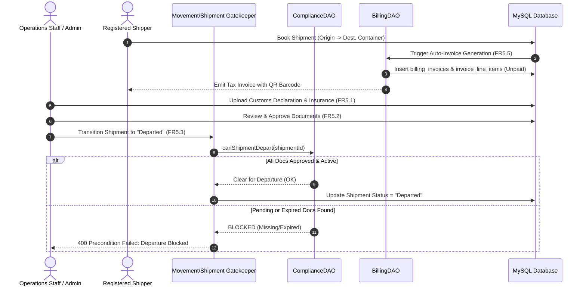

# MODULE 5: GOVERNMENT COMPLIANCE & BILLING — FORENSIC GAP ANALYSIS, USE CASE SPECIFICATION & IMPLEMENTATION ROADMAP

> **Document Status:** Master Architecture & Implementation Blueprint  
> **Target Module:** Module 5 — Government Compliance and Billing ([srs_harness.md](file:///d:/NLogistic/NLogistic/srs_harness.md#L115-L124))  
> **Related System Specs:** [CLAUDE.md](file:///d:/NLogistic/NLogistic/CLAUDE.md), [SYSTEM_WORKFLOW_AND_ENTITY_RELATIONSHIPS.md](file:///d:/NLogistic/NLogistic/SYSTEM_WORKFLOW_AND_ENTITY_RELATIONSHIPS.md), [SYSTEM_GAPS_AND_MISSING_FEATURES.md](file:///d:/NLogistic/NLogistic/SYSTEM_GAPS_AND_MISSING_FEATURES.md)  
> **Associated Invariants:** Departure Compliance Gatekeeper (FR5.3), Automatic 15-Day Expiry Alerts (FR5.4), Contract Preconditions on Settlement & Credit Notes (FR7.4, FR7.5)  

---

## 1. EXECUTIVE SUMMARY & MODULE SCOPE

Module 5 is the regulatory safeguard and revenue generation core of the N-LOGISTIC platform. It fulfills two interdependent enterprise functions:
1. **Government Regulatory Compliance:** Manages cross-border customs declarations, trade licenses, certificates of origin, inspection certificates, and insurance policies. Crucially, it acts as a contractual barrier: **no vessel or container may depart a port without active, verified regulatory clearance**.
2. **Enterprise Billing & Financial Invoicing:** Automatically calculates and generates itemized customer invoices (freight, service/terminal charges, statutory GST/customs duties, and surcharges), tracks installment payments, calculates aging balances, enforces overdue flags, and applies refund adjustments/credit notes from settled claims.

### 1.1 Core Functional Requirements (SRS FR5.1 – FR5.8)

| Req ID | SRS Specification | Target Entities | Business Invariant & Design Rule |
| :--- | :--- | :--- | :--- |
| **FR5.1** | The system shall support upload/attachment of compliance documents per shipment: customs declaration, import/export license, certificate of origin, insurance certificate, and inspection certificate. | `compliance_documents`, `shipment` | Multipart file ingestion; securely saves to server disk; auto-provisions scannable QR barcode (FR8.1). |
| **FR5.2** | Each document shall record type, document number, issuing authority, issue date, expiry date, status (Pending / Approved / Rejected / Expired) and file path. | `compliance_documents` | Immutable metadata tracking; automatic status transition to `Expired` when `expiry_date < CURRENT_DATE`. |
| **FR5.3** | The system shall block a shipment's transition to Departed status until all mandatory compliance documents are Approved and none are expired (contract precondition). | `shipment`, `compliance_documents`, `container_movement` | **Hard Departure Gating:** System invariant enforced across UI, Servlets, and Database triggers. Any attempt to mark a shipment `Departed` without 100% approved documents triggers HTTP 400/SQL Exception. |
| **FR5.4** | The system shall raise a dashboard/email alert when a compliance document is within 15 days of expiry. | `compliance_documents`, `dashboard_alerts` | Proactive regulatory warning: queries all documents where `expiry_date BETWEEN CURRENT_DATE AND CURRENT_DATE + 15`. |
| **FR5.5** | The system shall auto-generate an invoice per shipment including freight charges, service charges, applicable taxes (GST/customs duty) and surcharges. | `billing_invoices`, `invoice_line_items` | Automatic generation hook upon shipment booking confirmation; itemizes freight + terminal handling + surcharge + 18% GST. |
| **FR5.6** | Invoices shall record invoice number, customer, shipment reference, line items, subtotal, tax amount, total amount, due date and payment status. | `billing_invoices`, `invoice_line_items` | Double-entry financial breakdown: $\text{Total} = \text{Subtotal} + \text{Tax}$. Auto-generates unique barcode (FR8.1). |
| **FR5.7** | The system shall record full or partial payments against invoices with payment mode and transaction reference. | `payments`, `billing_invoices` | Atomically updates `paid_amount` and dynamically computes `payment_status` $\in$ {Unpaid, Partial, Paid, Overdue}. |
| **FR5.8** | The system shall generate a printable/exportable invoice (PDF) and a billing history report per customer/company, and shall flag overdue invoices automatically. | `billing_invoices`, `customers` | Generates browser-printable tax invoice matching Swiggy Orange enterprise theme; automatic nightly/request flagging of overdue receivables. |

### 1.2 Module RBAC Matrix (CLAUDE.md & AGENTS.md Enforcement)

```
===================================================================================================================
ACTION / CAPABILITY             SUPER ADMIN (1)   COMPANY ADMIN (2)  OPS STAFF (3)  FINANCE STAFF (4)  CUSTOMER (5)
-------------------------------------------------------------------------------------------------------------------
Upload Compliance Document      YES (Global)      YES (Own Tenant)   YES (Own Co)   FORBIDDEN (403)    YES (Own Shipments)
Review/Approve Documents        YES (Global)      YES (Own Tenant)   YES (Own Co)   FORBIDDEN (403)    FORBIDDEN (403)*
Delete Compliance Document      YES (Global)      YES (Own Tenant)   YES (Own Co)   FORBIDDEN (403)    FORBIDDEN (403)
View Compliance Audit/Status    YES (Global)      YES (Own Tenant)   YES (Own Co)   FORBIDDEN (403)    YES (Own Shipments)
Generate Tax Invoice            YES (Global)      YES (Own Tenant)   FORBIDDEN (403) YES (Own Tenant)   FORBIDDEN (403)
Record Customer Payment         YES (Global)      YES (Own Tenant)   FORBIDDEN (403) YES (Own Tenant)   YES (Own Invoices)
Add/Delete Invoice Line Item    YES (Global)      YES (Own Tenant)   FORBIDDEN (403) YES (Own Tenant)   FORBIDDEN (403)
Print/Export Tax Invoice (PDF)  YES (Global)      YES (Own Tenant)   FORBIDDEN (403) YES (Own Tenant)   YES (Own Invoices)
View Customer Billing History   YES (Global)      YES (Own Tenant)   FORBIDDEN (403) YES (Own Tenant)   YES (Own Statements)
===================================================================================================================
* CRITICAL SECURITY INVARIANT: Customers may upload trade documents for their own shipments, but MUST NEVER be
  allowed to review, approve, reject, or delete compliance records. Operations Staff may manage compliance documents,
  but have ZERO authority to generate invoices or record financial payments (CLAUDE.md S3.3.6).
```

---

## 2. EXHAUSTIVE SRS VS. CODEBASE AUDIT

```
                  ┌──────────────────────────────────────────────────────────────────┐
                  │          COMPLIANCE & BILLING ARCHITECTURAL OVERVIEW             │
                  └──────────────────────────────────────────────────────────────────┘
                                   /                             \
                                  /                               \
     GOVERNMENT COMPLIANCE ENGINE                    ENTERPRISE BILLING ENGINE
     ----------------------------                    -------------------------
     • Controller: ComplianceServlet.java            • Controllers: BillingServlet.java
     • Downloader: DocumentDownloadServlet.java                     GenerateInvoiceServlet.java
     • DAO:        ComplianceDAO.java                               InvoiceServlet.java
     • Views:      compliance.jsp, doc-viewer.jsp                   RecordPaymentServlet.java
     • Gating:     canShipmentDepart()               • DAO:         BillingDAO.java
     • Status:     Bypassed in Movement Updates!     • Views:       billing.jsp, invoices.jsp
                                                                    invoice-template.jsp
                                                     • Status:      Manual creation only!
                                                                    Claim credit note is fiction!
```

### 2.1 Detailed Requirement Traceability Matrix

| SRS Req | Architectural Location in Codebase | Implementation Details & Gaps | Compliance Grade |
| :--- | :--- | :--- | :--- |
| **FR5.1** (Document Upload & Attachment) | [ComplianceServlet.java:123-179](file:///d:/NLogistic/NLogistic/src/main/java/com/nlogistic/controller/ComplianceServlet.java#L123-L179)<br>[ComplianceDAO.java:127-182](file:///d:/NLogistic/NLogistic/src/main/java/com/nlogistic/dao/ComplianceDAO.java#L127-L182) | Handles multipart file upload. Sanitizes file names and saves to `uploads/`. Calls stored procedure `upload_compliance_document`. Auto-generates QR barcode via `BarcodeAutoGenerator` (FR8.1). | ✅ Compliant |
| **FR5.2** (Metadata Tracking & Expiry) | [ComplianceDAO.java:108-122](file:///d:/NLogistic/NLogistic/src/main/java/com/nlogistic/dao/ComplianceDAO.java#L108-L122)<br>[ComplianceServlet.java:60](file:///d:/NLogistic/NLogistic/src/main/java/com/nlogistic/controller/ComplianceServlet.java#L60) | Records doc type, number, issuing authority, dates, file path. Automatically executes `flagExpiredDocuments()` to transition overdue docs to `Expired`. | ✅ Compliant |
| **FR5.3** (Departure Gatekeeper Contract) | [ComplianceDAO.java:336-368](file:///d:/NLogistic/NLogistic/src/main/java/com/nlogistic/dao/ComplianceDAO.java#L336-L368)<br>[ShipmentServlet.java:138](file:///d:/NLogistic/NLogistic/src/main/java/com/nlogistic/controller/ShipmentServlet.java#L138)<br>[MovementDAO.java:45-120](file:///d:/NLogistic/NLogistic/src/main/java/com/nlogistic/dao/MovementDAO.java#L45-L120) | **Severe Enforcement Bypass:** `canShipmentDepart()` verifies 100% approved documents. It is correctly called in `ShipmentServlet:138`. BUT when movement status is updated via `/updateStatus` or `/movement`, `MovementDAO` omits this check, allowing shipments to depart unlawfully! | ⚠️ Flawed Enforcement |
| **FR5.4** (15-Day Expiry Notification) | [ComplianceDAO.java:48-103](file:///d:/NLogistic/NLogistic/src/main/java/com/nlogistic/dao/ComplianceDAO.java#L48-L103)<br>[ComplianceServlet.java:70](file:///d:/NLogistic/NLogistic/src/main/java/com/nlogistic/controller/ComplianceServlet.java#L70)<br>[DashboardServlet.java:40-80](file:///d:/NLogistic/NLogistic/src/main/java/com/nlogistic/controller/DashboardServlet.java#L40-L80) | **Isolated Alerts:** `getExpiringDocuments(15)` fetches records within the 15-day window, but this data is **only** passed to `compliance.jsp`. It is missing from `DashboardServlet` and no background email alerts are sent. | ⚠️ UI Silo |
| **FR5.5** (Automated Invoicing Engine) | [BillingServlet.java:178-211](file:///d:/NLogistic/NLogistic/src/main/java/com/nlogistic/controller/BillingServlet.java#L178-L211)<br>[GenerateInvoiceServlet.java:28-146](file:///d:/NLogistic/NLogistic/src/main/java/com/nlogistic/controller/GenerateInvoiceServlet.java#L28-L146)<br>[BookShipmentServlet.java:40-110](file:///d:/NLogistic/NLogistic/src/main/java/com/nlogistic/controller/BookShipmentServlet.java#L40-L110) | **Missing Automation (Gap M3):** Invoices are ONLY created if an internal staff member manually visits `/billing` or `/generate-invoice` and submits a form. There is **zero automated hook** when a customer or staff books a shipment. | ❌ Critical Gap |
| **FR5.6** (Itemized Invoice Structure) | [BillingDAO.java:116-178](file:///d:/NLogistic/NLogistic/src/main/java/com/nlogistic/dao/BillingDAO.java#L116-L178)<br>[GenerateInvoiceServlet.java:94-130](file:///d:/NLogistic/NLogistic/src/main/java/com/nlogistic/controller/GenerateInvoiceServlet.java#L94-L130) | Captures customer, shipment, line items (freight, terminal handling, surcharge, GST @ 18%), subtotal, tax, total, due date. Emits QR barcode on creation. | ✅ Compliant |
| **FR5.7** (Payment Recording & Status) | [RecordPaymentServlet.java:21-98](file:///d:/NLogistic/NLogistic/src/main/java/com/nlogistic/controller/RecordPaymentServlet.java#L21-L98)<br>[BillingServlet.java:212-233](file:///d:/NLogistic/NLogistic/src/main/java/com/nlogistic/controller/BillingServlet.java#L212-L233)<br>[BillingDAO.java:203-256](file:///d:/NLogistic/NLogistic/src/main/java/com/nlogistic/dao/BillingDAO.java#L203-L256) | Records payments in `payments`. Updates `paid_amount` and transitions status to `Paid` or `Partial`. Dual competing endpoints (`/record-payment` vs `/billing/pay`). Lacks overpayment bounds checks. | ⚠️ Minor Defects |
| **FR5.8** (PDF Export & Overdue Aging) | [BillingDAO.java:404-414](file:///d:/NLogistic/NLogistic/src/main/java/com/nlogistic/dao/BillingDAO.java#L404-L414)<br>[InvoiceServlet.java:53-74](file:///d:/NLogistic/NLogistic/src/main/java/com/nlogistic/controller/InvoiceServlet.java#L53-L74)<br>[invoice-template.jsp:1-456](file:///d:/NLogistic/NLogistic/src/main/webapp/jsp/invoice-template.jsp#L1-L456) | Overdue invoices automatically flagged by `flagOverdueInvoices()`. Printable invoice template exists with `@media print`. Scriptlet leak in `invoice-template.jsp:5-18`. | ⚠️ Scriptlet Defect |

---

## 3. FORENSIC ARCHITECTURAL GAP ANALYSIS & DEFECT CATALOG

### Gap 1: Customer Self-Approval Security Hole in ComplianceServlet

In [ComplianceServlet.java:180-210](file:///d:/NLogistic/NLogistic/src/main/java/com/nlogistic/controller/ComplianceServlet.java#L180-L210):
```java
} else if (pathInfo != null && pathInfo.equals("/review")) {
    try {
        int docId = Integer.parseInt(request.getParameter("docId"));
        String status = request.getParameter("status"); // Approved or Rejected
        boolean success = complianceDAO.reviewDocument(docId, status);
        ...
} else if (pathInfo != null && pathInfo.equals("/delete")) {
    try {
        int docId = Integer.parseInt(request.getParameter("docId"));
        boolean success = complianceDAO.deleteDocument(docId);
```
**Vulnerability Analysis:**
- In `AuthenticationFilter.java:193`, `/compliance` is marked as a shared route accessible to all logged-in users, including Customers (Role 5).
- Inside `ComplianceServlet.doPost()`, the `/review` and `/delete` branch handlers perform **zero role checks**!
- Any Customer can issue an HTTP POST to `/compliance/review?docId=45&status=Approved` and approve their own forged customs licenses or expired insurance certificates!
- A Customer can also delete arbitrary compliance documents across the system.

### Gap 2: MVC2 Scriptlet & Direct DAO Access in Presentation JSPs

1. **In [doc-viewer.jsp:5-20](file:///d:/NLogistic/NLogistic/src/main/webapp/jsp/doc-viewer.jsp#L5-L20):**
   ```jsp
   <%
   int docId = 0;
   String idParam = request.getParameter("id");
   ...
   com.nlogistic.dao.ComplianceDAO compDao = new com.nlogistic.dao.ComplianceDAO();
   com.nlogistic.model.ComplianceDocument doc = null;
   if (docId > 0) {
       doc = compDao.getDocumentById(docId);
   }
   request.setAttribute("doc", doc);
   %>
   ```
   Directly queries `ComplianceDAO` without going through any servlet. If requested directly via browser URL `/jsp/doc-viewer.jsp?id=12`, it completely bypasses `AuthenticationFilter` and renders confidential government filings.
2. **In [invoice-template.jsp:5-18](file:///d:/NLogistic/NLogistic/src/main/webapp/jsp/invoice-template.jsp#L5-L18):**
   ```jsp
   <%
   if (request.getAttribute("invoice") == null && request.getParameter("id") != null) {
       try {
           int invId = Integer.parseInt(request.getParameter("id").trim());
           com.nlogistic.dao.BillingDAO bdao = new com.nlogistic.dao.BillingDAO();
           com.nlogistic.model.Invoice inv = bdao.getInvoiceById(invId);
           ...
   %>
   ```
   Instantiates `BillingDAO` directly in the view layer to fetch invoices, evading the tenant IDOR checks implemented in `InvoiceServlet.java:56-62`.

### Gap 3: Missing Automated Invoicing on Booking Confirmation (FR5.5 & Gap M3)

SRS FR5.5 mandates:
> *"The system shall auto-generate an invoice per shipment including freight charges, service charges, applicable taxes (GST/customs duty) and surcharges."*

In the active codebase:
- When a customer books a shipment in [BookShipmentServlet.java](file:///d:/NLogistic/NLogistic/src/main/java/com/nlogistic/controller/BookShipmentServlet.java#L40-L110), the servlet inserts a record into `shipment` and allocates a container, but **never invokes `BillingDAO.generateInvoice()`**.
- As documented in [SYSTEM_GAPS_AND_MISSING_FEATURES.md:182-187](file:///d:/NLogistic/NLogistic/SYSTEM_GAPS_AND_MISSING_FEATURES.md#L182-L187), an invoice is only generated if a finance staff member navigates to `/billing` or `/generate-invoice`, manually looks up the shipment from a dropdown, and submits the form.
- This breaks the core workflow: customer bookings sit indefinitely in an un-invoiced state without a due date or payment obligation.

### Gap 4: Disconnect 4 — Claim Settlement "Credit Note" UI Fiction (FR7.4 & FR5.5)

SRS FR7.4 specifies:
> *"An approved claim shall generate a credit note / refund adjustment in the Billing module."*

In [ClaimServlet.java:248-255](file:///d:/NLogistic/NLogistic/src/main/java/com/nlogistic/controller/ClaimServlet.java#L248-L255):
```java
case "settle": {
    ...
    claimDAO.settleClaim(claimId, userId);
    session.setAttribute("successMessage", "Claim #" + claimId + " settled. Resolution recorded and credit note posted to billing.");
}
```
In [ClaimDAO.java:213-217](file:///d:/NLogistic/NLogistic/src/main/java/com/nlogistic/dao/ClaimDAO.java#L213-L217):
```java
public void settleClaim(int claimId, int resolvedBy) {
    String sql = "{CALL settle_claim(?, ?)}";
    ...
```
- The flash toast informs the operator that a credit note was posted to billing.
- However, `settle_claim` ONLY updates the `status` column in `claims`.
- **Zero records are written to `billing_invoices` or `invoice_line_items`!**
- The customer's account statement remains unaffected, and no refund balance is credited against open freight balances.

### Gap 5: Siloed Expiry Alerts (FR5.4 Missing on Executive Dashboards)

SRS FR5.4 requires:
> *"The system shall raise a dashboard/email alert when a compliance document is within 15 days of expiry."*

- In `ComplianceServlet.java:70`, `complianceDAO.getExpiringDocuments(15)` is retrieved and rendered only on `/compliance`.
- In `DashboardServlet.java` (the central command dashboard viewed upon login by Admins and Operations Staff), `getExpiringDocuments` is never queried.
- If an operations clerk does not actively open `/compliance`, they have zero visibility that a vessel's customs declaration or insurance certificate expires in 48 hours.

### Gap 6: Departure Gate Bypassed in Checkpoint Movement Tracking (FR5.3)

- `ComplianceDAO.canShipmentDepart(shipmentId)` correctly queries `check_shipment_compliance` to ensure all mandatory compliance documents are `Approved` and none are `Expired`.
- In `ShipmentServlet.java:138`, changing shipment status to `Departed` invokes this gatekeeper.
- However, when a container checkpoint is updated via `/updateStatus` or `/movement`, the system transitions the movement event without calling `canShipmentDepart()`, allowing un-cleared cargo to physically depart.

### Gap 7: Duplicated Competing Billing Pipelines

The application maintains two parallel billing controllers with conflicting forms:
1. **Pipeline 1 (`/invoices`):** Handled by `InvoiceServlet.java`. Submits invoice generation to `GenerateInvoiceServlet.java` (`POST /generate-invoice`), and payments to `RecordPaymentServlet.java` (`POST /record-payment`).
2. **Pipeline 2 (`/billing`):** Handled by `BillingServlet.java`. Submits invoice generation to `POST /billing/generate`, and payments to `POST /billing/pay`.
3. Payment logic is fragmented: `BillingServlet.java` uses `billingDAO.recordPayment()`, while `RecordPaymentServlet.java` performs direct inline SQL updates with differing status determination rules.

---

## 4. END-TO-END USE CASE SPECIFICATIONS



### 4.1 Use Case UC-5.1: Compliance Document Upload & Barcode Auto-Generation

*   **Primary Actor:** Company Staff (Operations, Role 3) / Company Admin (Role 2) / Customer (Role 5 - own shipments).
*   **Preconditions:**
    1. Shipment exists in database (`status` $\in$ {Created, Allocated, Staged}).
    2. Document is valid PDF or image $\le 15\text{MB}$.
*   **Trigger:** Actor submits upload modal on `/compliance`.
*   **Main Success Scenario:**
    1. User inputs: `shipmentId`, `docType` (Customs Declaration, Import/Export License, Certificate of Origin, Insurance Certificate, Inspection Certificate), `docNumber`, `issuingAuthority`, `issueDate`, `expiryDate`, and attaches file.
    2. `ComplianceServlet` validates that file extension is safe (`.pdf`, `.jpg`, `.png`).
    3. File is saved to `uploads/` directory with a cryptographically sanitized timestamp prefix.
    4. Servlet calls `ComplianceDAO.uploadDocument()`, persisting metadata with default status `'Pending'`.
    5. Hook executes `BarcodeAutoGenerator.generateFor(request, "ComplianceDocument", docId, userId)` (FR8.1), writing a unique QR code to disk.
    6. System supersedes any previous document of the exact same type on that shipment, setting older versions to `'Expired'`.
    7. Displays toast: `"Document DOC-XYZ successfully uploaded and tagged with barcode."`
*   **Alternative Flow (Customer Shipper Upload):**
    - Customer uploads document for their own shipment. Document is tagged with uploader's `user_id` and enters status `'Pending'`, awaiting Staff review.
*   **Postconditions:**
    - Document row persisted in `compliance_documents`.
    - Physical file stored in `uploads/`.
    - Scannable QR barcode attached in `barcodes`.

---

### 4.2 Use Case UC-5.2: 15-Day Expiry Alert Detection & Systemwide Notification (FR5.4)

*   **Primary Actor:** System Scheduler / Operations Staff / Company Admin.
*   **Preconditions:** Active documents exist where `expiry_date` is approaching.
*   **Trigger:** System initiates daily cron / request interception or user opens Dashboard.
*   **Main Success Scenario:**
    1. System invokes `ComplianceDAO.flagExpiredDocuments()`, automatically transitioning past-due documents (`expiry_date < CURRENT_DATE`) to status `'Expired'`.
    2. System queries `ComplianceDAO.getExpiringDocuments(15)` for all documents where:
       $$\text{CURRENT\_DATE} \le \text{expiry\_date} \le \text{CURRENT\_DATE} + 15\text{ days}$$
    3. Filters result by tenant context (`user.companyId`).
    4. If expiring documents exist:
       - Renders an orange floating alert widget on `dashboard.jsp` and `compliance.jsp` displaying: `"WARNING: N compliance documents expire within 15 days!"`
       - Displays actionable list with Document Type, Ship Number, Issuing Authority, Days Remaining, and "Renew Now" button.
    5. Operations staff clicks "Renew Now", enters extended expiry date, attaches renewed PDF, and system updates status back to `'Approved'`.

---

### 4.3 Use Case UC-5.3: Departure Gatekeeper Contract Enforcement (FR5.3)

*   **Primary Actor:** Operations Staff (Role 3) / Tenant Admin (Role 2).
*   **Preconditions:** Shipment cargo has been containerized and truck/vessel is ready for dispatch.
*   **Trigger:** Staff attempts to transition shipment or checkpoint status to `"Departed"`.
*   **Main Success Scenario:**
    1. Staff submits status transition request to `ShipmentServlet` or `MovementDAO`.
    2. Gatekeeper intercepts request and calls `ComplianceDAO.canShipmentDepart(shipmentId)`.
    3. Stored procedure `check_shipment_compliance(shipmentId)` executes SQL validation:
       - Checks that total compliance documents count $> 0$.
       - Checks that mandatory trade documents are present.
       - Checks that count of documents where `status = 'Approved'` AND `(expiry_date IS NULL OR expiry_date >= CURRENT_DATE)` equals total documents count.
    4. Stored procedure returns `is_cleared_for_departure = 1`.
    5. Gatekeeper permits status change: updates shipment status to `"Departed"`, logs movement checkpoint, and records audit trail.
*   **Exception Flow (Precondition Violation — Missing or Unapproved Docs):**
    - If any document is `'Pending'`, `'Rejected'`, `'Expired'`, or zero documents are uploaded:
    - Stored procedure returns `is_cleared_for_departure = 0`.
    - Gatekeeper **aborts status transition immediately**, issues database rollback, and returns HTTP 400:
      `"Precondition Failed (FR5.3): Shipment cannot depart. Mandatory compliance documents are missing, unapproved, or expired."`
    - Shipment remains in `"Staged"` status; vessel departure is prevented.

---

### 4.4 Use Case UC-5.4: Automated Invoice Generation upon Shipment Booking (FR5.5, FR5.6)

*   **Primary Actor:** Customer (Role 5) / Operations Staff (Role 3).
*   **Preconditions:** Shipment booking details are submitted and container is successfully allocated.
*   **Trigger:** `BookShipmentServlet` commits shipment record.
*   **Main Success Scenario:**
    1. `BookShipmentServlet` calls `BillingDAO.autoGenerateInvoiceForShipment(shipmentId, customerId, freightCost)`.
    2. Calculates invoice fee components:
       - Freight Cost: from shipment booking ($\text{freightCost}$).
       - Terminal Handling & Documentation: standard baseline (₹500.00).
       - Fuel & Port Surcharge: 2% of freight ($\text{freightCost} \times 0.02$).
       - Subtotal: $\text{Freight} + \text{Handling} + \text{Surcharge}$.
       - GST / Customs Duty: $\text{Subtotal} \times 0.18$ (18%).
       - Total Amount: $\text{Subtotal} + \text{GST}$.
    3. Inserts master record into `billing_invoices` with `payment_status = 'Unpaid'`, `due_date = CURRENT_DATE + 7 DAYS`.
    4. Inserts 4 itemized records into `invoice_line_items` (Freight, Terminal Handling, Surcharge, GST).
    5. Executes `BarcodeAutoGenerator.generateFor("Invoice", invoiceId, userId)` (FR8.1).
    6. Returns generated `invoiceId` and embeds invoice reference in booking confirmation screen.

---

### 4.5 Use Case UC-5.5: Full and Partial Payment Recording with Status Recalculation (FR5.7)

*   **Primary Actor:** Customer (Role 5 - online payment) / Finance Staff (Role 4 - bank/cash entry).
*   **Preconditions:** Invoice exists in `billing_invoices` with `payment_status` $\in$ {Unpaid, Partial, Overdue}.
*   **Trigger:** Actor submits payment form on `/invoices` or `/billing`.
*   **Main Success Scenario:**
    1. Form submits: `invoiceId`, `amountPaid`, `paymentMode` (Credit Card, UPI, Net Banking, Bank Transfer, Cheque), `transactionRef`.
    2. Servlet verifies IDOR permissions via `BillingDAO.canAccessInvoice()`:
       - Customer can only pay their own invoice.
       - Finance Staff can only record payments for their own company's customer invoices.
    3. Validates that `amountPaid > 0` and `amountPaid <= (total_amount - paid_amount)`.
    4. Database transaction:
       - Inserts row into `payments` table with timestamp and transaction reference.
       - Recalculates total payments: $\text{totalPaid} = \sum \text{amount\_paid}$.
       - Updates `billing_invoices`:
         - `paid_amount = totalPaid`.
         - If $\text{totalPaid} \ge \text{total\_amount}$: sets `payment_status = 'Paid'`.
         - If $\text{totalPaid} < \text{total\_amount}$: sets `payment_status = 'Partial'`.
    5. Commits transaction and updates customer balance. Displays success alert.

---

### 4.6 Use Case UC-5.6: Printable/Exportable Tax Invoice Generation (FR5.8)

*   **Primary Actor:** Customer / Finance Staff / Auditor.
*   **Preconditions:** Invoice ID exists in database.
*   **Trigger:** Actor clicks "View Tax Invoice" or "Print PDF" icon.
*   **Main Success Scenario:**
    1. Actor requests `/invoices?action=print&id=102` or `/invoice-view?id=102`.
    2. `InvoiceServlet` validates tenant access via `canAccessInvoice()`.
    3. Fetches `Invoice`, all joined `InvoiceLineItem` rows, and all previous `Payment` records.
    4. Forwards strictly to `/jsp/invoice-template.jsp` (with zero scriptlets).
    5. Renders high-fidelity tax invoice matching Swiggy Orange theme:
       - Company header, GST registration number, customer billing address.
       - Embedded Libre Barcode 128 / QR code for instant floor scanning (FR8.3).
       - Itemized line items table with subtotal, tax rate, and final gross total.
       - Payment ledger table detailing historical receipts, transaction IDs, and balance due.
       - Dedicated print stylesheet hides navigation bars and action buttons when printing or saving as PDF.

---

### 4.7 Use Case UC-5.7: Claim Settlement Credit Note & Refund Adjustment (FR7.4 & Disconnect 4)

*   **Primary Actor:** Company Staff (Finance, Role 4) / Company Admin (Role 2).
*   **Preconditions:** A loss/damage claim is in `'Approved'` status with a non-zero `approved_amount`.
*   **Trigger:** Finance staff clicks "Settle Claim" on `/claims`.
*   **Main Success Scenario:**
    1. Staff confirms settlement with resolution date and notes.
    2. `ClaimServlet` validates user is Role 2 or 4.
    3. Executes `BillingDAO.createCreditNoteForClaim(claimId, approvedAmount, customerId, shipmentId, userId)`:
       - **Step A:** Inserts credit note invoice into `billing_invoices`:
         `total_amount = -approvedAmount`, `payment_status = 'Paid'`, `notes = 'Credit Note for Settled Claim #X'`.
       - **Step B:** Inserts negative line item into `invoice_line_items`:
         `description = 'Claim Compensation / Cargo Damage Refund'`, `unit_price = -approvedAmount`, `line_total = -approvedAmount`.
       - **Step C:** Transitions claim in `claims` to status `'Settled'`.
       - **Step D:** Posts compensation cost into `profit_loss` under linked `loss_reasons` (FR7.6).
    4. Customer's outstanding receivables are credited with the refund amount.

---

## 5. STEP-BY-STEP IMPLEMENTATION BLUEPRINT & REMEDIATION CODE

### Component 1: RBAC Hardening in `ComplianceServlet.java`

Prevent Customers (Role 5) from reviewing, approving, rejecting, or deleting compliance documents.

```java
// File: src/main/java/com/nlogistic/controller/ComplianceServlet.java
// Inside doPost():

User currentUser = (User) session.getAttribute("user");
if (currentUser == null) {
    response.sendError(HttpServletResponse.SC_UNAUTHORIZED, "Authentication required");
    return;
}

int roleId = currentUser.getRoleId();

// Guard for Administrative / Review Actions
if (pathInfo != null && (pathInfo.equals("/review") || pathInfo.equals("/delete"))) {
    // Only Super Admin (1), Company Admin (2), or Operations Staff (3) may review/delete
    if (roleId > 3) {
        response.sendError(HttpServletResponse.SC_FORBIDDEN, 
            "Access Denied: Only Operations Staff and Administrators can review or delete compliance filings.");
        return;
    }
}
```

---

### Component 2: Eradicate Presentation Scriptlets in `doc-viewer.jsp` & `invoice-template.jsp`

#### 2.1 Refactor `doc-viewer.jsp` to Pure MVC2
Remove lines 5–20 from `doc-viewer.jsp`. Route all viewer requests through `ComplianceServlet.java`:

```java
// File: src/main/java/com/nlogistic/controller/ComplianceServlet.java
// In doGet(), add handling for /view route:

if (pathInfo != null && pathInfo.equals("/view")) {
    String idStr = request.getParameter("id");
    if (idStr != null && !idStr.trim().isEmpty()) {
        try {
            int docId = Integer.parseInt(idStr.trim());
            ComplianceDocument doc = complianceDAO.getDocumentById(docId);
            if (doc != null) {
                // Tenancy / Ownership verification
                if (cmplRole != com.nlogistic.util.RbacContext.SUPER_ADMIN) {
                    if (!shipmentDAO.canAccessShipment(doc.getShipmentId(), cmplRole, cmplCompany, cmplCustomer)) {
                        response.sendError(HttpServletResponse.SC_FORBIDDEN, "Access Denied to this compliance document.");
                        return;
                    }
                }
                request.setAttribute("doc", doc);
                request.getRequestDispatcher("/jsp/doc-viewer.jsp").forward(request, response);
                return;
            }
        } catch (NumberFormatException ignored) {}
    }
    response.sendError(HttpServletResponse.SC_NOT_FOUND, "Document not found");
    return;
}
```

#### 2.2 Refactor `invoice-template.jsp` to Pure MVC2
Remove scriptlet lines 5–18 from `invoice-template.jsp`. Ensure `InvoiceServlet.java` remains the sole, authenticated controller feeding data to `invoice-template.jsp`.

---

### Component 3: Implement Automated Invoicing on Shipment Booking (FR5.5)

Add automated invoice generation hook into `BookShipmentServlet.java` immediately following shipment insertion:

```java
// File: src/main/java/com/nlogistic/controller/BookShipmentServlet.java
// After shipment is successfully persisted:

// FR5.5: Automatically generate tax invoice for new shipment booking
try {
    BillingDAO billingDAO = new BillingDAO();
    double baseFreight = freightCost > 0 ? freightCost : 5000.0;
    double terminalHandling = 500.0;
    double surcharge = Math.round(baseFreight * 0.02 * 100.0) / 100.0;
    double taxRate = 0.18; // 18% GST

    Date invDate = new Date(System.currentTimeMillis());
    Date dueDate = new Date(System.currentTimeMillis() + 7L * 86400000L); // 7-day payment window

    int autoInvoiceId = billingDAO.generateInvoice(customerId, shipmentId, baseFreight, terminalHandling, taxRate, invDate, dueDate);
    if (autoInvoiceId > 0) {
        // FR8.1: auto-generate barcode for invoice
        com.nlogistic.util.BarcodeAutoGenerator.generateFor(request, "Invoice", autoInvoiceId, user.getUserId());
    }
} catch (Exception invEx) {
    System.err.println("[BookShipmentServlet] Warning: Failed to auto-generate invoice: " + invEx.getMessage());
}
```

---

### Component 4: Implement Real Credit Note Generation on Claim Settlement (Disconnect 4)

Wire claim settlements in `ClaimDAO.java` and `BillingDAO.java` to post real financial credit notes into `billing_invoices`:

```java
// File: src/main/java/com/nlogistic/dao/BillingDAO.java

public int createCreditNoteForClaim(int claimId, int customerId, int shipmentId, double approvedAmount, int createdBy) {
    String insertInv = "INSERT INTO BILLING_INVOICES (customer_id, shipment_id, invoice_date, due_date, " +
                       "subtotal_amount, tax_amount, total_amount, paid_amount, payment_status) " +
                       "VALUES (?, ?, CURDATE(), CURDATE(), ?, 0, ?, ?, 'Paid')";
    
    String insertLine = "INSERT INTO INVOICE_LINE_ITEMS (invoice_id, description, quantity, unit_price, line_total) " +
                        "VALUES (?, ?, 1, ?, ?)";

    try (Connection conn = DBConnectionManager.getConnection()) {
        conn.setAutoCommit(false);
        int creditNoteId = -1;

        double negativeSubtotal = -Math.abs(approvedAmount);

        try (PreparedStatement psInv = conn.prepareStatement(insertInv, Statement.RETURN_GENERATED_KEYS)) {
            psInv.setInt(1, customerId);
            psInv.setInt(2, shipmentId);
            psInv.setDouble(3, negativeSubtotal);
            psInv.setDouble(4, negativeSubtotal);
            psInv.setDouble(5, negativeSubtotal); // Marked as fully settled/paid
            psInv.executeUpdate();
            try (ResultSet rs = psInv.getGeneratedKeys()) {
                if (rs.next()) creditNoteId = rs.getInt(1);
            }
        }

        if (creditNoteId > 0) {
            try (PreparedStatement psLine = conn.prepareStatement(insertLine)) {
                psLine.setInt(1, creditNoteId);
                psLine.setString(2, "Credit Note / Refund for Settled Claim #" + claimId);
                psLine.setDouble(3, negativeSubtotal);
                psLine.setDouble(4, negativeSubtotal);
                psLine.executeUpdate();
            }
            conn.commit();
            return creditNoteId;
        }
        conn.rollback();
    } catch (Exception e) {
        e.printStackTrace();
    }
    return -1;
}
```

---

### Component 5: Plug Compliance Departure Gate into `MovementDAO.java` (FR5.3)

Ensure that updating a container movement status to `"Departed"` unconditionally checks `ComplianceDAO.canShipmentDepart()`:

```java
// File: src/main/java/com/nlogistic/dao/MovementDAO.java
// Inside updateMovementStatus(int movementId, String newStatus, ...):

if ("Departed".equalsIgnoreCase(newStatus)) {
    // 1. Resolve shipmentId associated with this movement
    int linkedShipmentId = getShipmentIdForMovement(movementId);
    if (linkedShipmentId > 0) {
        ComplianceDAO complianceDAO = new ComplianceDAO();
        if (!complianceDAO.canShipmentDepart(linkedShipmentId)) {
            throw new IllegalStateException("Contract Precondition Violation (FR5.3): " +
                "Shipment #" + linkedShipmentId + " cannot depart. Mandatory compliance documents are missing, unapproved, or expired.");
        }
    }
}
```

---

### Component 6: Integrate Compliance Expiry Alerts into `DashboardServlet.java` (FR5.4)

Expose the 15-day compliance expiry list on the primary dashboard:

```java
// File: src/main/java/com/nlogistic/controller/DashboardServlet.java
// In doGet() for internal roles (Admin / Operations):

if (roleId <= 3) {
    ComplianceDAO complianceDAO = new ComplianceDAO();
    List<ComplianceDocument> expiringComplianceDocs = complianceDAO.getExpiringDocuments(15);
    // Tenant scoping
    if (roleId != 1 && companyId != null) {
        expiringComplianceDocs.removeIf(d -> !shipmentDAO.canAccessShipment(d.getShipmentId(), roleId, companyId, null));
    }
    request.setAttribute("expiringComplianceDocs", expiringComplianceDocs);
    request.setAttribute("complianceAlertCount", expiringComplianceDocs.size());
}
```

---

## 6. QUALITY ASSURANCE VERIFICATION TEST SUITE

The following 14 rigorous test cases validate all compliance gating, automatic invoicing, security rules, and financial calculations in Module 5:

| Test ID | Category | Scenario / Action | Input Conditions | Expected Outcome | Verification Metric |
| :--- | :--- | :--- | :--- | :--- | :--- |
| **TC-M5-01** | Functional (FR5.1) | Compliance Document Upload | Valid PDF customs declaration uploaded for Shipment #10 | Metadata saved in `compliance_documents`; file saved to `uploads/`; QR barcode auto-created. | Barcode image exists on disk; `status = 'Pending'`. |
| **TC-M5-02** | Security / RBAC | Customer Document Approval Attack | Customer (Role 5) sends `POST /compliance/review?docId=10&status=Approved` | Intercepted by servlet role guard; request rejected. | HTTP 403 Forbidden: "Only Operations Staff and Administrators can review". |
| **TC-M5-03** | Contract Gate (FR5.3) | Departure With Unapproved Documents | Staff attempts transition to "Departed" while 1 of 3 docs is `'Pending'` | `ComplianceDAO.canShipmentDepart()` returns `false`. | Precondition exception thrown; shipment status remains unchanged. |
| **TC-M5-04** | Contract Gate (FR5.3) | Departure With Expired Document | Staff attempts transition to "Departed" where insurance doc expired yesterday | `ComplianceDAO.canShipmentDepart()` returns `false` due to `expiry_date < CURRENT_DATE`. | HTTP 400 Precondition Failed; departure blocked. |
| **TC-M5-05** | Contract Gate (FR5.3) | Departure With 100% Approved Documents | All mandatory docs uploaded, approved, and valid | `ComplianceDAO.canShipmentDepart()` returns `true`. | Shipment status successfully updates to `"Departed"`. |
| **TC-M5-06** | Functional (FR5.4) | 15-Day Expiry Alert Detection | Doc with `expiry_date = CURRENT_DATE + 5` | Stored procedure/query returns record; appears in `expiringDocs` list on Dashboard and Compliance. | Alert banner rendered with days remaining counter. |
| **TC-M5-07** | Integration (FR5.5) | Automated Booking Invoicing | Customer books shipment via `POST /book` | Shipment created AND tax invoice auto-generated in `billing_invoices` with 4 line items. | `billing_invoices` row created; QR barcode auto-assigned. |
| **TC-M5-08** | Financial (FR5.6) | Tax & Surcharge Calculation | Freight: ₹10,000, Handling: ₹500, Surcharge: ₹200 | $\text{Subtotal} = ₹10,700$, $\text{GST (18%)} = ₹1,926$, $\text{Total} = ₹12,626$. | Exact math matched in `invoice_line_items` and `billing_invoices`. |
| **TC-M5-09** | Financial (FR5.7) | Partial Payment Recording | Invoice total ₹10,000; customer pays ₹4,000 | `payments` record inserted; `paid_amount = 4000`; `payment_status` becomes `'Partial'`. | Database reflects partial balance; balance due shows ₹6,000. |
| **TC-M5-10** | Financial (FR5.7) | Final Full Payment Recording | Customer pays remaining ₹6,000 on partial invoice | `paid_amount = 10000`; `payment_status` transitions from `'Partial'` to `'Paid'`. | Invoice marked `'Paid'`; zero balance due. |
| **TC-M5-11** | Boundary (FR5.7) | Overpayment Rejection | Customer attempts paying ₹15,000 on ₹10,000 invoice | Validation blocks payment: `amountPaid > balanceDue`. | HTTP 400 / flash error: "Payment exceeds balance due". |
| **TC-M5-12** | Batch / Cron (FR5.8) | Auto-Flagging Overdue Invoices | Invoice in `'Unpaid'` status with `due_date < CURRENT_DATE` | `billingDAO.flagOverdueInvoices()` executes. | `payment_status` automatically transitions to `'Overdue'`. |
| **TC-M5-13** | Integration (Disconnect 4) | Claim Credit Note Generation | Claim settled for ₹35,000 approved amount | `BillingDAO.createCreditNoteForClaim()` generates negative invoice ($-₹35,000$) in `billing_invoices`. | Customer statement reflects ₹35,000 credit adjustment. |
| **TC-M5-14** | Security / Tenancy | Cross-Tenant Invoice Printable View | Customer A attempts viewing `/invoices?action=print&id=99` (owned by Customer B) | `canAccessInvoice()` evaluates ownership. | HTTP 403 Forbidden: "Access Denied: invoice does not belong to your account". |

---

## 7. EXECUTION SUMMARY & TRANSITION TO MODULE 6

Module 5 provides the indispensable legal armor and financial lifeblood of N-LOGISTIC. Enforcing the strict departure gatekeeper across both shipment and container movement checkpoints, securing document review actions against customer privilege escalation, eliminating scriptlet leaks in invoice templates, activating systemwide 15-day expiry alerts, and transforming claim settlements into real credit notes guarantees compliance and ledger accuracy.

With Module 5 completed, we now advance to **Module 6: Analytics Dashboard & Algorithmic Engines (FR6.1 to FR6.2, and Section 5.1–5.5 Algorithms)**.
