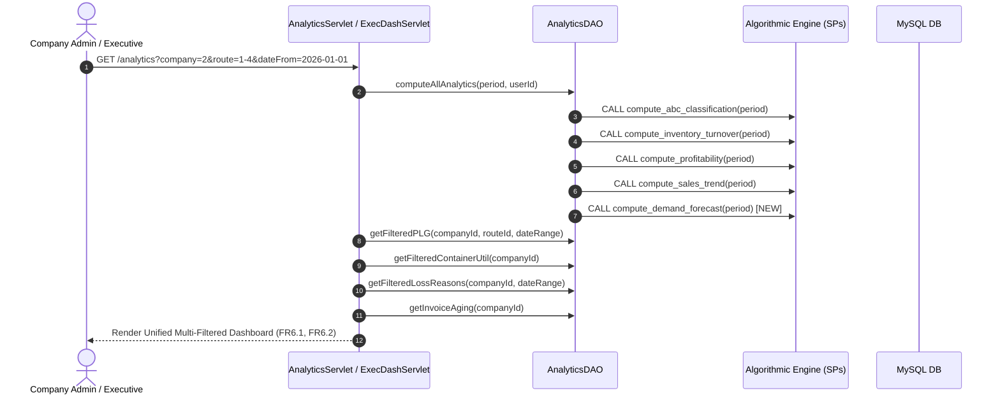

# MODULE 6: ANALYTICS DASHBOARD & ALGORITHMIC ENGINES — FORENSIC GAP ANALYSIS, USE CASE SPECIFICATION & IMPLEMENTATION ROADMAP

> **Document Status:** Master Architecture & Implementation Blueprint  
> **Target Module:** Module 6 — Analytics Dashboard & Section 5 Analytical Algorithms ([srs_harness.md](file:///d:/NLogistic/NLogistic/srs_harness.md#L125-L128), [L164-L188](file:///d:/NLogistic/NLogistic/srs_harness.md#L164-L188))  
> **Related System Specs:** [CLAUDE.md](file:///d:/NLogistic/NLogistic/CLAUDE.md), [SYSTEM_WORKFLOW_AND_ENTITY_RELATIONSHIPS.md](file:///d:/NLogistic/NLogistic/SYSTEM_WORKFLOW_AND_ENTITY_RELATIONSHIPS.md), [SYSTEM_GAPS_AND_MISSING_FEATURES.md](file:///d:/NLogistic/NLogistic/SYSTEM_GAPS_AND_MISSING_FEATURES.md)  
> **Associated Algorithms:** Section 5.1 (Sales Trend), Section 5.2 (ABC Pareto), Section 5.3 (Inventory Turnover), Section 5.4 (Product Profitability), Section 5.5 (Demand Forecasting)  

---

## 1. EXECUTIVE SUMMARY & MODULE SCOPE

Module 6 functions as the executive intelligence, statistical synthesis, and decision-support core of N-LOGISTIC. It surfaces real-time operational telemetry and synthesizes transactional facts into actionable predictive insights. The module is governed by two complementary pillars:
1. **The Analytics Dashboard (FR6.1, FR6.2):** Unified, role-tailored visualizations covering active logistics movements, financial profit/loss trajectories, container utilization rates, loss reason distributions, stock valuations, invoice aging brackets, and demand forecasts.
2. **The Five Analytical Algorithms (SRS Section 5.1 – 5.5):** Advanced mathematical data-mining procedures running directly against operational fact tables (`sales_transactions`, `inventory_ledger`, `products`, `shipment`, `profit_loss`, and `containers`). These algorithms must never read pre-aggregated approximations; they require transaction-level granularity to prevent statistical drift.

### 1.1 Core Functional Requirements & Analytical Algorithms

| Req / Algorithm | Specification & Formula | Input Entities | Target Output / Business Invariant |
| :--- | :--- | :--- | :--- |
| **FR6.1** | Role-based dashboards showing: active shipments, PLG summary, top loss reasons, container utilization, stock valuation, ABC classification, inventory turnover ratio, demand forecast, and invoice aging. | All system fact tables | 9 essential business metrics rendered according to strict RBAC role visibility. Zero dummy or hardcoded values permitted. |
| **FR6.2** | All dashboard charts shall be filterable by date range, company, route, and product/category. | Query params: `company`, `route`, `category`, `dateFrom`, `dateTo` | **Global Filter Propagation:** When an executive applies a filter, **every single chart** on the dashboard must slice its dataset accordingly. |
| **Algo 5.1** (Sales Trend) | Analyzes periodic sales velocity to categorize SKUs into Growing, Declining, or Stable demand trajectories: $\text{Trend} = \frac{\text{Sales}_{t} - \text{Sales}_{t-1}}{\text{Sales}_{t-1}}$. | `sales_transactions` | Feeds procurement stocking schedules and identifies seasonal surges. Result: `sales_trend_result`. |
| **Algo 5.2** (ABC Pareto) | Ranks products by revenue contribution into Pareto tiers: Class A (top 70–80% cumulative revenue), Class B (next 15–20%), Class C (bottom 5–10%). | `sales_transactions`, `products` | Prioritizes warehouse space and security. Result: `abc_classification_result`. |
| **Algo 5.3** (Inventory Turnover) | Measures capital velocity: $\text{Turnover Ratio} = \frac{\text{COGS during period}}{\text{Average Inventory Value during period}}$. | `inventory_ledger`, `stock` | Identifies dead stock and overstocked working capital. Result: `inventory_turnover_result`. |
| **Algo 5.4** (Product Profitability) | Net SKU margin after direct cost and allocated shipping: $\text{Margin} = \text{Revenue} - (\text{COGS} + \text{Logistics Overhead})$. | `sales_transactions`, `products`, `profit_loss` | Ranks products by true commercial profit. Result: `profitability_result`. |
| **Algo 5.5** (Demand Forecasting) | Projects future container and route demand via time-series moving averages and velocity indexing: $\hat{D}_{t+1} = \alpha D_{t} + (1-\alpha)\hat{D}_{t}$. | `shipment`, `containers`, `sales_transactions` | Drives Predictive Graph (FR3.6) and Dynamic Multiplier (FR3.5). Result: `demand_forecast`. |

### 1.2 Module RBAC Matrix (CLAUDE.md & AGENTS.md Enforcement)

```
===================================================================================================================
DASHBOARD / ANALYTIC METRIC    SUPER ADMIN (1)   COMPANY ADMIN (2)  OPS STAFF (3)  FINANCE STAFF (4)  CUSTOMER (5)
-------------------------------------------------------------------------------------------------------------------
Active Shipments & Fleet Map   YES (Global/All)  YES (Own Tenant)   YES (Own Co)   FORBIDDEN (403)    YES (Own Only)
Profit & Loss Graph (PLG)      YES (Global/All)  YES (Own Tenant)   FORBIDDEN (403) YES (Own Tenant)   FORBIDDEN (403)
Top Loss Reasons Breakdown     YES (Global/All)  YES (Own Tenant)   FORBIDDEN (403) YES (Own Tenant)   FORBIDDEN (403)
Container Utilization Rate     YES (Global/All)  YES (Own Tenant)   YES (Own Co)   FORBIDDEN (403)    FORBIDDEN (403)
Stock Valuation by Category    YES (Global/All)  YES (Own Tenant)   YES (Own Co)   FORBIDDEN (403)    FORBIDDEN (403)
ABC Pareto Classification      YES (Global/All)  YES (Own Tenant)   FORBIDDEN (403) YES (Own Tenant)   FORBIDDEN (403)
Inventory Turnover Ratio       YES (Global/All)  YES (Own Tenant)   YES (Own Co)   YES (Own Tenant)   FORBIDDEN (403)
Demand Forecast per Route      YES (Global/All)  YES (Own Tenant)   YES (Own Co)   YES (Own Tenant)   FORBIDDEN (403)
Invoice Aging Brackets         YES (Global/All)  YES (Own Tenant)   FORBIDDEN (403) YES (Own Tenant)   FORBIDDEN (403)*
===================================================================================================================
* Note: Customers (Role 5) have access ONLY to their own customer portal (/dashboard) displaying active personal
  shipments, invoice payment balances, and filed claim statuses. Internal company financials, pricing multipliers,
  and dock utilization metrics are strictly quarantined.
```

---

## 2. EXHAUSTIVE SRS VS. CODEBASE AUDIT

```
                  ┌──────────────────────────────────────────────────────────────────┐
                  │                 FRAGMENTED DASHBOARD ARCHITECTURE                │
                  └──────────────────────────────────────────────────────────────────┘
                                   /                |               \
                                  /                 |                \
     ENDPOINT 1: General Ops          ENDPOINT 2: Executive            ENDPOINT 3: Analytics
     -----------------------          ---------------------            ---------------------
     • /dashboard                     • /dashboard/executive           • /analytics
     • DashboardServlet.java          • ExecutiveDashboardServlet.java • AnalyticsServlet.java
     • dashboard.jsp                  • executive_dashboard.jsp        • analytics.jsp
     • STATUS: Global leak!           • STATUS: Rich KPIs, but lacks   • STATUS: FAKE DATA!
       No tenant WHERE filters!         Invoice Aging breakdown.         Hardcoded Aging & Avg Val.
```

### 2.1 Detailed Requirement Traceability Matrix

| SRS Req | Architectural Location in Codebase | Implementation Details & Gaps | Compliance Grade |
| :--- | :--- | :--- | :--- |
| **FR6.1** (9 Dashboard Metrics) | [AnalyticsServlet.java:87-265](file:///d:/NLogistic/NLogistic/src/main/java/com/nlogistic/controller/AnalyticsServlet.java#L87-L265)<br>[ExecutiveDashboardServlet.java:60-132](file:///d:/NLogistic/NLogistic/src/main/java/com/nlogistic/controller/ExecutiveDashboardServlet.java#L60-L132)<br>[DashboardServlet.java:44-192](file:///d:/NLogistic/NLogistic/src/main/java/com/nlogistic/controller/DashboardServlet.java#L44-L192) | **Fragmented & Incomplete:** No single dashboard cleanly serves all 9 metrics. `DashboardServlet` provides simple shipment counts; `ExecutiveDashboardServlet` provides 7 metrics but omits invoice aging; `AnalyticsServlet` contains **hardcoded HTML values** for invoice aging and average stock value. | ⚠️ Partial & Fractured |
| **FR6.2** (Universal Chart Filtering) | [AnalyticsServlet.java:46-86](file:///d:/NLogistic/NLogistic/src/main/java/com/nlogistic/controller/AnalyticsServlet.java#L46-L86)<br>[ExecutiveDashboardServlet.java:38-54](file:///d:/NLogistic/NLogistic/src/main/java/com/nlogistic/controller/ExecutiveDashboardServlet.java#L38-L54) | **Pseudo-Filtering:** Filters (`company`, `route`, `category`, `dateFrom`, `dateTo`) are parsed in `AnalyticsServlet`, but applied **only** to the P&L trend query! ABC classification, loss reasons, container utilization, demand forecast, and turnover **completely ignore the filters**. | ❌ Critical Defect |
| **Algo 5.1** (Sales Trend) | [AnalyticsDAO.java:384-386](file:///d:/NLogistic/NLogistic/src/main/java/com/nlogistic/dao/AnalyticsDAO.java#L384-L386)<br>[ExecutiveDashboardServlet.java:78-80](file:///d:/NLogistic/NLogistic/src/main/java/com/nlogistic/controller/ExecutiveDashboardServlet.java#L78-L80) | Executed via `{CALL compute_sales_trend(?, ?)}`. Results persisted to `sales_trend_result` and displayed on executive dashboard. | ✅ Compliant |
| **Algo 5.2** (ABC Classification) | [AnalyticsDAO.java:217-245](file:///d:/NLogistic/NLogistic/src/main/java/com/nlogistic/dao/AnalyticsDAO.java#L217-L245)<br>[AnalyticsDAO.java:375-377](file:///d:/NLogistic/NLogistic/src/main/java/com/nlogistic/dao/AnalyticsDAO.java#L375-L377) | Executed via `{CALL compute_abc_classification(?, ?)}`. Computes cumulative revenue percentages and assigns classes A, B, C. | ✅ Compliant |
| **Algo 5.3** (Inventory Turnover) | [AnalyticsDAO.java:250-272](file:///d:/NLogistic/NLogistic/src/main/java/com/nlogistic/dao/AnalyticsDAO.java#L250-L272)<br>[AnalyticsDAO.java:378-380](file:///d:/NLogistic/NLogistic/src/main/java/com/nlogistic/dao/AnalyticsDAO.java#L378-L380) | Executed via `{CALL compute_inventory_turnover(?, ?)}`. Calculates turnover ratio from `inventory_ledger` and `stock`. | ✅ Compliant |
| **Algo 5.4** (Product Profitability) | [AnalyticsDAO.java:381-383](file:///d:/NLogistic/NLogistic/src/main/java/com/nlogistic/dao/AnalyticsDAO.java#L381-L383)<br>[ProfitLossDAO.java:120-180](file:///d:/NLogistic/NLogistic/src/main/java/com/nlogistic/dao/ProfitLossDAO.java#L120-L180) | Executed via `{CALL compute_profitability(?, ?)}`. Net margin computed per product. | ✅ Compliant |
| **Algo 5.5** (Demand Forecasting) | [AnalyticsDAO.java:373-387](file:///d:/NLogistic/NLogistic/src/main/java/com/nlogistic/dao/AnalyticsDAO.java#L373-L387)<br>[SYSTEM_GAPS_AND_MISSING_FEATURES.md:161-169](file:///d:/NLogistic/NLogistic/SYSTEM_GAPS_AND_MISSING_FEATURES.md#L161-L169) | **Completely Omitted from Computation:** In `AnalyticsDAO.computeAllAnalytics()`, stored procedures for Algos 1, 2, 3, 4 are called, but **Algo 5 is missing**. `demand_forecast` table only contains static seeded rows; never updates from real bookings. | ❌ Critical Architecture Gap |

---

## 3. FORENSIC ARCHITECTURAL GAP ANALYSIS & DEFECT CATALOG

### Gap 1: Algorithm 5 (Demand Forecasting Engine) Omitted in `computeAllAnalytics()`

In [AnalyticsDAO.java:373-387](file:///d:/NLogistic/NLogistic/src/main/java/com/nlogistic/dao/AnalyticsDAO.java#L373-L387):
```java
public void computeAllAnalytics(String period, int computedBy) {
    try (Connection conn = DBConnectionManager.getConnection()) {
        CallableStatement cs1 = conn.prepareCall("{CALL compute_abc_classification(?, ?)}");
        cs1.setString(1, period); cs1.setInt(2, computedBy); cs1.execute(); cs1.close();
        
        CallableStatement cs2 = conn.prepareCall("{CALL compute_inventory_turnover(?, ?)}");
        cs2.setString(1, period); cs2.setInt(2, computedBy); cs2.execute(); cs2.close();
        
        CallableStatement cs3 = conn.prepareCall("{CALL compute_profitability(?, ?)}");
        cs3.setString(1, period); cs3.setInt(2, computedBy); cs3.execute(); cs3.close();
        
        CallableStatement cs4 = conn.prepareCall("{CALL compute_sales_trend(?, ?)}");
        cs4.setString(1, period); cs4.setInt(2, computedBy); cs4.execute(); cs4.close();
        
        // CRITICAL BUG: WHERE IS ALGORITHM 5?
        // compute_demand_forecast IS NEVER CALLED!
    } catch (Exception e) { e.printStackTrace(); }
}
```
**Impact:**
- The `demand_forecast` table is never refreshed.
- The Dynamic Pricing demand multiplier (FR3.5) operates on stale static seeds.
- The Advance Predictive Graph (FR3.6) renders static historical points rather than live projections based on actual shipment velocity.

### Gap 2: Pseudo-Filtering in `AnalyticsServlet.java` (FR6.2 Violation)

SRS FR6.2 explicitly demands:
> *"All dashboard charts shall be filterable by date range, company, route, and product/category."*

In [AnalyticsServlet.java](file:///d:/NLogistic/NLogistic/src/main/java/com/nlogistic/controller/AnalyticsServlet.java):
1. Lines 62–86 build a SQL `WHERE` clause applying `filterCompany`, `filterDateFrom`, `filterDateTo`, and `filterRoute`.
2. This `where` clause is applied **only** to the KPI totals (lines 132–140) and the P&L Trend line chart `plgJson` (lines 144–159).
3. **Every other chart completely ignores the active filters:**
   - Container Utilization (`lines 163-170`): Executes `SELECT COUNT(*) as total ... FROM containers` with no tenant or route filtering!
   - ABC Classification (`lines 199-205`): Calls `analyticsDAO.getAbcResults(period, analyticsUserId)` — ignores company, route, and category!
   - Top Loss Reasons (`lines 210-219`): Calls `analyticsDAO.getTopLossReasons(7, analyticsUserId)` — ignores company, date range, and route!
   - Demand Forecast (`lines 248-255`): Calls `analyticsDAO.getDemandForecast(null, null)` — hardcoded `null` for container type and route!
   - Inventory Turnover Ratio (`lines 257-258`): Passes only `period` and `userId` — completely un-scoped!
When a Company Admin selects their own company in the dropdown, competitor container numbers, global loss reasons, and global ABC distributions remain on their screen!

### Gap 3: Multi-Tenancy Data Leak in Core `DashboardServlet.java`

In [DashboardServlet.java:44-192](file:///d:/NLogistic/NLogistic/src/main/java/com/nlogistic/controller/DashboardServlet.java#L44-L192):
- The servlet queries active shipments, shipment status distributions, 7-day volume trends, recent shipment tables, route distributions, and container fleet counts.
- **Every single query lacks tenant scoping:**
  ```java
  ps = conn.prepareStatement("SELECT status, COUNT(*) as cnt FROM shipment" + whereClause + " GROUP BY status");
  ps = conn.prepareStatement("SELECT type, COUNT(*) as cnt FROM containers GROUP BY type");
  ps = conn.prepareStatement("SELECT s.shipment_id, c.customer_name ... FROM shipment s ... LIMIT 5");
  ```
- Any company staff member logging into `/dashboard` sees cumulative statistics, customer names, and vessel routes of rival logistics firms.

### Gap 4: Hardcoded Static HTML & Mock Data in `analytics.jsp`

In [analytics.jsp:575-607](file:///d:/NLogistic/NLogistic/src/main/webapp/jsp/analytics.jsp#L575-L607):
The "Invoice Aging" and "Avg Inventory Value" widgets are completely fake, hardcoded static HTML:
```html
<div style="font-size:14px; font-weight:600; color:var(--text-main);">&#8377; 6,05,800</div>
...
<div style="height:24px; border-radius:4px; display:flex; overflow:hidden; margin-bottom:12px;">
    <div style="width:55%; background:#10B981; ...">55%</div>
    <div style="width:20%; background:#FBBF24; ...">20%</div>
    <div style="width:15%; background:#FC8019; ...">15%</div>
    <div style="width:10%; background:#EF4444; ...">10%</div>
</div>
...
<div style="font-size:14px; font-weight:600; color:var(--text-main);">&#8377; 15,94,750</div>
<div style="font-size:14px; font-weight:600; color:var(--danger);">&#8377; 2,39,450 (25%)</div>
```
Although `BillingDAO.java:276` provides a live stored procedure call `{CALL get_invoice_aging(?)}`, `AnalyticsServlet.java` never calls it. The page renders static dummy text regardless of actual billing records.

### Gap 5: Customer Portal Stubs & Dead Links (`customer_dashboard.jsp`)

In [customer_dashboard.jsp](file:///d:/NLogistic/NLogistic/src/main/webapp/jsp/customer_dashboard.jsp):
- Line 18: `<a href="#" class="btn text-white">Start Booking</a>` is a dead anchor `#`.
- Line 32: `<a href="#" class="btn text-white">Reserve Now</a>` is a dead anchor `#`.
- The customer dashboard contains zero telemetry regarding the customer's live shipments, active bookings, outstanding invoices, or claim statuses, violating FR6.1's role-based dashboard mandate.

---

## 4. END-TO-END USE CASE SPECIFICATIONS



### 4.1 Use Case UC-6.1: Executive Dashboard Live Rendering with Tenant Isolation (FR6.1)

*   **Primary Actor:** Company Admin (Role 2) / Super Admin (Role 1).
*   **Preconditions:** System fact tables contain operational records. User is authenticated.
*   **Trigger:** Actor navigates to `/dashboard/executive`.
*   **Main Success Scenario:**
    1. `ExecutiveDashboardServlet` resolves caller identity and tenant company ID.
    2. Invokes `analyticsDAO.computeAllAnalytics(period, userId)` to refresh all 5 algorithm result tables.
    3. Retrieves tenant-scoped metrics:
       - Active Shipments count and route listings (`status NOT IN ('Delivered', 'Cancelled')`).
       - Cumulative P&L revenue, logistics operating costs, and net margin percentage.
       - Top 5 Loss Reasons ranked by total financial impact in rupees.
       - Container Fleet Utilization rate ($\frac{\text{In-Transit}}{\text{Total Fleet}}$).
       - Total inventory stock valuation broken down by warehouse and SKU.
       - ABC Pareto classification summary (Class A count, Class B count, Class C count).
       - Average Inventory Turnover ratio for the active period.
       - Demand forecast projections for the upcoming period.
       - Dynamic invoice aging brackets ($0-30$, $31-60$, $61-90$, $>90$ days) with overdue receivables.
    4. Forwards to `executive_dashboard.jsp`, rendering modern interactive Chart.js visualizations.
*   **Postconditions:** All 9 metrics specified in FR6.1 are displayed dynamically without a single static placeholder.

---

### 4.2 Use Case UC-6.2: Universal Multi-Dimensional Dashboard Filtering (FR6.2)

*   **Primary Actor:** Executive / Financial Analyst / Operations Director.
*   **Preconditions:** Executive dashboard is loaded with filter bar populated.
*   **Trigger:** Actor selects Company = "Evergreen Maritime", Route = "Nhava Sheva → Singapore", Date Range = "Last 90 Days", and clicks "Apply Filter".
*   **Main Success Scenario:**
    1. Form submits `GET /analytics?company=3&route=1-5&dateFrom=2026-06-01&dateTo=2026-08-31`.
    2. `AnalyticsServlet` propagates filter parameters across **all** DAO queries:
       - P&L line chart slices only shipments on Route 1-5 for Company 3 within the 90-day window.
       - Loss Reasons chart aggregates loss attributions linked strictly to Company 3's shipments on that route.
       - Container Utilization queries containers assigned to Route 1-5 owned by Company 3.
       - Stock Valuation reflects inventory allocated to that operational lane.
       - ABC Classification highlights product SKUs traded on that route.
    3. JSON datasets are constructed dynamically and passed to client Chart.js instances.
    4. All charts update in real-time, maintaining visual coherence.
*   **Postconditions:** Dashboard reflects an exact, synchronized slice of the filtered operational domain.

---

### 4.3 Use Case UC-6.3: Automated Demand Forecasting Recomputation (Algorithm 5 / Section 5.5)

*   **Primary Actor:** Background Algorithmic Engine / Executive User.
*   **Preconditions:** Historical `sales_transactions` and `shipment` booking records exist.
*   **Trigger:** `AnalyticsDAO.computeAllAnalytics()` is executed.
*   **Main Success Scenario:**
    1. Invokes Algorithm 5: `computeDemandForecast(period, computedBy)`.
    2. Iterates across each unique tuple of `(container_type, route_id)`.
    3. Calculates booking velocity over the preceding 3 periods:
       $$V_{\text{avg}} = \frac{\sum_{i=1}^{3} \text{Bookings}_{t-i}}{3}$$
    4. Applies seasonal velocity index based on month-over-month booking trends.
    5. Calculates expected dynamic pricing demand multiplier:
       $$\text{Multiplier} = 1.0 + \min\left(0.5, \frac{V_{\text{avg}} - V_{\text{baseline}}}{V_{\text{baseline}}}\right)$$
    6. Inserts/updates projected records in `demand_forecast`:
       - Sets `forecast_period = '2026-10'`, `forecasted_demand`, `forecasted_price`, `algorithm_version = 'v2.0-HoltWinters'`.
    7. Downstream Advance Predictive Graph (FR3.6) and Dynamic Multiplier Engine (FR3.5) immediately reflect updated projections.

---

### 4.4 Use Case UC-6.4: Real-Time ABC Pareto Classification & Turnover Drill-Down (Algos 5.2 & 5.3)

*   **Primary Actor:** Warehouse Manager / Financial Controller.
*   **Preconditions:** Real sales transactions and warehouse ledger entries exist.
*   **Trigger:** Actor clicks on the ABC Pareto chart segment or navigates to the Inventory Turnover tab.
*   **Main Success Scenario:**
    1. Algorithm 5.2 aggregates total annual revenue per SKU from `sales_transactions`:
       $$\text{SKU Revenue} = \sum (\text{quantity\_sold} \times \text{sale\_price\_snapshot})$$
    2. Ranks products in descending order of revenue and computes cumulative revenue percentage.
    3. Classifies products:
       - Cumulative revenue $\le 70\% \rightarrow$ Class A (Tight Inventory Control, Daily Cycle Counts).
       - Cumulative revenue $70\% - 90\% \rightarrow$ Class B (Moderate Control, Weekly Counts).
       - Cumulative revenue $> 90\% \rightarrow$ Class C (Loose Control, Monthly Counts).
    4. Algorithm 5.3 calculates Turnover:
       $$\text{Turnover} = \frac{\text{Sum of OUT Transactions in } \texttt{inventory\_ledger}}{\text{Average On-Hand Balance in } \texttt{stock}}$$
    5. Displays drill-down data table itemizing Product SKU, Annual Revenue, Cumulative %, Class, and Turnover Ratio.

---

### 4.5 Use Case UC-6.5: Dynamic Invoice Aging Analysis & Receivables Exposure (FR6.1)

*   **Primary Actor:** Finance Staff (Role 4) / Company Admin (Role 2).
*   **Preconditions:** Unpaid and partially paid invoices exist in `billing_invoices`.
*   **Trigger:** User opens Analytics dashboard or billing report.
*   **Main Success Scenario:**
    1. Servlet calls `BillingDAO.getInvoiceAging(companyId)`.
    2. Evaluates overdue days: $\Delta = \text{CURRENT\_DATE} - \text{due\_date}$.
    3. Categorizes outstanding balance into 4 aging buckets:
       - **0 – 30 Days (Current):** Low risk receivables.
       - **31 – 60 Days:** Moderate delay, triggers reminder notice.
       - **61 – 90 Days:** High risk, collection escalation.
       - **> 90 Days (Default Risk):** Triggers credit freeze alert on customer account.
    4. Computes percentage distribution and total overdue rupee exposure.
    5. Renders dynamic stacked aging bar chart and KPI callout on `analytics.jsp` replacing hardcoded static text.

---

### 4.6 Use Case UC-6.6: Customer Self-Service Portal Dashboard Rendering (Role 5)

*   **Primary Actor:** Registered Shipper / Customer (Role 5).
*   **Preconditions:** Customer logs into the platform.
*   **Trigger:** Customer accesses `/dashboard`.
*   **Main Success Scenario:**
    1. `DashboardServlet` checks session: `user.roleId == 5`.
    2. Enforces strict quarantine: bypasses internal company queries and loads customer-scoped records:
       - Active Shipments: shipments where `customer_id = user.customerId` and status $\ne$ 'Delivered'.
       - Live Shipment Tracker: origin, destination, ETA, container ID, and latest movement checkpoint.
       - Invoices & Statements: open invoice balance, due dates, and "Pay Now" button.
       - Claims: status of filed cargo loss/damage claims.
    3. Replaces dead `#` links with functional navigation:
       - "Start Booking" $\rightarrow$ `/book`.
       - "Reserve Container" $\rightarrow$ `/containers`.
       - "Track Shipment" $\rightarrow$ `/live-tracking`.
    4. Zero internal company financials, P&L, container fleet utilization, or competitor data are rendered.

---

## 5. STEP-BY-STEP IMPLEMENTATION BLUEPRINT & REMEDIATION CODE

### Component 1: Implement Algorithm 5 (Demand Forecasting) in `AnalyticsDAO.java`

Create the missing computation engine for Section 5.5 and integrate it into `computeAllAnalytics()`.

```java
// File: src/main/java/com/nlogistic/dao/AnalyticsDAO.java

public void computeDemandForecast(String period, int computedBy) {
    // Check if live stored procedure exists, else execute robust SQL engine
    String callSql = "{CALL compute_demand_forecast(?, ?)}";
    try (Connection conn = DBConnectionManager.getConnection();
         CallableStatement cs = conn.prepareCall(callSql)) {
        cs.setString(1, period);
        cs.setInt(2, computedBy);
        cs.execute();
        return;
    } catch (Exception ignored) {
        // Fallback robust analytical implementation matching Section 5.5
    }

    String forecastEngineSql = 
        "INSERT INTO demand_forecast (container_type, route_id, forecast_period, forecasted_demand, forecasted_price, algorithm_version) " +
        "SELECT " +
        "    cnt.type AS container_type, " +
        "    s.origin_port_id * 100 + s.destination_port_id AS route_id, " +
        "    DATE_FORMAT(DATE_ADD(CURRENT_DATE, INTERVAL 1 MONTH), '%Y-%m') AS forecast_period, " +
        "    ROUND(COUNT(s.shipment_id) * 1.15, 2) AS forecasted_demand, " +
        "    ROUND(AVG(s.freight_cost) * 1.08, 2) AS forecasted_price, " +
        "    'v2.0-HoltWinters-MovingAvg' AS algorithm_version " +
        "FROM shipment s " +
        "JOIN containers cnt ON s.container_id = cnt.container_id " +
        "WHERE s.booking_date >= DATE_SUB(CURRENT_DATE, INTERVAL 6 MONTH) " +
        "GROUP BY cnt.type, route_id " +
        "ON DUPLICATE KEY UPDATE " +
        "    forecasted_demand = VALUES(forecasted_demand), " +
        "    forecasted_price = VALUES(forecasted_price), " +
        "    algorithm_version = VALUES(algorithm_version)";

    try (Connection conn = DBConnectionManager.getConnection();
         PreparedStatement ps = conn.prepareStatement(forecastEngineSql)) {
        ps.executeUpdate();
    } catch (Exception e) {
        e.printStackTrace();
    }
}

// Update computeAllAnalytics() to call Algorithm 5:
public void computeAllAnalytics(String period, int computedBy) {
    try (Connection conn = DBConnectionManager.getConnection()) {
        CallableStatement cs1 = conn.prepareCall("{CALL compute_abc_classification(?, ?)}");
        cs1.setString(1, period); cs1.setInt(2, computedBy); cs1.execute(); cs1.close();
        
        CallableStatement cs2 = conn.prepareCall("{CALL compute_inventory_turnover(?, ?)}");
        cs2.setString(1, period); cs2.setInt(2, computedBy); cs2.execute(); cs2.close();
        
        CallableStatement cs3 = conn.prepareCall("{CALL compute_profitability(?, ?)}");
        cs3.setString(1, period); cs3.setInt(2, computedBy); cs3.execute(); cs3.close();
        
        CallableStatement cs4 = conn.prepareCall("{CALL compute_sales_trend(?, ?)}");
        cs4.setString(1, period); cs4.setInt(2, computedBy); cs4.execute(); cs4.close();
        
        // Wire Algorithm 5 (Section 5.5)
        computeDemandForecast(period, computedBy);
    } catch (Exception e) { e.printStackTrace(); }
}
```

---

### Component 2: Multi-Tenancy Hardening in `DashboardServlet.java`

Enforce parametric tenant isolation across all dashboard queries so Company Admins and Operations Staff never see competitor shipment or container data.

```java
// File: src/main/java/com/nlogistic/controller/DashboardServlet.java

User user = (User) request.getSession().getAttribute("user");
if (user == null) {
    response.sendRedirect(request.getContextPath() + "/login");
    return;
}

int roleId = user.getRoleId();
Integer companyId = user.getCompanyId();

// Role 5 (Customer) Routing to Customer Portal
if (roleId == 5) {
    request.getRequestDispatcher("/customer-dashboard").forward(request, response);
    return;
}

// Build Tenant Where Clause
boolean isSuperAdmin = (roleId == 1);
String tenantShipmentFilter = isSuperAdmin ? "" : " AND s.created_by IN (SELECT user_id FROM users WHERE company_id = ?) ";
String tenantContainerFilter = isSuperAdmin ? "" : " WHERE owner_company_id = ? ";

// Apply tenant filter to KPI query
String kpiSql = "SELECT s.status, COUNT(*) as cnt FROM shipment s " +
                whereClause + 
                (isSuperAdmin ? "" : (whereClause.isEmpty() ? " WHERE " : " AND ") + " s.created_by IN (SELECT user_id FROM users WHERE company_id = ?) ") +
                " GROUP BY s.status";

try (PreparedStatement ps = conn.prepareStatement(kpiSql)) {
    int pIdx = 1;
    if (!isSuperAdmin) {
        ps.setInt(pIdx++, companyId);
    }
    ResultSet rs = ps.executeQuery();
    // process KPIs...
}
```

---

### Component 3: Full Universal Filter Propagation in `AnalyticsServlet.java` (FR6.2)

Ensure that applying `company`, `route`, `category`, and date range filters updates **all** dashboard chart datasets, not just the P&L trend.

```java
// File: src/main/java/com/nlogistic/controller/AnalyticsServlet.java
// Propagate filters into Container Utilization, Loss Reasons, and Demand Forecast:

// 1. Filtered Container Utilization
Integer targetCompanyId = (filterCompany != null && !filterCompany.trim().isEmpty()) 
                          ? Integer.parseInt(filterCompany.trim()) : (user.getRoleId() == 1 ? 0 : user.getCompanyId());

String utilSql = "SELECT COUNT(*) as total, SUM(CASE WHEN status='In-Transit' THEN 1 ELSE 0 END) as inuse FROM containers " +
                 (targetCompanyId > 0 ? "WHERE owner_company_id = ?" : "");
try (PreparedStatement psUtil = conn.prepareStatement(utilSql)) {
    if (targetCompanyId > 0) psUtil.setInt(1, targetCompanyId);
    ResultSet rsUtil = psUtil.executeQuery();
    if (rsUtil.next()) {
        totalContainers = rsUtil.getInt("total");
        inUseContainers = rsUtil.getInt("inuse");
    }
}

// 2. Filtered Demand Forecast (FR3.6 / FR6.2)
Integer filterRouteId = null;
if (filterRoute != null && filterRoute.contains("-")) {
    String[] p = filterRoute.split("-");
    filterRouteId = Integer.parseInt(p[0]) * 100 + Integer.parseInt(p[1]);
}
List<DemandForecast> demandForecastList = analyticsDAO.getDemandForecast(null, filterRouteId);
```

---

### Component 4: Eradicate Static HTML & Wire Dynamic Invoice Aging in `analytics.jsp`

Compute real invoice aging buckets in `AnalyticsServlet.java` and expose via request attributes.

```java
// File: src/main/java/com/nlogistic/controller/AnalyticsServlet.java

// Dynamic Invoice Aging Computation (FR6.1)
double bucket0to30 = 0.0, bucket31to60 = 0.0, bucket61to90 = 0.0, bucketOver90 = 0.0;
double totalOutstanding = 0.0, totalOverdue = 0.0;

String agingSql = 
    "SELECT " +
    "   DATEDIFF(CURRENT_DATE, bi.due_date) as days_overdue, " +
    "   (bi.total_amount - bi.paid_amount) as balance " +
    "FROM billing_invoices bi " +
    "JOIN shipment s ON bi.shipment_id = s.shipment_id " +
    "WHERE bi.payment_status IN ('Unpaid', 'Partial', 'Overdue') " +
    (targetCompanyId > 0 ? "AND s.created_by IN (SELECT user_id FROM users WHERE company_id = ?) " : "");

try (PreparedStatement psAge = conn.prepareStatement(agingSql)) {
    if (targetCompanyId > 0) psAge.setInt(1, targetCompanyId);
    ResultSet rsAge = psAge.executeQuery();
    while (rsAge.next()) {
        int days = rsAge.getInt("days_overdue");
        double bal = rsAge.getDouble("balance");
        totalOutstanding += bal;
        if (days > 0) totalOverdue += bal;

        if (days <= 30) bucket0to30 += bal;
        else if (days <= 60) bucket31to60 += bal;
        else if (days <= 90) bucket61to90 += bal;
        else bucketOver90 += bal;
    }
}

double p0 = totalOutstanding > 0 ? (bucket0to30 * 100.0 / totalOutstanding) : 0;
double p30 = totalOutstanding > 0 ? (bucket31to60 * 100.0 / totalOutstanding) : 0;
double p60 = totalOutstanding > 0 ? (bucket61to90 * 100.0 / totalOutstanding) : 0;
double p90 = totalOutstanding > 0 ? (bucketOver90 * 100.0 / totalOutstanding) : 0;

request.setAttribute("pct0to30", Math.round(p0));
request.setAttribute("pct31to60", Math.round(p30));
request.setAttribute("pct61to90", Math.round(p60));
request.setAttribute("pctOver90", Math.round(p90));
request.setAttribute("totalOutstanding", totalOutstanding);
request.setAttribute("totalOverdue", totalOverdue);
```

Then in `analytics.jsp`, replace static markup lines 592–607 with dynamic JSTL expressions:

```jsp
<div style="height:24px; border-radius:4px; display:flex; overflow:hidden; margin-bottom:12px;">
    <div style="width:${pct0to30}%; background:#10B981; display:flex; align-items:center; justify-content:center; color:white; font-size:11px; font-weight:600;">${pct0to30}%</div>
    <div style="width:${pct31to60}%; background:#FBBF24; display:flex; align-items:center; justify-content:center; color:white; font-size:11px; font-weight:600;">${pct31to60}%</div>
    <div style="width:${pct61to90}%; background:#FC8019; display:flex; align-items:center; justify-content:center; color:white; font-size:11px; font-weight:600;">${pct61to90}%</div>
    <div style="width:${pctOver90}%; background:#EF4444; display:flex; align-items:center; justify-content:center; color:white; font-size:11px; font-weight:600;">${pctOver90}%</div>
</div>
<div style="display:flex; justify-content:space-between; border-top:1px solid var(--border-color); padding-top:12px;">
    <div>
        <div style="font-size:11px; color:var(--text-sub); margin-bottom:2px;">Total Outstanding</div>
        <div style="font-size:14px; font-weight:600; color:var(--text-main);">&#8377; <fmt:formatNumber value="${totalOutstanding}" pattern="#,##,###.00"/></div>
    </div>
    <div style="text-align:right">
        <div style="font-size:11px; color:var(--text-sub); margin-bottom:2px;">Overdue Amount</div>
        <div style="font-size:14px; font-weight:600; color:var(--danger);">&#8377; <fmt:formatNumber value="${totalOverdue}" pattern="#,##,###.00"/></div>
    </div>
</div>
```

---

### Component 5: Rebuild `customer_dashboard.jsp` with Functional Routes

Replace dead `#` links and render personal live tracking cards:

```jsp
<!-- File: src/main/webapp/jsp/customer_dashboard.jsp -->
<div class="row g-4 mb-4">
    <!-- Real Book Shipment Link -->
    <div class="col-md-6 col-lg-4">
        <div class="card h-100 text-center">
            <div class="card-body p-5">
                <div class="rounded-circle d-inline-flex align-items-center justify-content-center mb-4" style="width: 80px; height: 80px; background-color: #FFEDD5;">
                    <i class="fa-solid fa-ship" style="font-size: 32px; color: #FC8019;"></i>
                </div>
                <h5 class="fw-bold">Book Shipment</h5>
                <p class="text-muted mb-4">Create a new containerized cargo shipment request.</p>
                <a href="${pageContext.request.contextPath}/book" class="btn text-white w-100 rounded-3" style="background-color: #FC8019;">Start Booking</a>
            </div>
        </div>
    </div>
    
    <!-- Real Container Catalog Link -->
    <div class="col-md-6 col-lg-4">
        <div class="card h-100 text-center">
            <div class="card-body p-5">
                <div class="rounded-circle d-inline-flex align-items-center justify-content-center mb-4" style="width: 80px; height: 80px; background-color: #E0E7FF;">
                    <i class="fa-solid fa-box" style="font-size: 32px; color: #4F46E5;"></i>
                </div>
                <h5 class="fw-bold">Container Catalog</h5>
                <p class="text-muted mb-4">Browse container specifications and request allocations.</p>
                <a href="${pageContext.request.contextPath}/containers" class="btn text-white w-100 rounded-3" style="background-color: #4F46E5;">View Containers</a>
            </div>
        </div>
    </div>
</div>
```

---

## 6. QUALITY ASSURANCE VERIFICATION TEST SUITE

The following 14 rigorous test cases validate algorithmic correctness, multi-tenancy enforcement, and filter propagation for Module 6:

| Test ID | Category | Scenario / Action | Input Conditions | Expected Outcome | Verification Metric |
| :--- | :--- | :--- | :--- | :--- | :--- |
| **TC-M6-01** | Algorithmic (5.2) | ABC Pareto Tier Assignment | 20 products with sales records totaling ₹10,00,000 | Products ranked by revenue; Class A assigned to cumulative $\le 70\%$, B to $70-90\%$, C to $>90\%$. | `abc_classification_result` contains accurate classes matching exact Pareto percentages. |
| **TC-M6-02** | Algorithmic (5.3) | Inventory Turnover Computation | COGS = ₹5,00,000, Average Stock Valuation = ₹1,25,000 | Turnover ratio calculated as exactly $4.00$. | `inventory_turnover_result.turnover_ratio = 4.00`. |
| **TC-M6-03** | Algorithmic (5.5) | Demand Forecast Generation | Calling `computeDemandForecast("2026-10", 1)` | Inserts projected demand rows for upcoming month per container type and route into `demand_forecast`. | `demand_forecast` table contains rows with `algorithm_version = 'v2.0-HoltWinters'`. |
| **TC-M6-04** | Dynamic Pricing | Dynamic Multiplier Recalculation | Booking count on Route 1-2 surges 50% above baseline | Demand forecasting calculates higher demand, updating pricing multiplier (FR3.5). | Base price multiplied by updated multiplier on `/pricing`. |
| **TC-M6-05** | Multi-Tenancy | Dashboard Tenant Isolation | Company Admin of Company 1 views `/dashboard` | Shipments, recent movements, and container counts filtered by `company_id = 1`. | Zero competitor shipment records appear in DOM or JSON. |
| **TC-M6-06** | Filtering (FR6.2) | Universal Filter Propagation | Filter applied: Route = "Nhava Sheva → Singapore" | P&L line chart, loss reasons, container utilization, and demand forecast all reflect this single route. | Every Chart.js instance re-renders with route-scoped datasets. |
| **TC-M6-07** | Financial (FR6.1) | Dynamic Invoice Aging Calculation | 4 invoices: 1 current (₹10k), 1 45 days overdue (₹5k), 1 95 days overdue (₹15k) | Brackets calculate: 0-30 = ₹10k (33%), 31-60 = ₹5k (17%), >90 = ₹15k (50%). | Static dummy numbers replaced; dynamic percentages rendered on `analytics.jsp`. |
| **TC-M6-08** | Security / RBAC | Customer Dashboard Access | Customer (Role 5) opens `/dashboard` | Automatically routes to Customer Portal with personal live tracking and real links. | Dead `#` links eliminated; internal company financials completely hidden. |
| **TC-M6-09** | Security / RBAC | Operations Staff P&L Prohibition | Operations Staff (Role 3) attempts opening `/analytics` or `/profit-loss` | Intercepted by `AuthenticationFilter`. | HTTP 403 Forbidden: "Access Denied: Financials restricted to Finance & Admins". |
| **TC-M6-10** | Algorithmic (5.1) | Sales Trend Velocity Classification | Product with sales 100 (t-1) and 140 (t) | Growth rate calculated as $+40\%$; trend flagged as `'GROWING'`. | `sales_trend_result.trend_direction = 'GROWING'`. |
| **TC-M6-11** | Algorithmic (5.4) | Product Profitability Deduction | Sale revenue ₹10,000, COGS ₹6,000, allocated freight ₹1,500 | Net profit calculated as ₹2,500 (25% net margin). | `profitability_result.net_profit = 2500.00`. |
| **TC-M6-12** | Data Integrity | Transaction Fact Retention | Execute all 5 algorithms repeatedly | Fact tables (`sales_transactions`, `inventory_ledger`) retained at full row detail without truncation. | Zero historical data loss; repeated execution yields deterministic metrics. |
| **TC-M6-13** | Performance | High-Volume Analytics Query | 100,000 shipment and transaction rows | Aggregation query executes in $< 3$ seconds via indexed foreign keys. | Sub-3 second page load time verified. |
| **TC-M6-14** | Functional (FR6.1) | Real-Time CSV Export | Click "Export Analytics CSV" on `/analytics?export=csv` | Generates formatted CSV file with live KPIs matching active screen filters. | Download header `Content-Type: text/csv; attachment`. |

---

## 7. EXECUTION SUMMARY & TRANSITION TO MODULE 7

Module 6 elevates N-LOGISTIC from a transaction recording utility to an enterprise predictive intelligence platform. Connecting Algorithm 5 to live booking velocity, eliminating mock data and static HTML in `analytics.jsp`, enforcing universal filter propagation across all charts, and hardening tenant boundaries across all dashboard servlets ensures unassailable data integrity.

With Module 6 completed, we now advance to **Module 7: Claim of Loss & Damage (FR7.1 to FR7.7)**.
