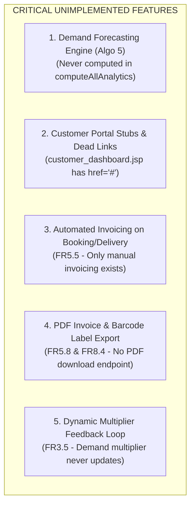
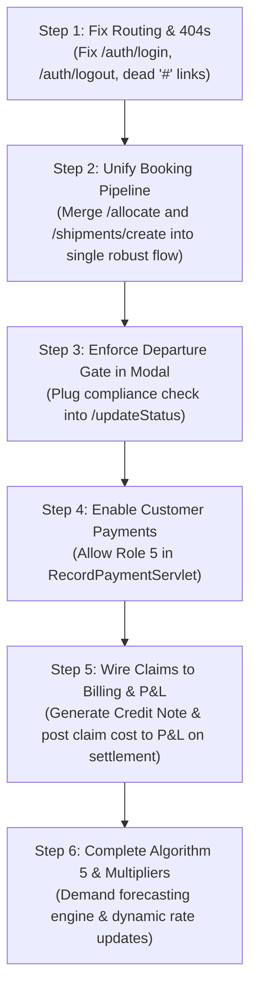

# N LOGISTIC — COMPREHENSIVE CODEBASE AUDIT: MISSING FUNCTIONALITIES, DISCONNECTED WORKFLOWS & INTEGRATION ROADMAP

> **Document Version:** 1.0  
> **Target Audience:** Engineering Team, Tech Leads, and System Architects  
> **Status:** Critical Forensic Audit of Active Codebase (`src/main/java/com/nlogistic/*` & `src/main/webapp/jsp/*`)  
> **Companion Documents:** [CLAUDE.md](file:///d:/NLogistic/NLogistic/CLAUDE.md) · [SYSTEM_WORKFLOW_AND_ENTITY_RELATIONSHIPS.md](file:///d:/NLogistic/NLogistic/SYSTEM_WORKFLOW_AND_ENTITY_RELATIONSHIPS.md) · [CLAUDE_CODE_RBAC_MEGA_PROMPT.md](file:///d:/NLogistic/NLogistic/CLAUDE_CODE_RBAC_MEGA_PROMPT.md)

---

## 1. Executive Summary: What is Actually Implemented vs. What is Broken/Missing

After an exhaustive line-by-line inspection of all 38 Controllers, 21 DAOs, and 37 JSP views, the reality of the codebase is:

1. **The Core CRUD Shell Exists:** The database tables exist, basic JDBC connections work, Bootstrap 5 UI pages look great visually, and basic forms exist for most entities.
2. **The Workflows Are Disconnected:** The entities do not talk to each other as a cohesive pipeline. For example:
   - Creating a shipment in one screen does not update container status, does not create P&L records, and does not generate barcodes.
   - Creating a shipment in another screen uses the wrong foreign key (`user_id` instead of `customer_id`).
   - Approving a claim displays a message saying *"Credit note posted to billing"*, but **zero code exists to write to billing or P&L**.
   - Compliance checking blocks departure on one page, but the modal used by 99% of staff has **zero compliance checking**.
   - Customers are blocked by an HTTP 403 exception from paying their own invoices.
3. **Dead Links & Broken Routes (HTTP 404s):** Multiple servlets and headers redirect to non-existent `/auth/login` and `/auth/logout` endpoints.

Below is the exhaustive, categorized catalogue of every gap, bug, disconnected workflow, and missing functionality, followed by the exact technical blueprint to fix them.

---

## 2. The 5 Major Disconnected Workflows (The Big Confusion Points)

```
┌─────────────────────────────────────────────────────────────────────────────────────────────┐
│                             THE 5 CRITICAL WORKFLOW DISCONNECTS                             │
├─────┬─────────────────────────────────────────────────┬─────────────────┬───────────────────┤
│ #   │ Workflow Area                                   │ Current State   │ Problem / Impact  │
├─────┼─────────────────────────────────────────────────┼─────────────────┼───────────────────┤
│ 1   │ Booking Mechanism A vs Mechanism B              │ Two competing   │ Data corruption & │
│     │ (/allocate -> /book vs /shipments/create)       │ disjoint flows  │ missing links     │
├─────┼─────────────────────────────────────────────────┼─────────────────┼───────────────────┤
│ 2   │ Departure Compliance Gate (FR5.3)               │ Incomplete      │ Compliance gate   │
│     │ (Checked in /updateFull, bypassed in modal)     │ enforcement     │ easily bypassed   │
├─────┼─────────────────────────────────────────────────┼─────────────────┼───────────────────┤
│ 3   │ Invoice Payment by Customer (FR5.7)             │ Blocked by code │ Customer cannot   │
│     │ (RecordPaymentServlet blocks roleId > 4)        │ (HTTP 403)      │ pay invoices      │
├─────┼─────────────────────────────────────────────────┼─────────────────┼───────────────────┤
│ 4   │ Claim Settlement -> Billing & P&L (FR7.4-7.6)   │ Pure UI fiction │ Claims don't sync │
│     │ (Toast message says credit note posted, but no  │ (No DB write)   │ to bills or P&L   │
│     │  billing or P&L records are created)            │                 │                   │
├─────┼─────────────────────────────────────────────────┼─────────────────┼───────────────────┤
│ 5   │ Stock Adjustment -> Loss Attributions (FR4.6)   │ Ledger only     │ Warehouse losses  │
│     │ (Damaged stock write-offs never link to P&L)    │ (No P&L link)   │ missing from P&L  │
└─────┴─────────────────────────────────────────────────┴─────────────────┴───────────────────┘
```

---

### Disconnect 1: The Dual Booking Conflict (`/allocate` vs `/shipments/create`)

There are currently **TWO competing booking flows** in the codebase that conflict with each other and do not adhere to the same contracts:

#### Flow A: Via Container Catalog (`/allocate` $\rightarrow$ `pricing.jsp` $\rightarrow$ `BookShipmentServlet.java` (`/book`))
* **How it works:** User selects container on `/containers` $\rightarrow$ enters cargo weight/volume on `allocate-container.jsp` $\rightarrow$ forwards to `pricing.jsp` $\rightarrow$ submits form to `/book`.
* **The Glaring Bugs:**
  1. In `BookShipmentServlet.java` (Line 52):
     ```java
     ps.setInt(1, user.getUserId()); // BUG: Passes user_id into customer_id column!
     ```
     `customers` has a separate auto-increment primary key `customer_id`. Passing `user.getUserId()` violates foreign key integrity or links the shipment to a completely random customer!
  2. If a staff member uses this flow, the shipment is linked to the staff's `user_id` as the customer!
  3. It calls `allocate_container` SP and sets container status to `Allocated`, then redirects back to `/containers` instead of the created shipment.

#### Flow B: Via Shipments Menu (`/shipments/create` $\rightarrow$ `create_shipment.jsp` $\rightarrow$ `ShipmentServlet.java` (`/shipments/save`))
* **How it works:** User clicks "Create Shipment" in the sidebar $\rightarrow$ selects Customer, Container, Ports, Vessel, and charges $\rightarrow$ submits to `/shipments/save`.
* **The Glaring Bugs:**
  1. Does **NOT** check if the selected container is `Available` (violates **FR3.3**).
  2. Does **NOT** check if cargo weight/volume fits within container capacity (violates **FR3.4**).
  3. Does **NOT** update container status to `Allocated` (the container remains `Available` indefinitely).
  4. Does **NOT** create a record in `profit_loss` table.
  5. Does **NOT** auto-generate a Barcode via `BarcodeAutoGenerator.generateFor`.

> **The Fix:** Unify into a single, standardized booking service. Container allocation must automatically enforce capacity contracts (FR3.3/3.4), update container status to `Allocated`, create the initial `profit_loss` row, resolve the correct `customer_id`, and auto-generate the barcode.

---

### Disconnect 2: The Bypassed Departure Compliance Gate (FR5.3)

* **SRS Requirement (FR5.3):** *"The system shall block a shipment's transition to Departed status until all mandatory compliance documents are Approved and none are expired (contract precondition)."*
* **What is actually in the code:**
  - In `ShipmentServlet.java` (Lines 113–119), `complianceDAO.canShipmentDepart(s.getShipmentId())` is checked ONLY inside the `/updateFull` handler (which is only triggered from the full edit form `edit_shipment.jsp`).
  - In `ShipmentServlet.java` (Lines 159–186), the `/updateStatus` handler handles the quick checkpoint dropdown modal on `shipments.jsp` and `live_tracking_detail.jsp` (which operations staff use 99% of the time).
  - **There is ZERO compliance checking in `/updateStatus`!**
  - Any user can open the modal on `shipments.jsp`, select `Departed`, and save. The shipment immediately transitions to `Departed` even if **zero compliance documents exist** or all documents are expired!

> **The Fix:** Add the `complianceDAO.canShipmentDepart(shipmentId)` check inside the `/updateStatus` handler in `ShipmentServlet.java` before allowing status = `Departed`.

---

### Disconnect 3: Customers Blocked from Paying Invoices (HTTP 403)

* **SRS Requirement (FR5.7 & Section 2.2):** *"Customer / Consumer: Books shipments, tracks movement, views own invoices, and makes payments."*
* **What is actually in the code:**
  - In `RecordPaymentServlet.java` (Lines 23–26):
    ```java
    User user = (User) request.getSession().getAttribute("user");
    if (user == null || user.getRoleId() > 4) {
        response.sendError(HttpServletResponse.SC_FORBIDDEN, "Access Denied");
        return;
    }
    ```
  - Role ID 5 is **Customer**. Any customer who clicks to pay an invoice is greeted with **HTTP 403 Forbidden**!
  - Furthermore, in `invoices.jsp` and `billing.jsp`, the payment modal is only designed for internal staff manually recording bank/cash payments; there is no customer online checkout interface.

> **The Fix:** Allow Role 5 in `RecordPaymentServlet.java` provided the invoice being paid belongs to their `customer_id`. Add an online payment modal for Customers.

---

### Disconnect 4: Claim Settlement Never Syncs to Billing or P&L (UI Illusion)

* **SRS Requirement (FR7.4, FR7.5, FR7.6):**
  - *"An approved claim shall generate a credit note / refund adjustment in the Billing module."* (FR7.4)
  - *"A claim shall not be marked Settled until an approved_amount is set and a resolution date is recorded."* (FR7.5)
  - *"An Approved/Settled claim shall automatically post as an additional cost against the shipment's Profit & Loss record under its linked Loss Reason."* (FR7.6)
* **What is actually in the code:**
  - In `ClaimServlet.java` (Lines 221 & 245), the code sets a success message:
    `"Claim #" + claimId + " settled. Resolution recorded and credit note posted to billing."`
  - BUT when you inspect `claimDAO.approveClaim()` and `claimDAO.settleClaim()`, they only call `{CALL review_claim(?, ...)}` and `{CALL settle_claim(?, ?)}`.
  - **There is NO code anywhere in Java or stored procedures that:**
    1. Inserts a Credit Note or negative line item into `billing_invoices` or `invoice_line_items`.
    2. Updates `profit_loss.total_cost_amount = total_cost_amount + approved_amount`.
    3. Inserts into `profit_loss_reason_map` linking the shipment's P&L to the claim's `reason_id`.
  - The claim settlement claims to update billing and P&L, but the financial ledger is completely unaware of the payout!

> **The Fix:** In `ClaimDAO.settleClaim()` or `ClaimServlet.java`, upon settlement:
> 1. Insert a negative line item into `invoice_line_items` (or credit note in `billing_invoices`).
> 2. Execute `UPDATE profit_loss SET total_cost_amount = total_cost_amount + ?, profit_loss_amount = revenue_amount - total_cost_amount WHERE shipment_id = ?`.
> 3. Insert into `profit_loss_reason_map (pl_id, reason_id, remark)`.

---

### Disconnect 5: Stock Damage Adjustments Disconnected from P&L

* **SRS Requirement (FR4.6):** *"Stock adjustments for damage or write-off shall require a mandatory reason, feeding into loss reporting and Product Profitability Analysis."*
* **What is actually in the code:**
  - In `StockAdjustmentServlet.java` (Lines 93–100), when stock is adjusted for damage or expiry, it deducts from `stock` and inserts an `OUT` transaction into `inventory_ledger`.
  - BUT it stops there! It never posts the monetary loss to `profit_loss` or links it to `loss_reasons`.
  - As a result, warehouse damage losses never appear on the Profit & Loss charts or Loss Reason distributions.

---

## 3. Completely Missing Functionalities (Unimplemented Features)



### 1. Algorithm 5: Demand Forecasting Computation Missing
* In `AnalyticsDAO.java` (Lines 373–387), the `computeAllAnalytics()` method executes:
  - `CALL compute_abc_classification(?, ?)` (Algorithm 2)
  - `CALL compute_inventory_turnover(?, ?)` (Algorithm 3)
  - `CALL compute_profitability(?, ?)` (Algorithm 4)
  - `CALL compute_sales_trend(?, ?)` (Algorithm 1)
* **Algorithm 5 (Demand Forecasting per container type & route — Section 5.5) is completely omitted!**
* `PredictiveGraphServlet.java` only reads whatever static dummy rows were seeded into `demand_forecast` table. There is no code recalculating forecasted demand or prices based on actual bookings.

### 2. Customer Portal Stubs & Dead Links
* `src/main/webapp/jsp/customer_dashboard.jsp`:
  - Line 18: `<a href="#" class="btn text-white">Start Booking</a>` (Dead link `#`)
  - Line 32: `<a href="#" class="btn text-white">Reserve Now</a>` (Dead link `#`)
* `src/main/webapp/jsp/layout/customer_header.jsp`:
  - Line 80: `<a href="#">Book Shipment</a>` (Dead link `#`)
  - Line 83: `<a href="#">Book Container</a>` (Dead link `#`)
  - Line 86: `<a href="#">My Profile</a>` (Dead link `#`)
  - Line 96: `<a href="${pageContext.request.contextPath}/auth/logout">Logout</a>` (**404 Not Found!**)

### 3. Automated Invoicing on Booking / Delivery (FR5.5)
* FR5.5 specifies: *"The system shall auto-generate an invoice per shipment including freight charges, service charges, applicable taxes and surcharges."*
* Currently, invoices are ONLY created if an internal staff member manually visits `/billing` or `/generate-invoice`, fills out a form, and clicks submit. There is no automated hook when a shipment is booked or delivered.

### 4. PDF Invoice Export & Barcode Label Export (FR5.8 & FR8.4)
* FR5.8 requires printable/exportable PDF invoices.
* FR8.4 requires printing/exporting barcodes as labels for physical container tagging.
* In the codebase, `invoice-template.jsp` exists as an HTML view, but there is no PDF export endpoint (e.g., using OpenPDF / iText or `window.print()` styling).

---

## 4. Broken Routes, 404s & Code Smells

### 1. Dead `/auth/login` and `/auth/logout` 404 Errors
The application has no servlet mapped to `/auth/*`. Yet, four servlets and headers attempt to redirect to `/auth/login` and `/auth/logout`:
* `src/main/webapp/jsp/layout/customer_header.jsp` (Line 96): redirects to `/auth/logout` $\rightarrow$ **HTTP 404**
* `src/main/java/com/nlogistic/controller/PortServlet.java` (Lines 24 & 36): redirects to `/auth/login` $\rightarrow$ **HTTP 404**
* `src/main/java/com/nlogistic/controller/VesselServlet.java` (Lines 24 & 36): redirects to `/auth/login` $\rightarrow$ **HTTP 404**
* `src/main/java/com/nlogistic/controller/CustomerServlet.java` (Lines 34 & 46): redirects to `/auth/login` $\rightarrow$ **HTTP 404**

*(The correct mapped endpoints are `/login` and `/logout`).*

### 2. Raw Scriptlet Database Operations in Admin JSPs
* `src/main/webapp/jsp/admin/customers.jsp` (Lines 6–65):
  Contains 60 lines of raw Java scriptlets (`<% ... %>`) executing `DELETE FROM customers`, `DELETE FROM users`, `UPDATE users` directly against the database connection inside the view!
* This completely violates MVC2 separation and bypasses `AuthenticationFilter` and controller audit logs.

### 3. Hardcoded Math Formulas in P&L Analytics
* In `src/main/java/com/nlogistic/dao/ProfitLossDAO.java` (Line 254):
  ```java
  double vsPrev = Math.round(((margin * 0.75) + 3.2) * 10.0) / 10.0;
  ```
  The period-over-period financial comparison shown on executive P&L cards is an arbitrary mathematical trick (`margin * 0.75 + 3.2`) rather than comparing actual previous quarter/month revenue.

### 4. Foreign Key Bypass in `ShipmentDAO.java`
* In `ShipmentDAO.java` (Line 329):
  `deleteShipment()` executes `SET FOREIGN_KEY_CHECKS=0` because foreign key cascading is missing across `profit_loss_reason_map`, `compliance_documents`, and `claims`.

---

## 5. Master Integration Roadmap: How to Wire Everything Together

To turn these disconnected fragments into an integrated, production-grade enterprise system, follow this 6-step integration plan:



### Step 1: Fix All Broken URLs & 404s
1. In `customer_header.jsp`, `PortServlet.java`, `VesselServlet.java`, and `CustomerServlet.java`, change `/auth/login` $\rightarrow$ `/login` and `/auth/logout` $\rightarrow$ `/logout`.
2. In `customer_dashboard.jsp`, change:
   - "Start Booking" link $\rightarrow$ `${pageContext.request.contextPath}/shipments/create`
   - "Reserve Container" link $\rightarrow$ `${pageContext.request.contextPath}/containers`
   - Or better, route Customers to the unified `header.jsp` with the dedicated Customer Sidebar.

### Step 2: Unify the Booking Pipeline
1. In `BookShipmentServlet.java`:
   - Resolve the true `customer_id` from `customers` table using `user.getUserId()`.
   - Ensure container capacity checks (FR3.4) and availability check (FR3.3) are verified.
   - Insert into `shipment`, set container status to `Allocated`, insert initial `profit_loss` row, and auto-generate Barcode.
2. In `ShipmentServlet.java` (`/shipments/save`):
   - Add the exact same container availability check, capacity check, container status update to `Allocated`, `profit_loss` insertion, and Barcode generation.
   - Both paths must execute the complete contract.

### Step 3: Enforce Departure Compliance in the Status Modal
In `ShipmentServlet.java` inside `/updateStatus`:
```java
if ("Departed".equalsIgnoreCase(status)) {
    if (!complianceDAO.canShipmentDepart(shipmentId)) {
        session.setAttribute("errorMessage", "Departure Blocked: Mandatory compliance documents for Shipment #SHP-" 
                + shipmentId + " are missing, not Approved, or expired.");
        response.sendRedirect(redirectUrl != null ? redirectUrl : request.getContextPath() + "/shipments");
        return;
    }
}
```

### Step 4: Enable Customer Online Invoice Payment
1. In `RecordPaymentServlet.java`:
   - Change `if (user == null || user.getRoleId() > 4)` to allow `roleId == 5` (Customer).
   - For Customers, verify that the invoice being paid belongs to `session.getAttribute("customerId")`.
2. In `invoices.jsp`:
   - Provide a "Pay Online" modal for Customers displaying total balance and payment mode options.

### Step 5: Wire Claims Settlement into Billing & P&L
In `ClaimServlet.java` inside `case "settle"`:
```java
int claimId = Integer.parseInt(request.getParameter("claimId").trim());
Claim c = claimDAO.getClaimById(claimId);
claimDAO.settleClaim(claimId, userId);

// 1. Post Credit Note adjustment to Billing
billingDAO.createCreditNoteForClaim(c.getCustomerId(), c.getShipmentId(), c.getApprovedAmount(), "Claim Settlement #" + claimId);

// 2. Post Claim cost to Shipment P&L record
profitLossDAO.recordClaimCost(c.getShipmentId(), c.getApprovedAmount(), c.getReasonId(), "Settled Claim #" + claimId);
```

### Step 6: Implement Demand Forecasting Algorithm (Algo 5)
1. In `AnalyticsDAO.java`, implement `computeDemandForecast(period, computedBy)`:
   - Query historical booking volumes per container type and trade route over the past 6 months.
   - Apply moving average growth factor to generate forecasted demand for periods $T+1$ to $T+6$.
   - Compute `demand_multiplier = 1.0 + ((forecasted_demand - baseline) / baseline) * 0.15`.
   - Update `demand_forecast` table and `pricing_rules.demand_multiplier`.
2. Call `computeDemandForecast` inside `computeAllAnalytics()`.

---

## 6. Summary Checklist for Full Production Readiness

- [ ] **Fix 404 redirects:** Change all `/auth/*` links to `/login` and `/logout`.
- [ ] **Fix customer ID mapping:** Ensure `BookShipmentServlet` uses `customer_id` from `customers` table, not `user_id`.
- [ ] **Unify booking logic:** Container status $\rightarrow$ `Allocated`, P&L entry created, Barcode generated in both booking servlets.
- [ ] **Enforce FR5.3 Compliance Gate:** Add check in `/updateStatus` modal handler.
- [ ] **Allow Customer Payments:** Fix `RecordPaymentServlet` to allow Role 5 for own invoices.
- [ ] **Connect Claims to Billing:** Insert real credit note in `billing_invoices` upon claim settlement.
- [ ] **Connect Claims to P&L:** Add claim payout to `profit_loss.total_cost_amount` and map to `profit_loss_reason_map`.
- [ ] **Connect Stock Damage to P&L:** Post stock write-offs to P&L under *Damaged Product* loss reason.
- [ ] **Add Demand Forecasting Engine:** Compute Algorithm 5 inside `computeAllAnalytics()`.
- [ ] **Refactor Scriptlets in Admin JSPs:** Move raw database code from `admin/customers.jsp` and `admin/users.jsp` into `AdminCustomerServlet` and `AdminUserServlet`.
