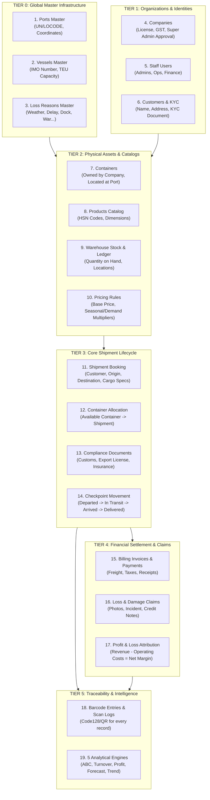
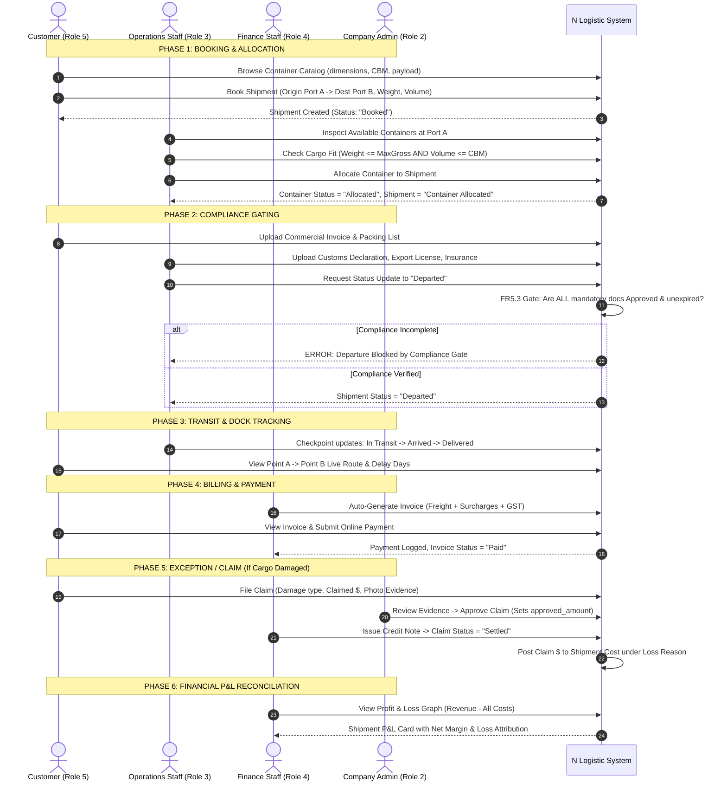
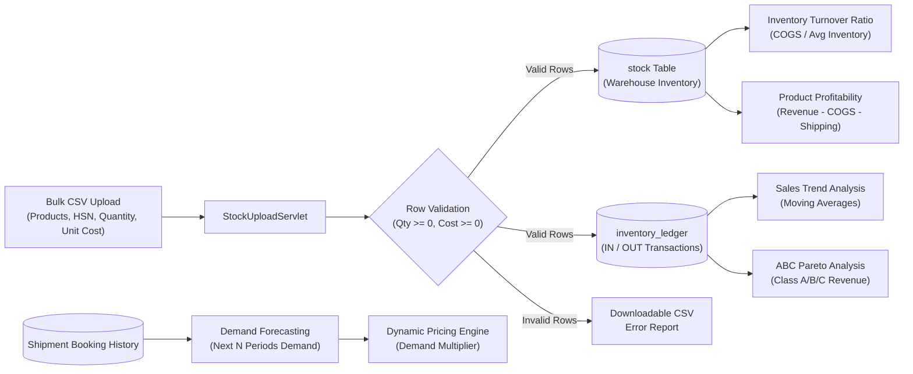

# N LOGISTIC IMPORT & EXPORT
## System Entity Lifecycle, Interconnection & Workflow Master Guide

> **Document Version:** 1.0  
> **Target Audience:** Developers, System Architects, Operations, and Business Stakeholders  
> **Companion Documents:** [CLAUDE.md](file:///d:/NLogistic/NLogistic/CLAUDE.md) · [AGENTS.md](file:///d:/NLogistic/NLogistic/AGENTS.md) · [CLAUDE_CODE_RBAC_MEGA_PROMPT.md](file:///d:/NLogistic/NLogistic/CLAUDE_CODE_RBAC_MEGA_PROMPT.md)

---

## 1. The Core Mental Model: Understanding the System

To understand how N Logistic works, think of the system as an **International Maritime Airline for Freight**:

```
┌──────────────────────────────────────────────────────────────────────────┐
│                             THE ANALOGY                                  │
├───────────────────┬──────────────────────────────────────────────────────┤
│ Logistics Concept │ Real-World Analogy                                   │
├───────────────────┼──────────────────────────────────────────────────────┤
│ Customer          │ The Passenger / Cargo Consignor                      │
│ Shipment          │ The Ticket / Flight Booking (Point A to Point B)     │
│ Container         │ The Airplane / Cargo Hold (Physical Steel Box)       │
│ Vessel            │ The Ocean Liner / Cargo Ship carrying Containers     │
│ Port              │ The Airport / Seaport Terminal                       │
│ Compliance Docs   │ The Passport / Visa / Customs Clearance              │
│ Invoice           │ The Flight Fare & Excess Baggage Bill                │
│ Claim             │ The Lost / Damaged Baggage Claim                     │
│ Profit & Loss     │ Flight Profitability (Ticket Revenue vs Fuel/Landing)│
└───────────────────┴──────────────────────────────────────────────────────┘
```

### The Big Confusion Resolved: "Container vs. Shipment"
A very common confusion is: *Does a customer book a container, or book a shipment? Who allots what?*

Here is the exact distinction:
1. **What is a Container (`containers` table)?**
   * A Container is a **permanent, reusable physical steel asset** owned or leased by a logistics company.
   * It has a physical ISO container number (e.g., `MSCU7829102`), a size (20ft, 40ft HC), a tare weight, a maximum gross weight limit (e.g., 28,000 kg), and a volume capacity (e.g., 33 CBM).
   * A container lives for years and moves across hundreds of voyages.
2. **What is a Shipment (`shipment` table)?**
   * A Shipment is a **single business transaction** representing a customer's request to transport cargo from Port A to Port B on a given date.
   * It has declared cargo weight, volume, value, origin port, and destination port.
3. **How do they connect?**
   * **The Customer BOOKS A SHIPMENT** (stating: *"I have 18,000 kg and 25 CBM of textiles to move from Port of Singapore to Port of Rotterdam"*).
   * **The Operations Staff ALLOCATES AN AVAILABLE CONTAINER** to that shipment (stating: *"I am assigning physical 40ft Container #MSCU7829102 to this shipment because it is currently Available at Port of Singapore and can safely hold the declared weight and volume"*).
   * **The Container goes on the Vessel**: Containers carrying shipments are loaded onto Vessels that navigate maritime routes between Ports.

---

## 2. Entity Creation Hierarchy: What Must Exist First?

Nothing in logistics happens in a vacuum. A shipment cannot be booked without ports, and a container cannot be allocated without a container fleet. The system follows a strict 6-tier dependency hierarchy:



---

## 3. End-to-End Operational Lifecycle: Step-by-Step

### Phase 1: Onboarding & Master Setup
1. **Super Admin** or **Company Admin** creates:
   - **Ports (`ports`):** Defines international shipping hubs (e.g., Shanghai, Singapore, Rotterdam, Los Angeles).
   - **Vessels (`vessels`):** Registers cargo ships with their IMO numbers and TEU (Twenty-Foot Equivalent Unit) capacities.
   - **Loss Reasons (`loss_reasons`):** Establishes standard cost-attribution categories (*Traffic in Sea, Weather, Delay, Dock Allocation, War, Damaged Product*).
2. **Company Admin** registers company details (License, GST) $\rightarrow$ **Super Admin** verifies and approves company status to `Active`.
3. **Company Admin** creates internal accounts:
   - **Operations Staff (`role_id = 3`)**
   - **Finance Staff (`role_id = 4`)**
4. **Company Admin** registers the company's **Container Fleet (`containers`)**:
   - Each container is registered with its ISO number, type (Dry/Reefer), capacity, and initial port location. Initial status: `Available`.
5. **Customer (`role_id = 5`)** self-registers, inputs address, and uploads KYC proof document.

---

### Phase 2: Booking & Capacity Feasibility (Customer)
1. **Customer browses Container Catalog (`/containers`)**:
   - Views container photographs, interior dimensions, tare weight, maximum payload, and CBM volume capacity.
2. **Customer Books Shipment (`/shipments/create`)**:
   - Selects **Origin Port (Point A)** and **Destination Port (Point B)**.
   - Declares cargo characteristics:
     - Cargo Description (e.g., "1,200 cartons of electronics")
     - Declared Weight in kg (e.g., 14,500 kg)
     - Declared Volume in CBM (e.g., 28.5 CBM)
     - Declared Monetary Value (for customs and insurance)
   - Selects preferred container type/size.
   - Submits booking $\rightarrow$ System creates a record in `shipment` with **Status = `Booked`**.

---

### Phase 3: Container Allocation (Operations Staff)
1. **Operations Staff** opens the Allocation screen (`/allocate?containerId=...` or `/shipments`).
2. **Contract Invariant Checks (FR3.3 & FR3.4)**:
   - Is container status `Available`? If `Allocated`, `In-Transit`, or `Under Maintenance`, allocation is **REJECTED**.
   - Does cargo weight $\le$ container maximum gross capacity? If cargo exceeds weight limit, allocation is **REJECTED**.
   - Does cargo volume $\le$ container CBM capacity? If cargo exceeds volume limit, allocation is **REJECTED**.
3. Upon passing validation:
   - Container status changes: `Available` $\rightarrow$ **`Allocated`**.
   - Shipment status advances: `Booked` $\rightarrow$ **`Container Allocated`**.
   - Container ID is linked to the Shipment record.
   - A unique **Barcode (QR/Code128)** is automatically generated for physical tagging (FR8.1).

---

### Phase 4: Government Compliance Gating (The Departure Gate)
1. Before any ship can leave dock, international trade laws require documentation.
2. **Operations Staff / Customer** uploads mandatory compliance documents (`compliance_documents`):
   - Customs Declaration Form
   - Import/Export Operating License
   - Certificate of Origin
   - Marine Cargo Insurance Policy
   - Port Inspection Certificate
3. **Contract Precondition (FR5.3 - Departure Gate)**:
   ```
   CAN SHIPMENT DEPART?
   ├─ Are all mandatory documents uploaded? ───> [NO] ──> CANNOT DEPART (Blocked)
   ├─ Are all documents status == 'Approved'? ─> [NO] ──> CANNOT DEPART (Blocked)
   ├─ Is any document expired? ────────────────> [YES] ─> CANNOT DEPART (Blocked)
   └─ ALL APPROVED & UNEXPIRED? ───────────────> [YES] ─> DEPARTURE PERMITTED
   ```
4. If documents are valid, **Operations Staff** updates movement status to **`Departed`**. If compliance fails, the system blocks the update with a contract violation alert.

---

### Phase 5: Live Transit & Checkpoint Tracking
1. As the vessel sails, **Operations Staff** logs checkpoints:
   - `Departed` $\rightarrow$ `In Transit` $\rightarrow$ `Customs Hold` (if held at border) $\rightarrow$ `Arrived` $\rightarrow$ `Delivered`.
2. Every checkpoint logs:
   - Checkpoint location name
   - Actual timestamp and staff user ID (FR2.3)
   - Calculated delay days: `actual_arrival_date - expected_arrival_date` (FR2.5)
3. **Customer** watches real-time route progress on the **Live Tracking Dashboard** (Point A $\rightarrow$ Point B visual line and status badge).

---

### Phase 6: Invoicing, Billing & Payment (Finance Staff)
1. Once booked or delivered, an invoice is generated (`billing_invoices`):
   - **Line Items:** Freight charges (derived from dynamic pricing engine: Base Price $\times$ Seasonal Multiplier $\times$ Demand Multiplier) + Terminal Handling + Insurance + GST/Tax.
2. **Customer** views invoice in their customer portal (`/invoices`) and pays online (FR5.7):
   - Enters Card / UPI / Bank Transfer Reference $\rightarrow$ Record created in `payments`.
3. System recalculates invoice status:
   - `Unpaid` $\rightarrow$ `Partial` $\rightarrow$ `Paid` (or `Overdue` if `CURRENT_DATE > due_date`).

---

### Phase 7: Loss & Damage Claims & P&L Feedback Loop
1. **If cargo is damaged or lost during transit**:
   - **Customer or Operations Staff** files a Claim (`claims`):
     - Selects affected shipment, container, and cargo item.
     - Uploads photographic proof (`claim_documents`).
     - Specifies claimed amount and incident date. Status: **`Filed`**.
2. **Company Admin / Operations** reviews physical proof $\rightarrow$ Status: **`Under Review`** $\rightarrow$ **`Approved`** (with `approved_amount`).
3. **Finance Staff** settles the claim (**FR7.5 Contract Precondition**):
   - Generates a **Credit Note** against the customer's invoice.
   - Status transitions to **`Settled`**.
4. **Profit & Loss Feedback Loop (FR2.6 & FR7.6)**:
   - The approved claim amount is automatically added as an **additional cost** to the shipment's P&L record.
   - The loss is tagged against standard Loss Reasons (`loss_reasons`, e.g., *Damaged Product*, *Ship Issue*, *Weather Condition*).

---

### Phase 8: Profit & Loss (P&L) Computation
For every completed voyage, the financial engine calculates net profitability:

$$\text{Net Profit / Loss} = \text{Total Freight Revenue} - \text{Total Operating Costs}$$

Where:
* **Total Revenue:** Base Freight + Handling Charges + Surcharges (collected from customer invoice).
* **Total Operating Costs:** Fuel Cost + Port Berthing Fees + Customs Duty + Marine Insurance + Delay Penalties + Claim Payouts.
* **If Profit $\ge$ 0:** Profitable shipment (rendered green on P&L trend charts).
* **If Profit < 0:** Loss-making shipment (rendered red, mandatory tagging with contributing Loss Reasons).

---

## 4. Visual Master Flowchart



---

## 5. Warehouse Stock & Analytical Algorithms Flow

In parallel with maritime container shipments, logistics companies store bulk client goods in warehouse depots:



---

## 6. Comprehensive Entity CRUD & Ownership Matrix

This table resolves exactly **who creates, updates, and deletes every entity** in the database:

| Entity Name | Primary DB Table | Who Creates / Adds? | Preconditions to Create | Who Updates / Edits? | Who Can Delete? | Deletion Safeguards (Invariants) |
| :--- | :--- | :--- | :--- | :--- | :--- | :--- |
| **Port** | `ports` | Super Admin | Unique Port Code (UN/LOCODE) | Super Admin | Super Admin Only | Cannot delete if active shipments or containers are mapped to this port. |
| **Vessel** | `vessels` | Super Admin / Company Admin | Valid IMO number, TEU capacity > 0 | Super Admin / Company Admin | Super Admin Only | Cannot delete if vessel is assigned to active shipments. |
| **Company** | `companies` | Company Admin (via Register) | Valid License No & GST No | Company Admin (profile) | Super Admin Only | Status transitions to `Suspended` before permanent purge. |
| **User Account** | `users` | Super Admin, Company Admin, or Customer Register | Unique Email & Username | Account owner (profile), Admins (status) | Super Admin Only | Handled via stored procedure `delete_users` with audit log entry. |
| **Customer** | `customers` | Customer (Register) or Staff | Valid linked `user_id` | Customer (address), Admins | Super Admin Only | Handled via `delete_customers` stored procedure. |
| **Container** | `containers` | Company Admin / Super Admin | Unique ISO Container Number | Operations (status, port), Admins | Super Admin Only | Invariant: Container must be in `Available` status and not allocated to any shipment. |
| **Shipment** | `shipment` | Customer (Self-Service) or Staff | Valid Customer, Origin Port, Dest Port | Operations (checkpoints), Admins | Super Admin (or Co. Admin for draft) | Cannot delete after shipment status reaches `Departed`. |
| **Movement Log** | `container_movements` | System (Auto on status update) | Shipment exists | Operations Staff | Super Admin Only | Audit integrity: historical movement records are immutable. |
| **Compliance Doc** | `compliance_documents` | Operations Staff or Customer | Shipment exists, valid file upload | Operations / Customer (re-upload) | Super Admin / Co. Admin | Cannot delete if document is marked `Approved`. |
| **Billing Invoice** | `billing_invoices` | System / Finance Staff | Shipment exists (Booked or Delivered) | Finance Staff (terms, status) | Finance / Admin | Cannot delete once a payment has been recorded against it. |
| **Payment** | `payments` | Customer (Online) or Finance Staff | Invoice exists, amount > 0 | Finance Staff (reconcile) | Super Admin Only | Immutable accounting ledger entry. |
| **Claim** | `claims` | Customer or Operations Staff | Shipment exists, claimed amount > 0 | Reviewing Admin / Finance Staff | Super Admin Only | Cannot delete once marked `Settled`. |
| **Stock Item** | `stock` | Operations Staff (Upload/Manual) | Product exists, quantity $\ge$ 0 | Operations Staff | Super Admin / Co. Admin | Cannot delete if inventory ledger history exists. |
| **Barcode Entry** | `barcode_entries` | System (Auto on record creation) | Core entity exists (unique barcode value) | System | Super Admin Only | Invariant: Barcode value is universally unique across all entities. |

---

## 7. Role-by-Role "Day in the Life" Summary

### 1. Customer (`role_id = 5`)
* **What they do:**
  1. Logs in $\rightarrow$ Lands on personal Customer Portal.
  2. Browses Container Catalog to check sizes and dimensions.
  3. Books a Shipment (Origin, Destination, Cargo weight/volume).
  4. Uploads KYC and commercial shipping documents.
  5. Tracks active shipments on the Live Movement Map (Point A to Point B).
  6. Views and downloads Invoices; makes online payments.
  7. Files Loss & Damage claims with photo proof if cargo arrives broken.
* **What they NEVER do:**
  - Never allocates containers, never modifies checkpoints, never sees internal company profit & loss or fuel costs, never accesses warehouse stock ledgers, never sees other customers' data.

### 2. Operations Staff (`role_id = 3`)
* **What they do:**
  1. Logs in $\rightarrow$ Inspects incoming shipment bookings.
  2. Verifies cargo dimensions and **allocates available physical containers**.
  3. Validates trade compliance documents before departure (**Departure Gate**).
  4. Advances movement checkpoints (`Departed` $\rightarrow$ `In Transit` $\rightarrow$ `Arrived` $\rightarrow$ `Delivered`).
  5. Uploads bulk stock CSVs and logs warehouse inventory adjustments.
  6. Scans barcodes on the dock floor using handheld or camera terminals.
* **What they NEVER do:**
  - Never accesses company Profit & Loss analytics, never sets base freight prices, never generates customer invoices or records payments.

### 3. Finance Staff (`role_id = 4`)
* **What they do:**
  1. Logs in $\rightarrow$ Inspects eligible unbilled shipments.
  2. Generates itemized billing invoices with freight, handling, and GST taxes.
  3. Records payments received via bank transfer, card, or UPI.
  4. Reviews overdue customer aging reports.
  5. Reviews approved claims and issues Credit Notes to settle liabilities.
  6. Analyzes Profit & Loss graphs and Financial Drilldowns to identify loss-making routes.
* **What they NEVER do:**
  - Never moves container checkpoints, never allocates containers, never uploads warehouse stock.

### 4. Company Admin (`role_id = 2`)
* **What they do:**
  1. Manages company container fleet and vessel allocations.
  2. Creates and manages internal company staff (Operations and Finance accounts).
  3. Calibrates base freight rates and seasonal multipliers for company trade lanes.
  4. Reviews high-level company Profit & Loss, loss reason trends, and stock turnover.
  5. Reviews and approves high-value damage claims.

### 5. Super Admin (`role_id = 1`)
* **What they do:**
  1. Global platform guardian across all logistics tenants.
  2. Approves or rejects new logistics company registrations and customer KYC.
  3. Governs user accounts, unlocks locked credentials, and audits security access logs.
  4. Manages international Ports master and global maritime Vessels registry.
  5. Calibrates algorithmic demand forecasting models and global pricing rules.
  6. Only authority permitted to execute permanent deletions of corrupted or obsolete master records.
